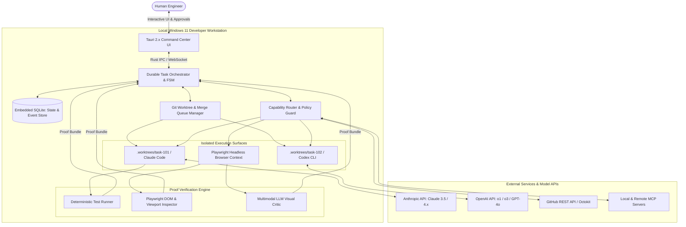
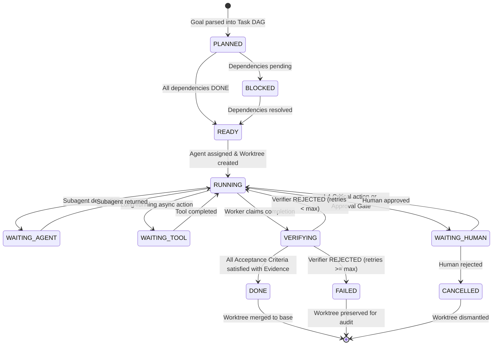
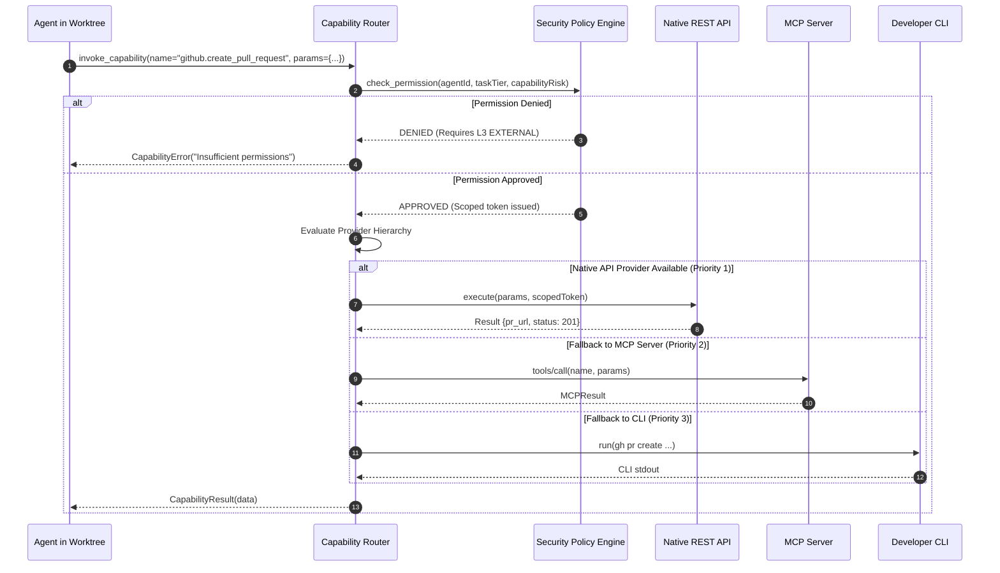
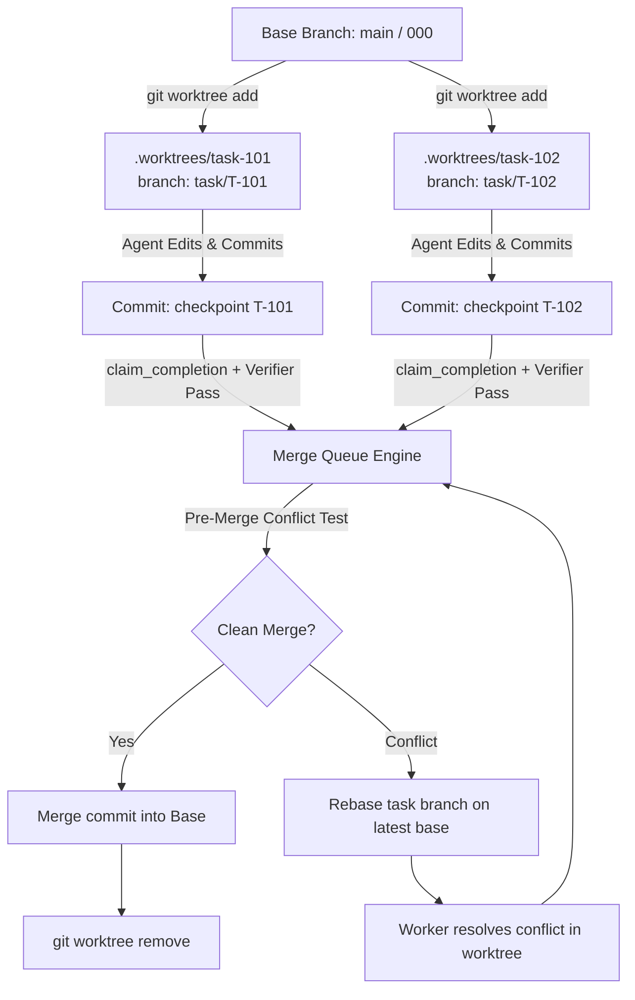
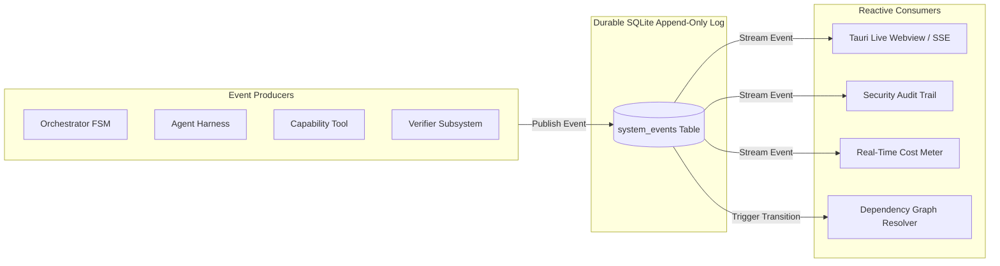

# Architecture - System Context & Complete Mermaid Blueprint Catalog

> **Document Type:** Phase 0 Architecture Blueprint  
> **Status:** Authoritative  

This document consolidates the complete architectural diagrams for the Multi-Agent Computer Operating System.

---

## 1. Overall System Context Diagram

---

## 2. Complete Task Lifecycle FSM State Diagram

---

## 3. Capability Routing Sequence Diagram

---

## 4. Git Worktree Isolation & Merge Queue Strategy

---

## 5. Event Sourcing Bus Architecture

