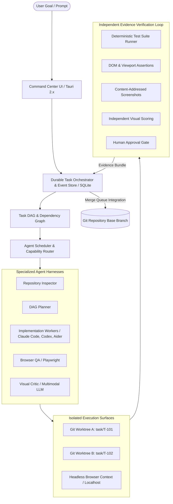

# 00 - Executive Summary: Multi-Agent Computer Operating System

> **Document Type:** Phase 0 Technical Research & Architecture Specification  
> **Release Target:** September 2026 Ecosystem  
> **Author:** Antigravity Engineering Architecture  
> **Status:** Architecture Review Ready  

---

## 1. Vision & Core Problem

The promise of generative AI coding assistants has hit a severe operational bottleneck. Today, software engineers act as manual human context buses:
1. Manually copying research findings between disparate agent chat tabs.
2. Manually checking out git branches and debugging corrupted working trees.
3. Launching localhost servers and manually squinting at mobile viewports.
4. Manually detecting that an agent hallucinated a "passed" test suite.
5. Manually resolving conflicting edits across multiple concurrent agents.

The **Multi-Agent Computer Operating System** transforms this fragmented landscape into a **local-first, deterministic command center**. The orchestrator coordinates specialized agents across Git worktrees, browser engines, MCP servers, CLI binaries, and desktop environments.

### The Immutable Core Principle
> **"No task becomes DONE merely because an agent claims it is done. DONE requires tamper-proof, verifiable evidence."**

---

## 2. High-Level System Architecture

---

## 3. Key Research Findings & Architectural Decisions

### 1. Orchestration Engine: Durable Task Engine over Monolithic Agent Frameworks
- **[FACT]**: Monolithic agent frameworks (CrewAI, AutoGen v0.2) frequently suffer from uncontrolled conversational loops, high token bloat, and brittle state recovery across process crashes.
- **[INFERENCE]**: We adopt a **durable state machine backed by SQLite event sourcing** (inspired by Temporal workflows and LangGraph cyclic checkpointing). The orchestrator acts as a deterministic state machine; agents are ephemeral worker activities that run in isolated workspaces.

### 2. The Model Context Protocol (MCP) Boundary
- **[FACT]**: The official **2026-07-28 MCP specification** established a stateless protocol core with Multi Round-Trip Requests (MRTR) and OAuth 2.0/OIDC authorization headers.
- **[INFERENCE]**: The Orchestrator **must be an MCP Client** to consume external developer ecosystems. However, internal task orchestration, git workspace management, and state persistence **must NOT use MCP**. MCP is one capability provider in our Capability Router, not the universal internal substrate.

### 3. Git Isolation via Git Worktrees
- **[FACT]**: Two concurrent agents modifying a single working directory produce file locks, race conditions, and corrupted edits.
- **[INFERENCE]**: Every concurrent task is provisioned its own isolated **Git Worktree** (`git worktree add .worktrees/task-{id} -b task/{id}`). All work occurs on an isolated branch with automated checkpoint commits. Merge conflicts are resolved through a deterministic merge queue before human sign-off.

### 4. Playwright CLI vs. Playwright MCP
- **[FACT]**: Official Microsoft Playwright documentation explicitly differentiates Playwright CLI from Playwright MCP:
  - **Playwright CLI (`@playwright/cli`)**: Highly token-efficient; designed for coding agents running short shell commands backed by a persistent browser daemon.
  - **Playwright MCP (`@playwright/mcp`)**: Designed for deep exploratory agentic loops using rich accessibility snapshots.
- **[INFERENCE]**: Coding workers utilize Playwright CLI for quick verification; independent Browser QA inspectors consume Playwright MCP for structured visual and accessibility audits.

### 5. Capability-Based Security & Prompt Injection Mitigation
- **[FACT]**: Untrusted web pages and external documentation can execute indirect prompt injection attacks against LLMs equipped with tool execution capabilities.
- **[INFERENCE]**: We enforce a strict **5-tier capability-based permission model (L0-L4)**. Browser and external web content is quarantined as untrusted data. Critical operations (L4: merging to protected branches, production deployments, database drops) require cryptographic nonces and explicit human sign-off.

---

## 4. V0 Scope Definition: "The Golden Loop"

To guarantee delivery without architectural sprawl, **V0 solves exactly ONE mission-critical workflow**:

> **"Autonomously and verifiably implement a frontend/fullstack feature in an existing Git repository."**

### V0 End-to-End Workflow:
1. **Intake & Repo Forensics**: Inspector agent audits repo structure, dependencies, and git status.
2. **DAG Generation**: Planner creates a task dependency graph with explicit Acceptance Criteria.
3. **Isolated Implementation**: Coding agent (Claude Code or Codex CLI) works in an isolated Git worktree.
4. **Localhost QA**: Orchestrator launches the local dev server; Browser QA agent navigates and executes DOM assertions.
5. **Visual Evidence**: Playwright captures content-addressed screenshots (mobile 390x844 and desktop 1920x1080).
6. **Independent Visual Critique**: Multimodal critic model scores the output against the design spec.
7. **Human Approval**: Human inspects the evidence bundle (diff, test output, screenshot) in the Command Center UI.
8. **Automated Integration**: Task branch merges cleanly into the base branch, and the worktree is dismantled.

---

## 5. What Explicitly Will NOT Be Built in V0
1. No arbitrary Windows desktop mouse/keyboard pixel-clicking (vision desktop automation deferred to V2).
2. No public cloud SaaS multi-tenant backend (V0 is 100% local-first).
3. No public MCP marketplace or dynamic uncurated tool installation.
4. No autonomous production deployment without human-in-the-loop sign-off.
5. No complex multi-party conversational debate rooms (agents communicate strictly via task artifacts).

---

## 6. Document Navigation

| Document | Focus Area |
| :--- | :--- |
| **`01-ECOSYSTEM-MAP.md`** | Complete landscape of current agents, frameworks, protocols, and tools |
| **`02-MCP-RESEARCH.md`** | Deep specification analysis of the 2026 Model Context Protocol |
| **`03-AGENT-HARNESSES.md`** | Programmatic evaluation of Claude Code, Codex, Aider, Gemini CLI |
| **`04-BROWSER-COMPUTER-CONTROL.md`** | Playwright MCP/CLI, CDP, Windows UIA, and vision models |
| **`05-ORCHESTRATION-FRAMEWORKS.md`** | LangGraph, Temporal, AutoGen, and durable execution engines |
| **`06-CAPABILITY-ARCHITECTURE.md`** | Unified capability router across API, MCP, CLI, Browser, Desktop |
| **`07-TASK-EVIDENCE-MODEL.md`** | Immutable proof objects, DAG state machines, and acceptance criteria |
| **`08-PERMISSIONS-SECURITY.md`** | 5-tier permission model, secret brokering, prompt injection defenses |
| **`09-MEMORY-CONTEXT.md`** | SQLite event store, knowledge graphs, context budgeting, and compaction |
| **`10-OBSERVABILITY.md`** | OpenTelemetry GenAI spans, live UI telemetry, and event schemas |
| **`11-COMMAND-CENTER-UX.md`** | Tauri 2.x desktop interface, live DAG graph, and diff inspectors |
| **`12-V0-ARCHITECTURE.md`** | Technical architecture specification for the initial working release |
| **`13-BUILD-VS-BUY.md`** | Pragmatic component reuse vs custom development analysis |
| **`14-RISK-REGISTER.md`** | Technical, security, and operational failure modes & mitigations |
| **`15-IMPLEMENTATION-ROADMAP.md`** | 4-phase concrete execution plan with engineering milestones |
