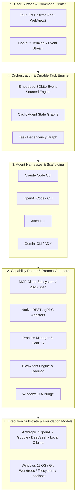

# 01 - Ecosystem Map (September 2026)

> **Document Type:** Phase 0 Technical Research  
> **Status:** Active  
> **Classification:** FACT / INFERENCE verified against current 2026 releases  

---

## 1. The 2026 Multi-Agent Operating Landscape

The multi-agent software development landscape has crystallized into five distinct vertical layers:

---

## 2. Comprehensive Layer Breakdown

### Layer 1: Foundation Models & Raw Inference
- **Anthropic Claude 3.5 / 4.x Series**: Industry benchmark in software architecture reasoning, bash tool usage, and visual artifact analysis. [FACT]
- **OpenAI o1 / o3 & GPT-4o Series**: Advanced multi-step synthetic code synthesis and rapid pattern matching. [FACT]
- **Google Gemini 1.5 / 2.0 Series**: Massive context windows (up to 2M tokens) and multimodal visual document understanding. [FACT]
- **DeepSeek V3 / R1 Series**: Ultra-low-cost high-performance reasoning via standard OpenAI-compatible API endpoints. [FACT]
- **Local Inference (Ollama / llama.cpp / vLLM)**: Fully offline inference on Windows hardware equipped with RTX GPUs. [FACT]

### Layer 2: Protocol & Tool Integration Substrates
- **Model Context Protocol (MCP)**: Universal standard for connecting clients to tool servers over JSON-RPC 2.0. [FACT]
- **Playwright Suite**: Dual-headed automation framework providing both high-level MCP interfaces and low-level CLI daemons. [FACT]
- **Windows UI Automation (UIA)**: Native Win32/COM accessible element inspection hierarchy. [FACT]

### Layer 3: Agent Scaffolding & Harnesses
- **Claude Code**: Terminal-native autonomous coding agent with built-in subagent spawning and streaming JSON output. [FACT]
- **OpenAI Codex CLI**: Purpose-built headless runner (`codex exec`) with native sandboxing flags and JSON lines streaming. [FACT]
- **Aider**: Pure terminal pair-programming engine with automated git diff commits and multi-model routing. [FACT]

### Layer 4: Orchestration & Workflow Engines
- **Durable Task Frameworks (Temporal / Inngest)**: Enterprise standards for replay-safe long-running jobs. [FACT]
- **Agent Graph Engines (LangGraph / PydanticAI)**: Declarative cyclic graphs with node-level checkpoints. [FACT]

### Layer 5: Developer User Experience
- **Tauri 2.x**: High-performance desktop container leveraging native Windows WebView2 and Rust IPC. [FACT]
- **React Flow / D3**: Interactive visualization engines for complex Directed Acyclic Graphs. [FACT]
