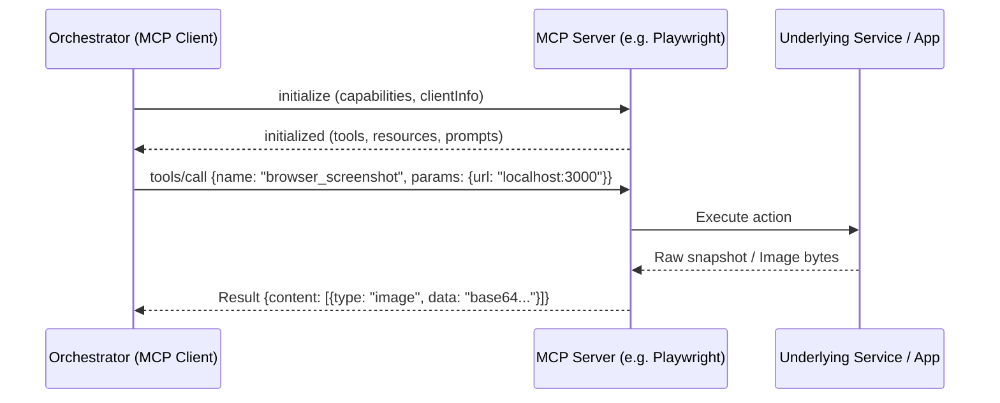

# 02 - Model Context Protocol (MCP) Deep Research

> **Document Type:** Phase 0 Technical Research  
> **Reference Release:** Official Specification 2026-07-28  
> **Status:** Authoritative  
> **Classification:** FACT (from spec) / INFERENCE (system design)  

---

## 1. The 2026 MCP Architecture Revolution

On **July 28, 2026**, the Model Context Protocol governance consortium released the landmark **Stateless Core Specification**. This addressed the primary failure mode of earlier versions: brittle sticky socket connections and state synchronization failures across distributed worker nodes.

### Key Innovations in the 2026-07-28 Release [FACT]
1. **Stateless Core Over HTTP & Streamable JSON-RPC**: MCP servers are no longer required to maintain in-memory persistent connection state. Any standard HTTP server or serverless function can handle tool invocations.
2. **Multi Round-Trip Requests (MRTR)**: Allows tools to yield intermediate validation requests back to the client within a single logical tool execution cycle.
3. **Header-Based Routing & Caching**: Standard HTTP headers (`MCP-Session-ID`, `ETag`) govern request routing and caching of expensive capability lists (`tools/list`, `resources/list`).
4. **Authorization Hardening**: Standardized OAuth 2.0 / OIDC Bearer Token verification protocol for remote servers, preventing unauthorized execution.
5. **Formal Extensions Framework**: Provides standardized hooks for server capabilities such as progress reporting, cancellation, and logging.

---

## 2. Core Protocol Primitives

### 1. Tools (`tools/list`, `tools/call`)
Deterministic, executable endpoints invoked by LLMs. Every tool exposes a typed JSON Schema defining required inputs and expected output structures.

### 2. Resources (`resources/list`, `resources/read`)
Passive, URI-addressable data sources (e.g. `file:///repo/src/app.tsx` or `db://schema/users`). Used to supply background context into LLM context windows without consuming tool execution turns.

### 3. Prompts (`prompts/list`, `prompts/get`)
Server-defined prompt templates enabling tool authors to guide agents through optimal usage patterns.

### 4. Sampling (`sampling/createMessage`)
Allows an MCP server to request an LLM completion from the host client. This enables "agentic MCP servers" that manage internal sub-loops while relying on the host's configured model credentials.

### 5. Elicitation (`elicitation/requestInput`)
Enables an MCP server to pause execution and solicit interactive user feedback or confirmation before proceeding with destructive mutations.

---

## 3. Critical Architectural Questions Answered

### Q1: Should the Orchestrator be an MCP Client?
- **Answer**: **YES (Definitive)**. [INFERENCE]
- **Rationale**: Being an MCP client allows our command center to instantly inherit the thousands of community and commercial MCP servers (GitHub, Playwright, PostgreSQL, Filesystem, Slack, Linear) without writing proprietary adapters for each service.

### Q2: Should the Orchestrator expose itself as an MCP Server?
- **Answer**: **PARTIALLY (Selected Interfaces Only)**. [INFERENCE]
- **Rationale**: The orchestrator should expose an MCP server endpoint for **external coding agents** (e.g., Cursor, Claude Code, Windsurf) so they can invoke command center capabilities (such as `command_center.request_qa_verification` or `command_center.query_task_status`). However, internal subsystem communication should use typed native TypeScript/Rust APIs to avoid serialization overhead.

### Q3: Should MCP be our Universal Internal Abstraction?
- **Answer**: **NO**. [INFERENCE]
- **Rationale**: MCP is an *external integration protocol*, not an internal systems architecture. MCP lacks:
  - Directed Acyclic Graph (DAG) task models.
  - Fine-grained Git worktree lifecycle management.
  - Deterministic event-sourcing replay mechanisms.
  - Multi-agent retry budgets and rollbacks.
  Forcing internal task scheduling through MCP adds massive JSON-RPC serialization overhead and destroys type safety.

### Q4: Can Agents Dynamically Discover Approved MCP Servers Safely?
- **Answer**: **YES, via an Orchestrator Capability Gatekeeper**. [INFERENCE]
- **Rationale**: Agents must not have unrestricted access to spawn arbitrary local MCP binaries (which could execute unauthorized shell commands). Instead, the Orchestrator maintains a curated registry of approved servers and exposes tools dynamically based on the agent's permission tier (L0-L4).
