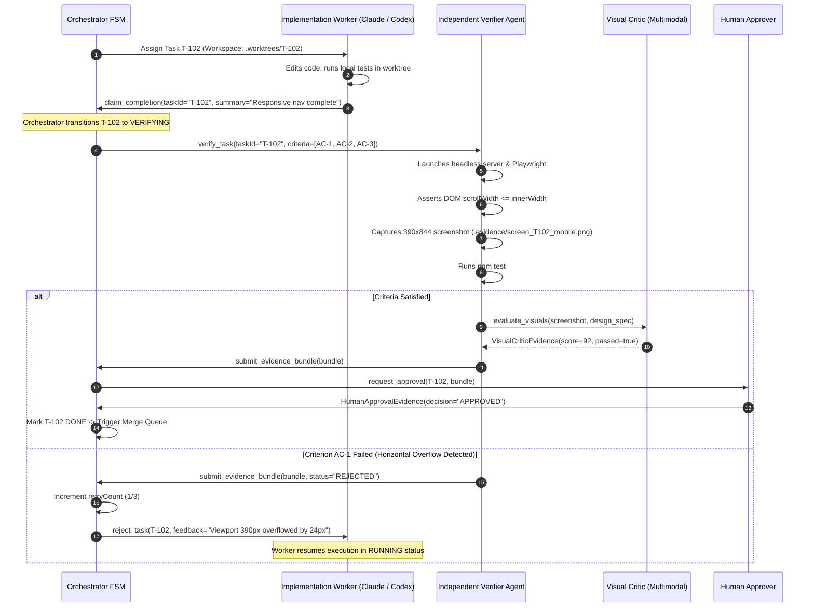

# 07 - Task & Evidence Model: The Proof-Carrying Workflow Engine

> **Document Type:** Phase 0 Technical Architecture Specification  
> **Status:** Authoritative Core Architecture  
> **Classification:** FACT / INFERENCE  

---

## 1. Foundational Architecture Principle

> **"A task is only DONE when its acceptance criteria have matching, tamper-proof, verifiable evidence. Agent claims are never accepted without proof."**

Software development agents frequently suffer from **premature completion hallucination**: claiming that unit tests passed, mobile viewports look correct, or database migrations executed without errors. 

Our operating system solves this by introducing **Proof-Carrying Tasks**.

---

## 2. Complete Task Schema

```typescript
export interface Task {
  // Identity & Hierarchy
  id: string;                         // UUIDv7 (time-ordered)
  projectId: string;                  // Project identifier
  name: string;                       // Short descriptive title
  objective: string;                  // Detailed natural language requirement
  
  // Dependency DAG
  dependencies: string[];             // Task IDs that must be DONE
  parentTaskId: string | null;        // For subtasks
  childTaskIds: string[];             // Spawned subtasks
  
  // Lifecycle & State
  status: TaskStatus;
  priority: number;                   // 1 (lowest) to 100 (highest)
  retryCount: number;
  maxRetries: number;                 // Prevents infinite loops (default: 3)
  
  // Ownership & Assignment
  assignedAgentId: string | null;     // Current worker agent
  verifierAgentId: string | null;     // MUST be different from assignedAgentId
  
  // Isolated Workspace
  workspace: {
    worktreePath: string;             // Isolated directory on disk
    branch: string;                   // e.g. "task/T-102-responsive-nav"
    baseCommitSha: string;            // Starting snapshot
  };
  
  // Contracts & Proofs
  permissionsGranted: PermissionTier[];// L0 - L4
  acceptanceCriteria: AcceptanceCriterion[];
  collectedEvidence: Evidence[];
  
  // Timestamps
  createdAt: string;                  // ISO8601
  startedAt: string | null;
  completedAt: string | null;
}

export type TaskStatus =
  | 'PLANNED'         // Created, waiting for dependencies
  | 'BLOCKED'         // Dependencies actively failing or unresolved
  | 'READY'           // All dependencies DONE, ready for scheduling
  | 'RUNNING'         // Agent actively executing in worktree
  | 'WAITING_AGENT'   // Subagent activity underway
  | 'WAITING_TOOL'    // Long-running async tool executing
  | 'WAITING_HUMAN'   // Blocked on human approval gate
  | 'VERIFYING'       // Independent verifier evaluating claims
  | 'REJECTED'        // Verifier rejected claims; returning to RUNNING
  | 'DONE'            // All acceptance criteria backed by validated evidence
  | 'FAILED'          // Max retries exceeded or unrecoverable error
  | 'CANCELLED';      // Manually aborted
```

---

## 3. Acceptance Criteria & Typed Evidence Objects

Every task defines explicit `AcceptanceCriterion` records. Only matching `Evidence` objects can satisfy them:

```typescript
export interface AcceptanceCriterion {
  id: string;                         // e.g. "AC-MOBILE-VIEWPORT"
  description: string;                // "Mobile viewport (390x844) has no horizontal scroll"
  requiredEvidenceType: EvidenceType;
  validationRule: {
    type: 'DOM_ASSERTION' | 'TEST_EXIT_ZERO' | 'DIFF_INSPECT' | 'VISUAL_SCORE' | 'HUMAN_APPROVAL';
    params: Record<string, any>;
  };
}

export type EvidenceType =
  | 'GIT_EVIDENCE'
  | 'TEST_EVIDENCE'
  | 'SCREENSHOT_EVIDENCE'
  | 'BROWSER_EVIDENCE'
  | 'FILE_EVIDENCE'
  | 'COMMAND_EVIDENCE'
  | 'DEPLOYMENT_EVIDENCE'
  | 'VISUAL_CRITIC_EVIDENCE'
  | 'HUMAN_APPROVAL_EVIDENCE';

export interface BaseEvidence {
  id: string;                         // UUIDv7
  taskId: string;
  criterionId: string;                // References target AcceptanceCriterion
  collectedByAgentId: string;         // Verifier identity
  collectedAt: string;                // ISO8601
  contentSha256: string;              // Tamper-proof cryptographic hash
}
```

### Concrete Evidence Implementations

#### 1. GitEvidence
```typescript
export interface GitEvidence extends BaseEvidence {
  evidenceType: 'GIT_EVIDENCE';
  repoPath: string;
  branch: string;
  commitSha: string;
  filesChanged: string[];
  unifiedDiff: string;
}
```

#### 2. TestEvidence
```typescript
export interface TestEvidence extends BaseEvidence {
  evidenceType: 'TEST_EVIDENCE';
  testFramework: 'vitest' | 'jest' | 'playwright' | 'pytest';
  exitCode: number;
  totalTests: number;
  passedTests: number;
  failedTests: number;
  durationMs: number;
  rawOutputLogPath: string;
}
```

#### 3. ScreenshotEvidence & VisualCriticEvidence
```typescript
export interface ScreenshotEvidence extends BaseEvidence {
  evidenceType: 'SCREENSHOT_EVIDENCE';
  url: string;
  viewport: { width: number; height: number };
  imageFilePath: string;              // Local content-addressed image
  imageSha256: string;
}

export interface VisualCriticEvidence extends BaseEvidence {
  evidenceType: 'VISUAL_CRITIC_EVIDENCE';
  screenshotRefId: string;
  designBriefRef: string;
  score: number;                      // 0 - 100
  passed: boolean;                    // true if score >= threshold (e.g. 85)
  critiqueNotes: string[];
  evaluatorModel: string;             // e.g. "claude-3-5-sonnet-20241022"
}
```

---

## 4. Evidence Verification Loop Sequence


