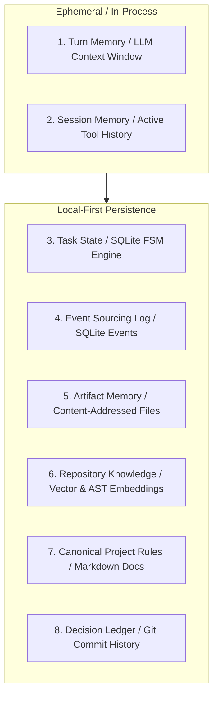

# 09 - Memory, Context Management & Project Knowledge

> **Document Type:** Phase 0 Technical Research  
> **Status:** Authoritative  
> **Classification:** FACT / INFERENCE  

---

## 1. The Eight Memory Tiers

A multi-agent operating system requires distinct memory tiers optimized for different access latencies and lifecycles:

---

## 2. Memory Tier Specifications

| Tier | Memory Type | Storage Substrate | Eviction / Compaction Policy |
| :--- | :--- | :--- | :--- |
| **1** | **Turn Memory** | LLM Context Window | Strictly capped per model (e.g. 30k input tokens). |
| **2** | **Session Memory** | Worker Harness RAM | Summarized or flushed upon task completion. |
| **3** | **Task State** | SQLite (`tasks` table) | Durable; survives system reboots; updated on transitions. |
| **4** | **Event Sourcing Log** | SQLite (`events` table)| Immutable append-only log; queryable for audit trails. |
| **5** | **Artifact Memory** | Filesystem (`.evidence/`) | Content-addressed by SHA-256; permanent. |
| **6** | **Repository AST** | LanceDB / SQLite-vec | Embedded code chunks; refreshed on git merge. |
| **7** | **Project Rules** | Git (`PROJECT.md`) | Canonical ground truth loaded into planner context. |
| **8** | **Decision Ledger** | Git (`DECISIONS/`) | Architectural Decision Records (ADRs). |

---

## 3. Context Compaction & Token Budgeting

To prevent context window degradation and exponential API costs:

1. **Context Budget Allocation**:
   Every worker invocation is granted a strict token budget:
   - System Core & Task Contract: **5,000 tokens**
   - Canonical Architecture Rules: **3,000 tokens**
   - Relevant File Snippets: **15,000 tokens**
   - Headroom for Reasoning & Tools: **10,000 tokens**
2. **Selective AST Slicing over Full Dumps**:
   Rather than dumping 500 lines of an imported component, the AST parser extracts only exported type signatures, interfaces, and function headers.
3. **Structured Event Compaction**:
   When intermediate tool call sequences exceed 20 turns, the harness invokes an ephemeral summarization pass, condensing 15 previous tool turns into a concise 300-word state summary.
