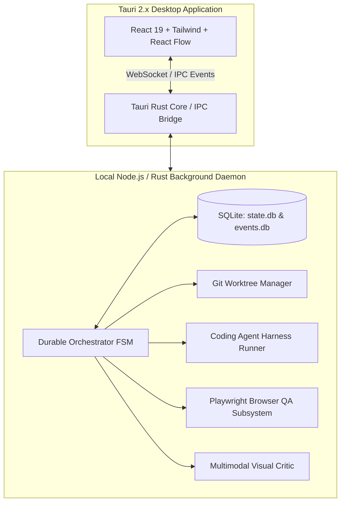

# 12 - V0 Architecture Specification: "The Golden Loop"

> **Document Type:** Phase 0 Technical Architecture Specification  
> **Status:** Authoritative Implementation Blueprint  
> **Classification:** FACT / INFERENCE  

---

## 1. The V0 Mission: The Golden Loop

The objective of V0 is strictly focused on executing **one complete, reliable workflow**:

> **"A user commands: 'Finish ALGORYXZ Gate 1'. The system inspects the repository, plans a task graph, edits code in an isolated Git worktree, runs tests, launches localhost, verifies layout via Playwright, generates visual evidence, acquires human sign-off, and integrates the git branch."**

If this single workflow does not operate with deterministic reliability, broader desktop automation is futile.

---

## 2. V0 Subsystems & Component Map



### Component Breakdown
1. **Durable Orchestrator FSM**: Embedded state machine managing task statuses (`PLANNED` -> `DONE`).
2. **SQLite Event Store**: Append-only log persisting tasks, dependencies, evidence hashes, and token telemetry.
3. **Git Worktree Manager**: Provisions `.worktrees/task-{id}`, manages branch lifecycles, and executes clean merge-queue merges.
4. **Harness Runner**: Spawns non-interactive worker CLI subprocesses (`claude -p` or `codex exec`) with scoped environment tokens and turn caps.
5. **Browser QA Subsystem**: Headless Playwright engine performing automated viewport navigation, DOM assertions, and screenshot generation.
6. **Visual Critic Engine**: Evaluates captured screenshots against project design specs using Claude 3.5 Sonnet / Gemini Multimodal vision APIs.

---

## 3. SQLite Database Schema for V0

```sql
-- Append-only immutable event sourcing log
CREATE TABLE system_events (
    id TEXT PRIMARY KEY,               -- UUIDv7
    timestamp TEXT NOT NULL,           -- ISO8601
    project_id TEXT NOT NULL,
    task_id TEXT,
    event_type TEXT NOT NULL,
    payload_json TEXT NOT NULL,
    cost_usd REAL DEFAULT 0.0
);

-- Durable Task FSM state
CREATE TABLE tasks (
    id TEXT PRIMARY KEY,               -- UUIDv7
    project_id TEXT NOT NULL,
    title TEXT NOT NULL,
    objective TEXT NOT NULL,
    status TEXT NOT NULL,              -- PLANNED, RUNNING, VERIFYING, DONE, etc.
    priority INTEGER DEFAULT 50,
    retry_count INTEGER DEFAULT 0,
    max_retries INTEGER DEFAULT 3,
    worktree_path TEXT,
    branch_name TEXT,
    assigned_agent TEXT,
    created_at TEXT NOT NULL,
    completed_at TEXT
);

-- Task dependency edges
CREATE TABLE task_dependencies (
    task_id TEXT NOT NULL,
    depends_on_task_id TEXT NOT NULL,
    PRIMARY KEY (task_id, depends_on_task_id)
);

-- Immutable verified evidence bundles
CREATE TABLE evidence_records (
    id TEXT PRIMARY KEY,               -- UUIDv7
    task_id TEXT NOT NULL,
    criterion_id TEXT NOT NULL,
    evidence_type TEXT NOT NULL,
    collected_by TEXT NOT NULL,
    sha256_hash TEXT NOT NULL,
    payload_json TEXT NOT NULL,
    created_at TEXT NOT NULL,
    FOREIGN KEY(task_id) REFERENCES tasks(id)
);
```
