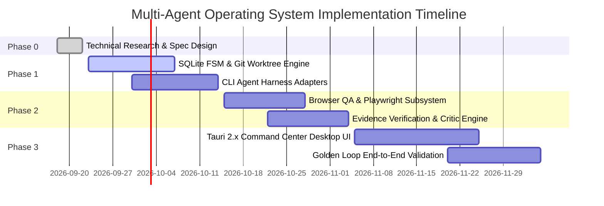

# 15 - Engineering Implementation Roadmap

> **Document Type:** Phase 0 Technical Architecture Specification  
> **Status:** Authoritative  
> **Classification:** INFERENCE (execution planning)  

---

## 1. Phase Progression Overview

---

## 2. Phase Breakdown & Acceptance Milestones

### Phase 1: Core Engine & Isolation Substrates (Weeks 1 - 3)
- **Deliverables**:
  - Embedded SQLite event sourcing engine (`events` and `tasks` tables).
  - Git Worktree Manager (`git worktree add/remove`, automated checkpoint commits).
  - Universal Harness Wrapper for **Claude Code** and **OpenAI Codex CLI**.
- **Exit Gate**: Headless CLI test where an agent implements a feature in a worktree and commits cleanly without user interaction.

### Phase 2: Evidence Verification & QA Engine (Weeks 4 - 6)
- **Deliverables**:
  - Playwright Browser QA agent executing automated DOM assertions.
  - Content-addressed screenshot evidence pipeline (`.evidence/*.png`).
  - Multimodal Visual Critic evaluating design briefs against captured viewports.
  - Verifier feedback loop returning rejected tasks to implementers with actionable diffs.
- **Exit Gate**: The system autonomously flags a responsive layout defect, rejects the task, and prompts the implementer to fix it.

### Phase 3: Tauri 2.x Command Center & Human Approval (Weeks 7 - 9)
- **Deliverables**:
  - Tauri 2.x desktop shell with React Flow DAG visualization.
  - Live streaming telemetry, terminal mirror, and Playwright inspection dock.
  - Side-by-side Human Approval modal with diff and screenshot viewers.
  - Automated merge queue integrating verified branches into base.
- **Exit Gate**: "The Golden Loop" completes end-to-end on ALGORYXZ Gate 1 with human approval.
