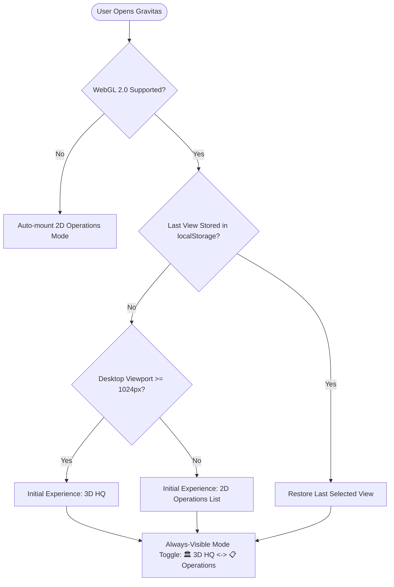

# GRAVITAS 3D HEADQUARTERS — ACCESSIBILITY & DEFAULT VIEW STRATEGY
## Semantic Equivalence, Targeted Controls & Inclusive Operation

> **CORE PRINCIPLE**: The 3D Headquarters must never be a barrier to operating Gravitas.  
> **PRAGMATIC ACCESSIBILITY**: We do NOT generate a bloated invisible DOM mirror for every 3D mesh in the scene graph. The existing **2D Operations/List mode is the primary semantic equivalent**. Within the 3D view, semantic accessible controls are exposed strictly for selected, active, and operationally critical entities.

---

## 1. Default View & User Choice Strategy

Gravitas respects user device capabilities, previous preferences, and accessibility settings:



### View Behavior Rules:
1. **Persistent Preference**: The user's chosen view (`HQ3D` vs. `OFFICE`) is remembered in `localStorage` (`gravitas_preferred_view`).
2. **First Supported Desktop Visit**: On a desktop device (\(\ge 1024\text{px}\) viewport width) with functioning WebGL 2.0, the initial experience defaults to **`HQ3D`**.
3. **Always-Visible Operations Toggle**: A permanent button in the TopBar and a global hotkey (`Alt+V`) allows one-click switching between 3D HQ and 2D Operations mode at all times.
4. **Automatic WebGL Fallback**: If WebGL context creation fails or crashes, the application automatically mounts 2D Operations mode with zero loss of orchestrator state.
5. **Reduced Motion Compatibility**: When `prefers-reduced-motion: reduce` is active, the 3D HQ remains fully functional and usable with instant camera cuts, static character postures, and zero transit animations.

---

## 2. Targeted Semantic Accessibility Controls in 3D

Rather than duplicating hundreds of static furniture meshes in an unmaintainable shadow DOM tree, Gravitas maintains a **compact, targeted ARIA overlay** for operationally meaningful entities:

```html
<!-- Mounted alongside <canvas> for screen readers & keyboard accessibility -->
<div class="sr-only" aria-label="3D Headquarters Operational Overview">
  <div role="status" aria-live="polite" id="hq-status-announcements">
    <!-- Dynamic announcements: "Task 2 assigned to Codex", "Task 1 awaiting approval" -->
  </div>

  <!-- Focused Entity Action Controls -->
  <div id="hq-focused-entity-controls" aria-label="Active Selection Controls">
    <!-- Populated only when an entity is selected or active -->
    <section aria-labelledby="active-selection-title">
      <h3 id="active-selection-title">Workstation 01: Codex (WORKING)</h3>
      <p>Executing task: Implement AST parser. Worktree: isolated-task-branch.</p>
      <button onclick="openTaskInspector('task-01')">Open Task Inspector & Git Diff</button>
      <button onclick="clear3DFocus()">Return to Overview</button>
    </section>
  </div>

  <!-- Global Operational Shortcuts -->
  <nav aria-label="Headquarters Room Landmarks">
    <button onclick="focusRoom('MISSION_CONTROL')">1. Mission Control (Planning)</button>
    <button onclick="focusRoom('AGENT_OPERATIONS')">2. Agent Operations (Workers)</button>
    <button onclick="focusRoom('VERIFICATION_LAB')">3. Verification Lab (Cleanroom)</button>
    <button onclick="focusRoom('BROWSER_QA_LAB')">4. Browser QA Lab (Device Matrix)</button>
    <button onclick="focusRoom('INFRASTRUCTURE_ROOM')">5. Infrastructure Room (Gateways)</button>
    <button onclick="focusRoom('APPROVAL_MEZZANINE')">6. Approval Control (Mezzanine)</button>
  </nav>
</div>
```

---

## 3. Keyboard Traversal & Action Grammar

| Keyboard Input | Operational Action | Assistive Technology Announcement |
| :--- | :--- | :--- |
| **`1` through `6`** | Snap camera to Room Zone (1: Mission Control, 2: Ops, 3: Verifier, 4: Browser QA, 5: Infra, 6: Approval). | *"Navigated to [Room Name]."* |
| **`Tab` / `Shift+Tab`** | Move selection focus across active stations with running or waiting tasks. | Speaks station title, worker name, and active task state. |
| **`Spacebar` / `Esc`** | Reset focus and return camera to HQ Overview framing. | *"Returned to Headquarters Overview."* |
| **`Enter`** | Open the 2D `TaskInspector` for the selected task or worker. | Shifts keyboard focus cleanly to the 2D Inspector's header. |
| **`A`** | Trigger task approval (only when a task in `WAITING_APPROVAL` is selected). | *"Approved task [Title]. Commit materialized."* |
| **`R`** | Trigger task rejection (opens rejection modal with focus on reason input). | *"Reject task modal opened."* |
| **`Alt + V`** | Instantly toggle between 3D Headquarters and 2D Operations mode. | *"Switched to 2D Operations mode."* |

---

## 4. Visual Accessibility: Contrast & Motion

1. **High Contrast (`prefers-contrast: more`)**:
   - Disables soft PCF contact shadows.
   - Increases station perimeter outline thickness to \(4\text{mm}\) with solid `#FFFFFF` borders on dark surfaces.
   - Forces text billboarding on workstations to solid black-and-white plates.
2. **Reduced Motion (`prefers-reduced-motion: reduce`)**:
   - Zero continuous camera panning; room transitions snap instantly (0ms).
   - Character walk and typing loops replaced with static posed stances.
   - Folio transit animations snap directly to destination station docks.
