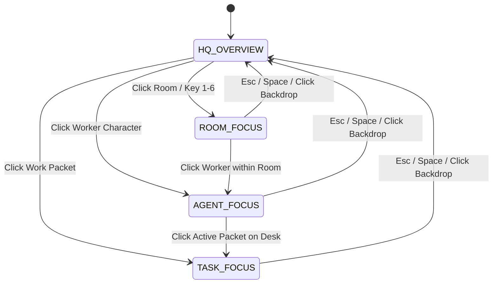

# GRAVITAS 3D HEADQUARTERS — CAMERA SYSTEM & INTERACTION MODEL
## Projection Strategy, Preset Framing, Raycast Picking & Control Grammar

> **CORE PRINCIPLE**: The camera in Gravitas is an operational tool, not a video game controller.  
> It provides immediate spatial comprehension, effortless focus switching, and bounded, intuitive orbit controls.  
> **EXPLICIT PROHIBITION**: Zero first-person WASD roaming or disorienting full-spherical tumbling.

---

## 1. Camera Projection Decision: Restrained Perspective vs. True Orthographic

### Comparative Evaluation

| Projection Mode | Architectural Readability | Depth & Parallax Cues | True Dimensional Scale | Edge Distortion | Verdict |
| :--- | :--- | :--- | :--- | :--- | :--- |
| **True Orthographic** (`OrthographicCamera`) | Excellent (parallel lines never converge, CAD precision) | Poor (flat, lacks tactile miniature feel; hard to judge vertical lifts) | Perfect 1:1 | Zero | Acceptable for 2D CAD mode, but feels sterile for a "living miniature atelier." |
| **Wide Perspective** (`FOV = 60° - 75°`) | Poor (severe peripheral fish-eye; wall occlusion) | Excessive (cinematic distortion) | Distorted | High | **REJECTED** (Destroys operational clarity). |
| **Restrained Telephoto Perspective** (`FOV = 28° - 32°`) | **Superior** (parallel lines remain nearly true while subtle depth cues provide tactile scale) | **Optimal** (miniature tilt-shift feeling; natural ambient occlusions) | True to scale | Negligible | **RECOMMENDED PRIMARY CAMERA PROJECTION**. |

### Authoritative Specification:
- **Camera Type**: `PerspectiveCamera` with a narrow Field of View (\(\text{FOV} = 30^{\circ}\)).
- **Clipping Planes**: Near \(= 0.5\text{m}\), Far \(= 120.0\text{m}\).
- **Default Framing**: Elevated Three-Quarter Isometric Angle:
  - Azimuth: \(45.0^{\circ}\) (Looking North-East from South-West).
  - Elevation: \(35.0^{\circ}\) above ground plane.
  - Initial Position: \([-24.0\text{m}, 18.0\text{m}, -24.0\text{m}]\), Target LookAt: \([0.0\text{m}, 1.2\text{m}, 3.0\text{m}]\).

---

## 2. Camera Navigation Modes & Framing Presets

The camera system operates with five distinct framing modes, smoothly transitioning via spherical linear interpolation (slerp / cubic ease-out):

### 2.1 Preset Framing Coordinates

| Camera Mode | Target Focus Object | Target Center \([X, Y, Z]\) | Camera Offset \([X, Y, Z]\) | Target Distance | Transition Time |
| :--- | :--- | :--- | :--- | :--- | :--- |
| **`HQ_OVERVIEW`** | Central Operations Atrium | \([0.0, 1.2, 3.0]\) | \([-24.0, 18.0, -24.0]\) | \(36.0\text{m}\) | 600ms (Cubic Ease) |
| **`ROOM_MISSION_CONTROL`** | Planning Table | \([-4.0, 0.8, 7.0]\) | \([-10.0, 9.0, -3.0]\) | \(14.0\text{m}\) | 450ms |
| **`ROOM_AGENT_OPERATIONS`** | Codex / FCC Desks | \([-4.0, 0.8, 0.0]\) | \([-12.0, 8.0, -10.0]\) | \(16.0\text{m}\) | 450ms |
| **`ROOM_VERIFICATION`** | Cleanroom Bench | \([6.0, 1.0, 6.0]\) | \([0.0, 8.0, -4.0]\) | \(12.0\text{m}\) | 450ms |
| **`ROOM_BROWSER_QA`** | Device Matrix Wall | \([6.0, 1.2, 0.0]\) | \([0.0, 7.0, -8.0]\) | \(11.0\text{m}\) | 450ms |
| **`ROOM_INFRASTRUCTURE`** | Server Racks | \([-12.0, 1.5, -9.0]\) | \([-6.0, 6.0, -16.0]\) | \(10.0\text{m}\) | 450ms |
| **`ROOM_APPROVAL`** | Mezzanine Plinth | \([0.0, 4.0, 12.5]\) | \([-8.0, 10.0, 4.0]\) | \(12.0\text{m}\) | 500ms |
| **`AGENT_FOCUS`** | Specific Worker Mesh | \([\text{Worker}_X, 1.0, \text{Worker}_Z]\) | \([-4.0, 3.5, -4.0]\) | \(6.5\text{m}\) | 400ms |
| **`TASK_FOCUS`** | Specific Work Packet | \([\text{Task}_X, \text{Task}_Y, \text{Task}_Z]\) | \([-3.0, 2.5, -3.0]\) | \(4.8\text{m}\) | 400ms |

---

## 3. Bounded Orbital & Pan Controls

The operator can freely orbit and pan, constrained strictly within ergonomic safety bounds to prevent disorientation:

1. **Orbit Limits**:
   - Minimum Azimuth: \(15^{\circ}\) (prevents rotating past side walls).
   - Maximum Azimuth: \(75^{\circ}\).
   - Minimum Elevation: \(15^{\circ}\) (prevents dipping below the floor line).
   - Maximum Elevation: \(65^{\circ}\) (prevents looking straight down from top).
2. **Zoom Distance Bounds**:
   - Minimum Zoom (Closest Macro): \(4.0\text{m}\) (prevents camera clipping through character meshes).
   - Maximum Zoom (Widest Macro): \(45.0\text{m}\) (prevents zooming into black void).
3. **Inertial Damping**: Smooth damping factor of `0.08` for tactile, friction-rich motion.

---

## 4. Raycast Picking & Selection Interaction Model

Raycasting runs on a dedicated throttled loop (`pointerdown` and debounced `pointermove`):

### 4.1 Selection Grammar & Visual Feedback

| Interactive Target | Click / Tap Reaction | Hover Visual Enhancement | 2D UI Reaction |
| :--- | :--- | :--- | :--- |
| **Worker Character** | Character highlights with crisp brass ring at base; camera eases to `AGENT_FOCUS`. | Subtle cursor change (`pointer`); tooltip displays worker name and active role. | Opens docked 2D Agent Registry / Status Inspector. |
| **Work Packet** | Packet glows with accent highlight; camera aligns to `TASK_FOCUS`. | Packet header tag elevates slightly (+2mm); acceptance criteria preview tooltip. | Docked 2D `TaskInspector` loads task details, logs, and live git diff. |
| **Workstation** | Workstation desk border illuminates; camera centers on station. | Subtle border brightening on desk outline. | Displays station telemetry and assigned worker details. |
| **Room Floor / Plinth** | Camera executes smooth transition to `ROOM_FOCUS`. | Floor perimeter line highlights with warm ambient glow. | Updates TopBar room context indicator. |
| **Server Rack** | Camera focuses on Infrastructure Room; rack bay illuminates. | Rack relay switches highlight; latency badge pops up. | Opens Gateway & Provider Health Telemetry in 2D drawer. |
| **Approval Plinth** | Camera focuses on Mezzanine Plinth; signet mechanism glows. | Plinth spotlight intensifies; "Approval Required" pill pulses. | Focuses 2D Inspector on Approve/Reject action buttons. |
| **Empty Backdrop Floor** | Deselects active selection; camera returns smoothly to `HQ_OVERVIEW`. | None. | Resets 2D inspector to run-level summary. |

---

## 5. Keyboard Navigation Equivalents

To ensure power-user velocity and accessibility parity:

- **`Spacebar` / `Esc`**: Return camera immediately to `HQ_OVERVIEW` and clear selection.
- **`1`**: Focus Mission Control (Planning Table).
- **`2`**: Focus Agent Operations (Codex & FCC Desks).
- **`3`**: Focus Verification Lab (Cleanroom).
- **`4`**: Focus Browser QA Lab (Device Matrix).
- **`5`**: Focus Infrastructure Room (Server Racks).
- **`6`**: Focus Approval Mezzanine (Human Control Plinth).
- **`Tab` / `Shift+Tab`**: Cycle focus across active work packets in topological execution order.
- **`Enter`**: Open selected entity's deep 2D inspector.
- **`A`**: Trigger Approve (when a task in `WAITING_APPROVAL` is selected and human confirmation is primed).
- **`R`**: Trigger Reject modal (with mandatory reason field).
