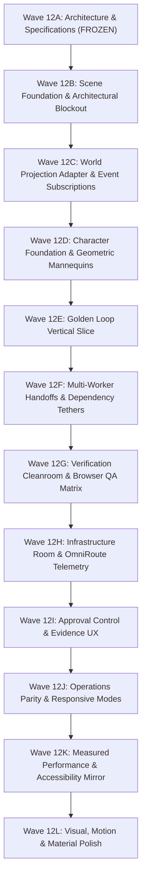

# GRAVITAS 3D HEADQUARTERS — IMPLEMENTATION ROADMAP (WAVES 12B–12L)
## Phased Rollout Sequence, Acceptance Gates & Wave 12B Foundation Scope

> **CURRENT STATUS**: WAVE 12A-R PLANNING COMPLETE · ARCHITECTURE FROZEN · PENDING HUMAN APPROVAL  
> **CORE RULE**: We have planned the world. Next we build the foundation, NOT the illusion of the finished product.  
> **GATE**: Wave 12B MUST NOT claim Golden Loop completion. It is strictly the 3D Scene Foundation.

---

## 1. Wave 12B: 3D Scene Foundation Scope (Strict Boundaries)

Wave 12B lays the rock-solid foundation for the 3D Headquarters. It proves that the chosen 3D runtime integrates seamlessly into the existing Vite/React 19 application without breaking existing workflows or introducing fake activity:

### Explicit Deliverables for Wave 12B:
- **Clean 3D Runtime Integration**: Install vanilla `three` and required types; mount `<LivingHqCanvas3D />` cleanly inside `apps/web`.
- **Architectural Blockout**: Render the architectural room geometry (Mission Control, Agent Operations, Verification Lab, Infrastructure Room, Approval Mezzanine) using clean, modern PBR shapes (walnut, stone, brass, glass).
- **Camera Rig**: Bounded perspective camera (\(\text{FOV} = 30^{\circ}\)) with orbit, pan, and zoom limits.
- **Room Focus Presets**: Clicking a room or pressing numeric keys `1`–`6` transitions camera smoothly to that zone.
- **Raycast Selection**: Raycasting picks stations and objects; passes selection callbacks up to React.
- **React 2D Inspector Integration**: Clicking a workstation in 3D successfully docks and highlights the corresponding 2D `TaskInspector`.
- **Viewport Resize**: Responsive canvas resizing via `ResizeObserver` without stretching or aspect ratio distortion.
- **HQ3D View Switching**: Switching between `HQ3D` and `OFFICE` (`Alt+V` or TopBar toggle) works cleanly.
- **Render Loop Suspension**: Render loop suspends immediately when `document.hidden === true` OR when `currentWorkspaceView !== 'HQ3D'`.
- **Reduced Motion Support**: Instant cuts and zero continuous orbit when `prefers-reduced-motion` is enabled.
- **WebGL Failure Fallback**: Graceful fallback to 2D `OfficeFloor` if WebGL 2.0 context is unavailable.
- **Prototype Stations**: Static workstations, planning table, and approval plinth positioned accurately in 3D space.
- **Static Scale Figures Only**: Characters appear ONLY as clean, static geometric mannequins/cylinders for spatial scale reference.
- **ZERO Fake Runtime Activity**: No real worker animations, no fake progress timers, no synthesized task movements.

---

## 2. Corrected Phased Roadmap Sequence (12B – 12L)

---

### Detailed Wave Specifications

#### Wave 12B: Scene Foundation
- **Scope**: Vanilla Three.js runtime setup; `<LivingHqCanvas3D />` component; architectural room blockout; bounded camera rig; raycast picking; resize observer; render suspension; static geometric scale figures.
- **Dependencies**: Wave 12A-R approval.
- **Acceptance Evidence**: WebGL canvas mounts at \(\ge 45\) FPS; camera bounded; rooms focusable; inspector connects; RAF suspends on hidden/inactive.
- **Explicit Non-Goals**: No Golden Loop integration; no character rigging or walking; no audio; no production GLB character packs.

#### Wave 12C: World Projection
- **Scope**: Implement pure `deriveWorldState()` adapter in TypeScript. Expand `useEvents.ts` to all 28 canonical backend events. Map snapshot state to 3D station statuses and packet entities.
- **Dependencies**: Wave 12B.
- **Acceptance Evidence**: Vitest unit test suite passes covering state transitions for all 28 events; `deriveWorldState` produces 100% deterministic entity states.
- **Explicit Non-Goals**: No skeletal animation blending.

#### Wave 12D: Character Foundation
- **Scope**: Procedural/custom geometric prototype characters with state postures (`IDLE`, `ASSIGNED`, `WORKING`, `STANDBY`). Implement deterministic waypoint navigation along the navigation graph.
- **Dependencies**: Wave 12C.
- **Acceptance Evidence**: Geometric prototype characters smoothly transition between sit/stand and walk between waypoints upon authoritative state changes.
- **Explicit Non-Goals**: No external downloaded character packs.

#### Wave 12E: Golden Loop Vertical Slice
- **Scope**: Wire the complete Golden Loop through 3D space: Task creation \(\rightarrow\) Scheduling \(\rightarrow\) Codex working at desk \(\rightarrow\) Candidate produced \(\rightarrow\) Verification Lab cleanroom \(\rightarrow\) Verifier pass \(\rightarrow\) Approval Mezzanine \(\rightarrow\) Human user approves via 2D inspector \(\rightarrow\) Commit materialized in vault.
- **Dependencies**: Wave 12D.
- **Acceptance Evidence**: Real task executed in isolated worktree is visibly tracked through all stages into base branch commit.
- **Explicit Non-Goals**: Multi-worker concurrent execution (reserved for 12F).

#### Wave 12F: Multi-Worker Handoffs
- **Scope**: Multi-task DAG spatial visualization (Codex on T1, FCC on T2 depending on T1). Visual dependency tethers, blocked state visualization, and atomic release on upstream approval.
- **Dependencies**: Wave 12E.
- **Acceptance Evidence**: FCC remains in `WAITING_DEPENDENCY` with visible orange tether until T1 is approved; tether dissolves and T2 dispatches to FCC.
- **Explicit Non-Goals**: Dynamic navmesh (use static waypoint graph).

#### Wave 12G: Verification + Browser QA
- **Scope**: Digital diff inspection console in Verification Lab and Device Matrix Wall for Playwright Browser QA.
- **Dependencies**: Wave 12F.
- **Acceptance Evidence**: When Browser QA runs, device matrix screens illuminate with simulated viewport wireframes; pass/fail states reflect in real-time.
- **Explicit Non-Goals**: Interactive desktop streaming inside canvas.

#### Wave 12H: Infrastructure / OmniRoute
- **Scope**: Acoustic Infrastructure Room: OmniRoute 42U server cabinets, fiber optic patch leads, provider relay indicators, and token tachometers.
- **Dependencies**: Wave 12G.
- **Acceptance Evidence**: Server racks display active provider relay; `PROVIDER_FALLBACK_OCCURRED` triggers amber bypass circuit.
- **Explicit Non-Goals**: Humanoid representation of gateways (strictly forbidden).

#### Wave 12I: Approval + Evidence UX
- **Scope**: Approval Control plinth integration with 2D TaskInspector. Spotlight illumination on candidate task; gold embossed seal upon human approval; rejection feedback routing.
- **Dependencies**: Wave 12H.
- **Acceptance Evidence**: Clicking plinth opens 2D inspector; human clicking Approve updates authoritative engine and marks 3D packet approved.
- **Explicit Non-Goals**: NPC pretending to approve.

#### Wave 12J: Operations Parity / Responsive
- **Scope**: Seamless toggle between 3D HQ and 2D Office (`Alt+V`). Responsive camera framing presets and high-density mobile list fallback.
- **Dependencies**: Wave 12I.
- **Acceptance Evidence**: Toggling causes zero state loss; mobile devices default to responsive 2D list view.
- **Explicit Non-Goals**: Full 3D rendering on low-end mobile.

#### Wave 12K: Performance + Accessibility
- **Scope**: Dual-condition RAF suspension, frame-time telemetry, texture compression (KTX2), and targeted accessible ARIA controls for active entities.
- **Dependencies**: Wave 12J.
- **Acceptance Evidence**: Zero RAF calls when hidden or inactive; rolling frame-time telemetry records \(\ge 45\) FPS on laptops; screen readers navigate active tasks.
- **Explicit Non-Goals**: Bloated full-mesh shadow DOM mirror.

#### Wave 12L: Visual / Motion / Material Polish
- **Scope**: Impeccable critique and aesthetic tuning. PBR material refinements, contact shadow soft-biasing, optional micro-audio (assignment, verification result, approval, failure - muted by default), and final polish.
- **Dependencies**: Wave 12K.
- **Acceptance Evidence**: Unanimous pass on the "Modern Architectural Miniature" aesthetic rubric.
- **Explicit Non-Goals**: Adding new functional features or entities.
