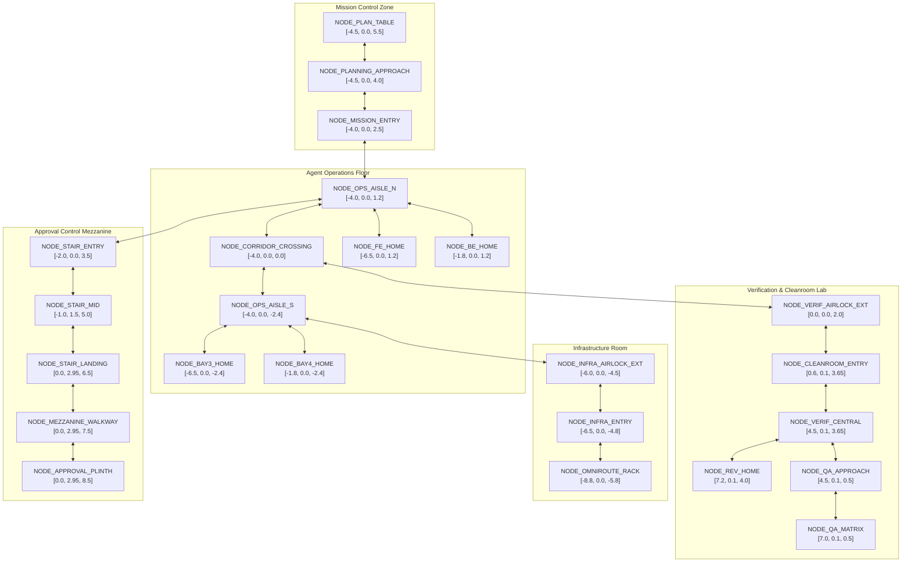

# GRAVITAS 3D HEADQUARTERS — NAVIGATION GRAPH & PATHING
## Deterministic Spatial Topology, Waypoints & Transit Dynamics (Wave 12G)

> **CORE CONCEPTUAL INVARIANTS**:
> - **LOCOMOTION != EXECUTION**: Character movement along waypoints does not execute code, advance tasks, or invoke harnesses.
> - **ARRIVAL != HANDOFF SATISFACTION**: Reaching a station waypoint does NOT satisfy or advance handoffs.
> - **CHARACTER POSITION != ARTIFACT CUSTODY**: Avatar location is decoupled from artifact docket custody.
> - **ANIMATION != TASK STATE**: Path traversal does not advance backend task FSM state.
> - **CAMERA != AUTHORITY**: Viewport framing does not alter navigation or scheduling.
> - **HUMAN OPERATOR != NPC**: There is NO fake operator avatar at the Approval Plinth.
> - **ROLE != HARNESS**: Waypoints belong to canonical organizational roles, never harnesses.

---

## 1. Waypoint Topology & Node Roster

The Headquarters navigation system (`apps/web/src/hq3d/motion/navigationGraph.ts`) implements a deterministic 24-waypoint directed network with strict clearance buffers:

---

## 2. Collision & Boundary Disciplines

1. **Airlock Boundary Enforcement**: Entry into the Verification Lab requires passing through `NODE_CLEANROOM_ENTRY` at `[0.6, 0.1, 3.65]`. Characters cannot cut across the glass partition.
2. **Staircase Traversal**: Access to the elevated Approval Mezzanine at $Y = 2.95\text{m}$ strictly follows the staircase trajectory (`NODE_STAIR_ENTRY` $\rightarrow$ `NODE_STAIR_MID` $\rightarrow$ `NODE_STAIR_LANDING`).
3. **No Furniture Collisions**: Desks, drafting tables, and server racks are surrounded by clearance buffers; waypoints are placed in clear transit aisles.
4. **Deterministic Routing**: Pathfinding uses pure A* with Euclidean distance heuristic and lexicographic node tie-breaking (`pathfinding.ts`).
