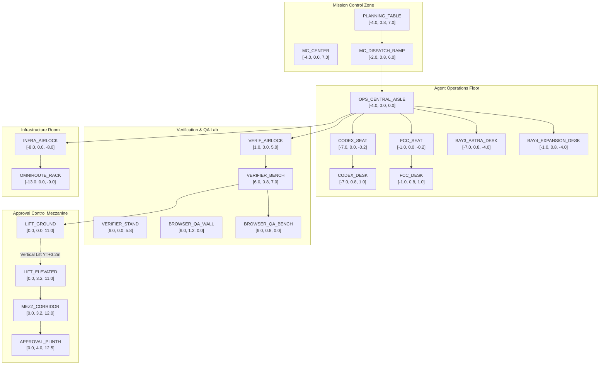

# GRAVITAS 3D HEADQUARTERS — NAVIGATION GRAPH & PATHING
## Deterministic Spatial Topology, Waypoints & Transit Dynamics

> **CORE PRINCIPLE**: Navigation in Gravitas is 100% deterministic and topological.  
> We do NOT begin with continuous AI pathfinding (such as Recast navmeshes or dynamic A* over arbitrary grids). Characters and packets move along predefined, authoritative navigation vectors between fixed architectural waypoints.

---

## 1. Waypoint Topology & Node Roster

The Headquarters contains 18 canonical waypoints located in 3D scene space (\(X, Y, Z\) in meters):

---

## 2. Waypoint Coordinates & Orientation Catalog

| Node ID | Zone | \(X\) (m) | \(Y\) (m) | \(Z\) (m) | Default Yaw (\(^{\circ}\)) | Node Purpose |
| :--- | :--- | :--- | :--- | :--- | :--- | :--- |
| `NODE_MC_PLANNING` | Mission Control | -4.0 | 0.85 | 7.0 | 0° (North) | Work packet origins; DAG layout table |
| `NODE_MC_DISPATCH` | Mission Control | -2.0 | 0.85 | 5.5 | 180° (South) | Intake ramp for optical conduit |
| `NODE_OPS_AISLE_N` | Agent Operations | -4.0 | 0.00 | 4.0 | 180° (South) | North entrance to central operations corridor |
| `NODE_OPS_AISLE_C` | Agent Operations | -4.0 | 0.00 | 0.0 | 180° (South) | Central interchange point for worker desks |
| `NODE_OPS_AISLE_S` | Agent Operations | -4.0 | 0.00 | -4.0 | 180° (South) | South entrance connecting to expansion bays |
| `NODE_CODEX_STAND` | Agent Operations | -6.0 | 0.00 | 0.0 | 90° (East) | Codex character standing position |
| `NODE_CODEX_CHAIR` | Agent Operations | -7.0 | 0.00 | 0.8 | 0° (North) | Codex seated working position |
| `NODE_CODEX_DESK` | Agent Operations | -7.0 | 0.85 | 1.4 | 0° (North) | Codex workstation packet docking plinth |
| `NODE_FCC_STAND` | Agent Operations | -2.0 | 0.00 | 0.0 | 270° (West) | FCC character standing position |
| `NODE_FCC_CHAIR` | Agent Operations | -1.0 | 0.00 | 0.8 | 0° (North) | FCC seated working position |
| `NODE_FCC_DESK` | Agent Operations | -1.0 | 0.85 | 1.4 | 0° (North) | FCC workstation packet docking plinth |
| `NODE_VERIF_PORTAL`| Verification Lab | 1.5 | 0.00 | 5.0 | 90° (East) | Glass sliding airlock entrance |
| `NODE_VERIF_STAND` | Verification Lab | 6.0 | 0.00 | 5.8 | 0° (North) | Independent Verifier character position |
| `NODE_VERIF_BENCH` | Verification Lab | 6.0 | 0.85 | 7.0 | 0° (North) | Digital diff console & test packet dock |
| `NODE_BQA_BENCH` | Browser QA Lab | 6.0 | 0.85 | 0.0 | 90° (East) | Playwright test device matrix station |
| `NODE_LIFT_BASE` | Central Atrium | 0.0 | 0.00 | 10.5 | 0° (North) | Vertical lift ground terminal |
| `NODE_LIFT_TOP` | Mezzanine | 0.0 | 3.20 | 10.5 | 0° (North) | Vertical lift mezzanine arrival terminal |
| `NODE_MEZZ_PLINTH` | Mezzanine | 0.0 | 4.00 | 12.5 | 0° (North) | Human authorization plinth under spotlight |

---

## 3. Transit Dynamics & Motion Velocities

To maintain an unhurried, architectural rhythm:
1. **Character Walking Speed**: Constant \(1.4\text{m/s}\) with smooth acceleration/deceleration curves (duration = \(\text{distance} / 1.4\text{s}\)).
2. **Packet Conduit Velocity**: Constant \(3.0\text{m/s}\) along smooth 3D Catmull-Rom cubic splines connecting station plinths.
3. **Vertical Lift Velocity**: Constant \(2.0\text{m/s}\) vertical ascent/descent (\(3.2\text{m}\) travel in \(1.6\text{s}\)).
4. **Collision Avoidance**: Because waypoints are dedicated to specific stations, two workers never share the same corridor destination simultaneously. If both Codex and FCC transit simultaneously, their parallel corridors are spaced \(5.0\text{m}\) apart, eliminating collision hazards.

---

## 4. Evaluation of Future Dynamic NavMesh Justification

When would a dynamic 3D Navigation Mesh (e.g., Three-Pathfinding or Recast.js) become technically justified in Gravitas?

- **Current Architecture (Wave 12)**: **NOT JUSTIFIED**.
  - With a fixed architectural layout, dedicated workstations, and fixed furniture, a static waypoint graph is faster, uses zero CPU per frame, has zero memory overhead, and guarantees 100% deterministic, repeatable paths with zero edge clipping.
- **Future Justification Triggers**:
  - If Gravitas implements **customizable user-built headquarter layouts** (drag-and-drop desk positioning).
  - If concurrent worker density scales beyond **20 simultaneous moving agents** on the same floor with dynamic obstacle avoidance.
  - Until those requirements exist, the deterministic waypoint graph is strictly superior.
