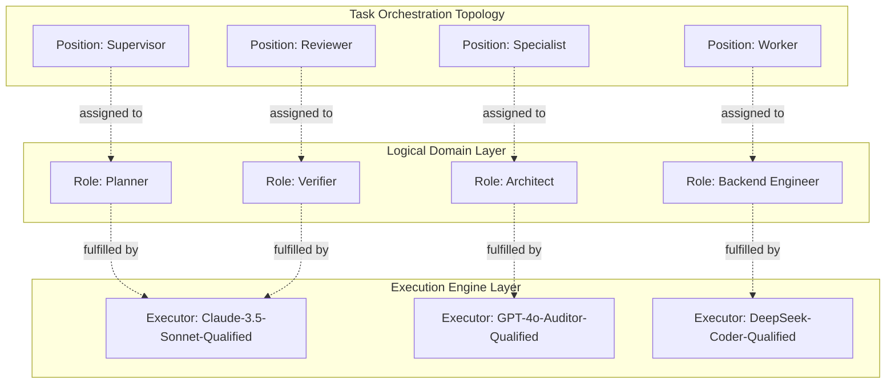
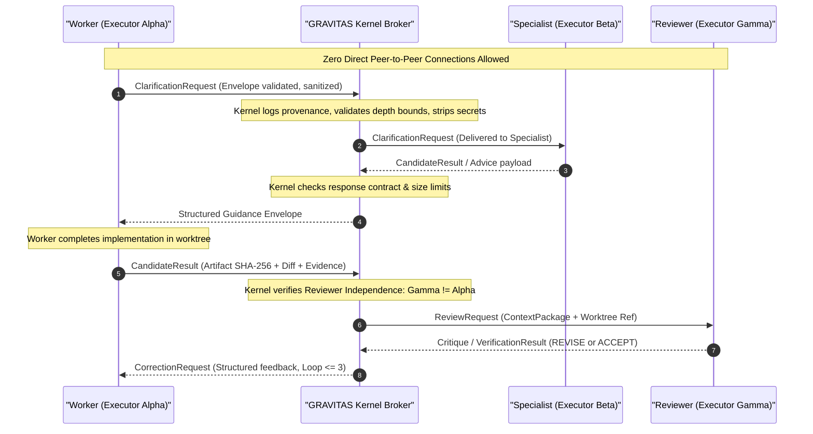
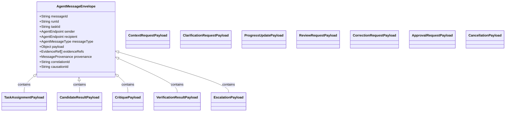
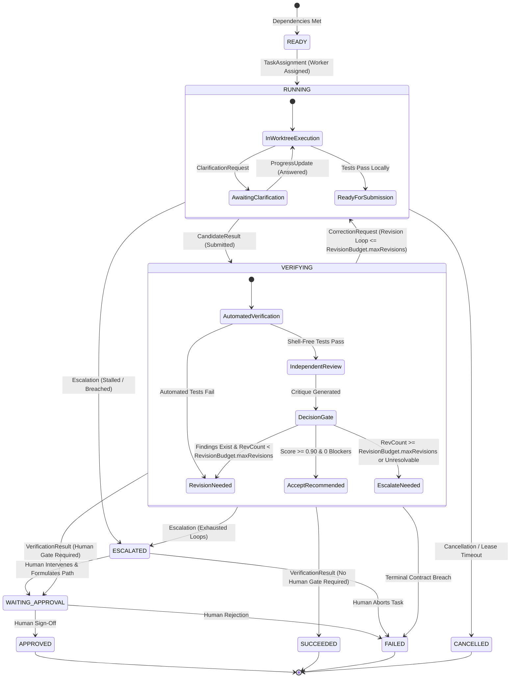
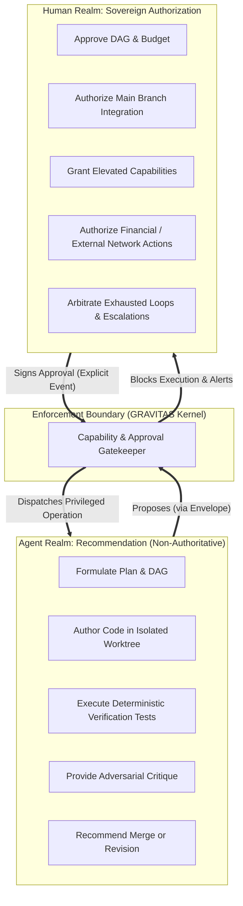
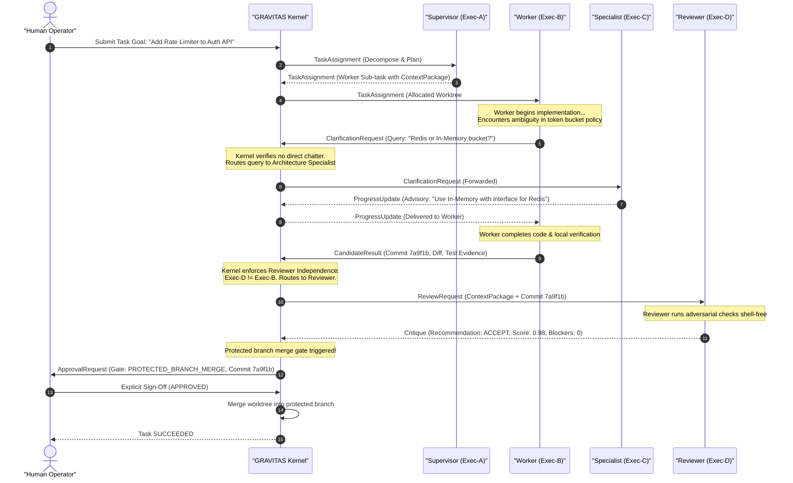
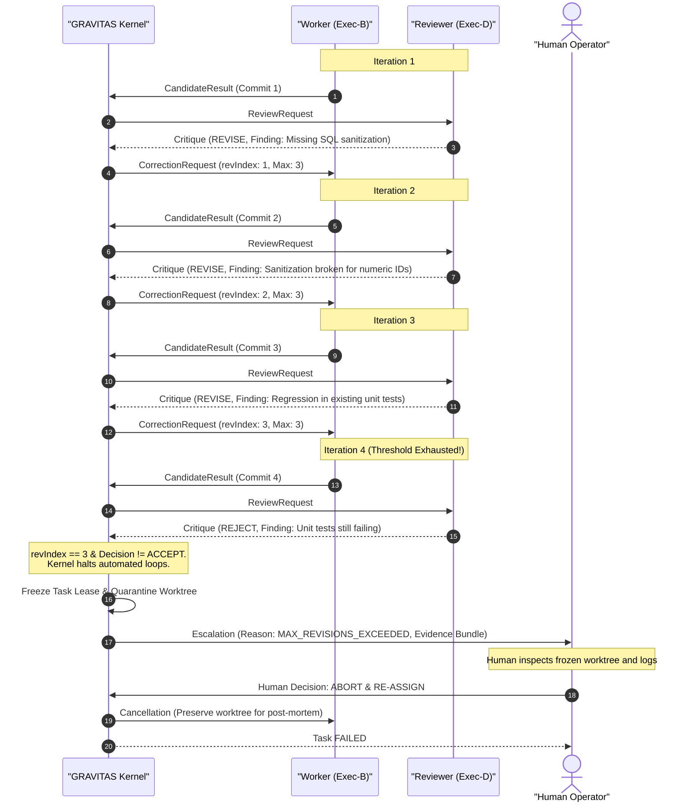

# GRAVITAS — MULTI-AGENT INTERACTION & PROTOCOL SPECIFICATION
## Bounded Interaction Architecture, Bounded Messaging, and Governance Invariants

**Document Identifier**: `GRAVITAS-ARCH-P3-002`  
**Governing Milestone**: Wave P3 (Interaction Model & Multi-Agent Protocol)  
**Requirement Mapping**: `REQ-P3-07`, `REQ-P3-08`, `REQ-P3-09`, `REQ-P3-10`, `REQ-P3-11`  
**Document Status**: Final Architecture Contract  

---

### Foundational System Invariant
$$\text{ROLE} \neq \text{EXECUTOR} \neq \text{HARNESS} \neq \text{MODEL} \neq \text{PROVIDER} \neq \text{GATEWAY} \neq \text{PROCESS}$$

### Interaction Invariant
$$\text{INTERACTION POSITION} \neq \text{LOGICAL ROLE} \neq \text{QUALIFIED EXECUTOR}$$

---

## 1. Executive Summary & Purpose

The GRAVITAS multi-agent system operates in high-stakes software engineering, code verification, and infrastructure governance. Unbounded conversational sprawl, unmediated inter-agent peer chat, and informal human clipboard bridging (e.g. copying text back and forth between web UIs and local terminals) introduce non-deterministic state corruption, context pollution, sycophantic hallucination loops, and catastrophic loss of auditability.

This specification establishes:
1. **The Four Interaction Positions**: Formal operational semantics for `Supervisor`, `Specialist`, `Worker`, and `Reviewer` as dynamic interaction slots distinct from persistent domain Roles and qualified Executors.
2. **The Bounded Message Protocol**: Strict kernel-mediated message routing that eliminates manual clipboard copying by routing all queries, clarifications, and artifacts canonically through the GRAVITAS kernel:
   $$\text{Worker} \longrightarrow \text{GRAVITAS} \longrightarrow \text{Supervisor/Specialist} \longrightarrow \text{GRAVITAS} \longrightarrow \text{Worker}$$
3. **The `AgentMessageEnvelope<T>` Specification**: A typed, cryptographically traceable, causally tracked schema governing every multi-agent interaction.
4. **The Closed Set of 12 Message Types**: Strongly typed operational payloads with strict state machine transition grammars.
5. **Anti-Chatter & Boundedness Invariants**: Mathematically bounded depth limits, revision caps (governed by configurable `RevisionBudget`, non-normative default: $N \le 3$), retry policies, and cycle/deadlock detection.
6. **Bounded Context Transfer Package (`ContextPackage`)**: Deterministic, hashed, redacted, and minimal context packaging preventing context window bloat and historical narrative drift.
7. **The Supervision & Review Loop**: Deterministic finite state machine (`ASSIGN` $\rightarrow$ `EXECUTE` $\rightarrow$ `SUBMIT` $\rightarrow$ `REVIEW` $\rightarrow$ `[ACCEPT | REVISE | ESCALATE | FAIL]`) enforcing the non-negotiable **Reviewer Independence Invariant**.
8. **Human Sovereignty & Escalation Gates**: Non-negotiable boundaries where automated authority terminates and sovereign human sign-off is mandatory.

---

## 2. Definitional Taxonomy: The 4 Interaction Positions

### 2.1 Disambiguation: Position vs. Role vs. Executor

In GRAVITAS, an **Interaction Position** is a temporary, task-scoped responsibility assumed by a qualified agent within an orchestration topology. Conflating an interaction position with a domain role or an agent executor violates architectural boundaries.

| Dimension | Definition | Lifetime | Example |
| :--- | :--- | :--- | :--- |
| **Role** | Organizational domain capability contract defining *what* standards, skills, and prompts govern domain behavior. | System-wide / Permanent | `Backend Engineer`, `Verifier`, `Security Auditor` |
| **Executor** | Qualified agent profile/identity equipped with specific tools, models, and qualification status. | Deployment / WorkSession | `Adversarial Coder v2`, `Fast Reviewer LLM-A` |
| **Position** | Dynamic interaction slot occupied during the execution of a specific DAG node or sub-protocol. | Task-scoped / Ephemeral | `Worker` (implementing), `Reviewer` (auditing) |

An agent whose primary Role is `Backend Engineer` may occupy the `Worker` position for an API implementation task, but occupy the `Specialist` position when consulted on schema design by a different worker, or occupy the `Reviewer` position when auditing a pull request authored by another engineer.



---

### 2.2 Formal Semantics of the 4 Positions

#### 1. Position: `Supervisor`
- **Primary Responsibility**: Goal decomposition, task DAG generation, dependency scheduling, resource allocation, context package synthesis, lease monitoring, and escalation arbitration.
- **Authority**:
  - May issue `TaskAssignment`, `ContextPackage`, and `Cancellation` messages.
  - May accept or reject candidate completions submitted by Workers after independent review.
  - May escalate unresolved deadlocks or terminal failures to Human Operators.
- **Constraints**:
  - **Non-Execution Invariant**: A Supervisor must NOT directly execute shell commands, mutate codebase files, or generate implementation code inside task worktrees.
  - Must mediate all task delegations through formal kernel envelopes.

#### 2. Position: `Specialist`
- **Primary Responsibility**: Deep domain consulting, algorithmic problem-solving, architectural validation, and constraint formulation without taking on general task execution ownership.
- **Authority**:
  - May receive `ContextRequest` or `ClarificationRequest` forwarded by the GRAVITAS kernel.
  - May return targeted advice, formal mathematical constraints, or API schemas.
- **Constraints**:
  - **Advisory Invariant**: A Specialist acts purely in an advisory capacity. It cannot issue task assignments, cannot approve candidate results, and cannot modify filesystem state.
  - **Stateless Response Invariant**: Specialists do not retain task execution state; each interaction is isolated and bounded by the provided query payload.

#### 3. Position: `Worker`
- **Primary Responsibility**: Leaf-level task execution, workspace artifact production, localized test execution, and candidate result generation inside an isolated Git worktree.
- **Authority**:
  - Operates within an explicitly sandboxed Git worktree governed by a `CapabilityGrant`.
  - May request context clarification or domain assistance exclusively via the GRAVITAS kernel.
  - Submits final deliverables via `CandidateResult` messages.
- **Constraints**:
  - **Confinement Invariant**: A Worker must never read, write, or execute outside its designated task worktree and assigned file paths.
  - **Zero Self-Delegation**: A Worker cannot spawn sub-tasks or assign work to other agents; all sub-division requests must flow back to the Supervisor.

#### 4. Position: `Reviewer`
- **Primary Responsibility**: Independent, adversarial audit of candidate deliverables against formal acceptance criteria, test execution suites, security policies, and architectural contracts.
- **Authority**:
  - Inspects code diffs, verification reports, and evidence bundles.
  - Emits formal `Critique`, `CorrectionRequest`, or `VerificationResult` messages.
  - Recommends `ACCEPT`, `REVISE`, `ESCALATE`, or `FAIL`.
- **Constraints**:
  - **Reviewer Independence Invariant**: 
    $$\text{Reviewer.executorId} \neq \text{Worker.executorId} \quad \land \quad \text{Reviewer.position} \neq \text{Worker.position}$$
    Under no circumstances may an executor review, critique, or approve code or artifacts authored by itself.
  - **Read-Only / Test-Only Invariant**: A Reviewer must not rewrite or patch candidate code during review; corrections must be requested from the Worker or escalated.

---

## 3. The Bounded Message Protocol

### 3.1 Eliminating Human Clipboard Transport

A pervasive failure mode in ad-hoc AI engineering is the "Human Clipboard Anti-Pattern":
```
[Antigravity / Local IDE] 
       │ (Developer copies prompt/diff)
       ▼
 [Developer Clipboard] 
       │ (Developer pastes into web chat)
       ▼
[ChatGPT / Claude Web] 
       │ (Developer copies response)
       ▼
 [Developer Clipboard] 
       │ (Developer pastes back into IDE)
       ▼
[Antigravity / Local Workspace]
```

**Consequences of Human Clipboard Transport**:
1. Zero provenance: Commits lose attribution to the generating model, prompt, and parameters.
2. Context corruption: Humans arbitrarily truncate, rephrase, or misformat messages.
3. Silent security bypass: Sensitive secrets, internal tokens, or PII leak into external web chats without audit logging.
4. Loss of determinism: The system state cannot be reconstructed, debugged, or replayed.

### 3.2 Canonical GRAVITAS Message Bus Topology

GRAVITAS replaces manual clipboard hopping with a unified, kernel-mediated, bounded messaging bus. All inter-agent communications pass strictly through the GRAVITAS Kernel Message Broker:

$$\text{Worker} \xrightarrow{\text{Message}} \text{GRAVITAS Kernel} \xrightarrow{\text{Validated Dispatch}} \text{Supervisor / Specialist} \xrightarrow{\text{Response}} \text{GRAVITAS Kernel} \xrightarrow{\text{Validated Delivery}} \text{Worker}$$



### 3.3 Kernel Broker Invariants
1. **Zero Unmediated P2P**: Direct socket, HTTP, or memory sharing between agents is physically partitioned. Every message is addressed to the Kernel Bus.
2. **Schema Validation**: Any message failing JSON-schema validation against `AgentMessageEnvelope<T>` is rejected at the ingress gate with an error event.
3. **Secret Redaction**: Inbound and outbound payloads pass through regex and entropy-based secret scrubbers.
4. **Causality Graph Maintenance**: Every message appends to the immutable causal event ledger, establishing a strict Directed Acyclic Graph (DAG) of system intent.

---

## 4. Formal `AgentMessageEnvelope<T>` Schema

Every message transmitted within the GRAVITAS multi-agent interaction runtime is wrapped in the standard envelope.

```typescript
/**
 * Closed set of interaction positions in GRAVITAS.
 */
export type InteractionPosition = 'SUPERVISOR' | 'SPECIALIST' | 'WORKER' | 'REVIEWER' | 'SYSTEM'

/**
 * Closed set of 12 multi-agent message types.
 */
export type AgentMessageType =
  | 'TaskAssignment'
  | 'ContextRequest'
  | 'ClarificationRequest'
  | 'ProgressUpdate'
  | 'CandidateResult'
  | 'ReviewRequest'
  | 'Critique'
  | 'CorrectionRequest'
  | 'VerificationResult'
  | 'Escalation'
  | 'ApprovalRequest'
  | 'Cancellation'

/**
 * Full agent endpoint identification tuple.
 */
export interface AgentEndpoint {
  /** Durable logical domain role ID (e.g. 'BACKEND_ENGINEER') */
  readonly roleId: string
  /** Qualified runtime executor instance ID (e.g. 'exec_claude35_sonnet_01') */
  readonly executorId: string
  /** Active interaction position assumed for this task */
  readonly position: InteractionPosition
  /** Sub-process ID or OS PID handling the execution, if applicable */
  readonly processId?: number | undefined
}

/**
 * Immutable reference to an execution evidence artifact.
 */
export interface EvidenceRef {
  /** Stable evidence identifier */
  readonly id: string
  /** URI pointing to persistent storage (e.g. 'evidence://runs/run-99/evidence-01.json') */
  readonly uri: string
  /** Cryptographic SHA-256 hash of the evidence artifact */
  readonly sha256: string
  /** Standard MIME type */
  readonly mimeType: string
  /** Byte size of artifact */
  readonly sizeBytes: number
  /** Timestamp when evidence was captured */
  readonly capturedAt: string
}

/**
 * Multi-layer provenance tracking conforming to the Foundational Invariant:
 * ROLE != EXECUTOR != HARNESS != MODEL != PROVIDER != GATEWAY != PROCESS
 */
export interface MessageProvenance {
  /** Identifier of the qualified harness invoking the agent */
  readonly harnessId: string
  /** Specific LLM weights / checkpoint utilized */
  readonly modelId: string
  /** Vendor hosting inference */
  readonly providerId: string
  /** Routing/Proxy gateway layer utilized (or 'DIRECT') */
  readonly gatewayId: string
  /** Host machine hostname or container ID */
  readonly hostId: string
  /** Git commit SHA of the governing repository runtime */
  readonly repoCommitSha: string
  /** Environment configuration hash */
  readonly environmentHash: string
}

/**
 * Formal Agent Message Envelope wrapping all inter-agent communications.
 */
export interface AgentMessageEnvelope<T = unknown> {
  /** Globally unique, time-sortable message identifier (UUIDv7 or ULID) */
  readonly messageId: string
  /** Orchestrator execution run identifier */
  readonly runId: string
  /** Unique task identifier within the DAG */
  readonly taskId: string
  /** Parent task identifier, if running in a hierarchical sub-task */
  readonly parentTaskId?: string | undefined
  /** Explicit sender endpoint tuple */
  readonly sender: AgentEndpoint
  /** Explicit target recipient endpoint tuple */
  readonly recipient: AgentEndpoint
  /** Closed-set message type tag */
  readonly messageType: AgentMessageType
  /** Strongly typed message payload */
  readonly payload: T
  /** Immutable evidence artifacts attached to this message */
  readonly evidenceRefs: readonly EvidenceRef[]
  /** Complete physical and software provenance of the message generation */
  readonly provenance: MessageProvenance
  /** ISO-8601 UTC timestamp of message generation */
  readonly timestamp: string
  /** Distributed trace identifier spanning the entire collaborative workflow */
  readonly correlationId: string
  /** The specific messageId that directly caused/triggered this message */
  readonly causationId?: string | undefined
  /** Interaction depth counter (incremented at each delegation/forwarding hop) */
  readonly interactionDepth: number
  /** Revision loop counter for the active taskId */
  readonly revisionIndex: number
}
```

---

## 5. The Closed Set of 12 Message Types

Every message type within GRAVITAS has an explicit schema, sender/recipient constraints, state machine triggers, and permitted next responses.



---

### 5.1 `TaskAssignment`
- **Purpose**: Initiates execution of a DAG task. Dispatches the bounded `ContextPackage`, assigned worktree, and capabilities to a Worker.
- **Allowed Sender**: `SUPERVISOR`
- **Allowed Recipient**: `WORKER`
- **State Transition**: `READY` $\longrightarrow$ `RUNNING`
- **Payload Schema**:
```typescript
export interface TaskAssignmentPayload {
  readonly taskId: string
  readonly taskName: string
  readonly contextPackage: ContextPackage
  readonly allocatedWorktreePath: string
  readonly capabilityGrantToken: string
  readonly timeoutMs: number
  readonly maxRevisionsAllowed: number
}
```
- **Valid Follow-Up Messages**: `ProgressUpdate`, `ClarificationRequest`, `ContextRequest`, `CandidateResult`, `Escalation`.

---

### 5.2 `ContextRequest`
- **Purpose**: Worker requests additional scoped data or documentation explicitly omitted from the initial context package.
- **Allowed Sender**: `WORKER`
- **Allowed Recipient**: `SUPERVISOR`
- **State Transition**: None (Worker remains `RUNNING`, enters temporary wait state).
- **Payload Schema**:
```typescript
export interface ContextRequestPayload {
  readonly taskId: string
  readonly requestedResourceUris: readonly string[]
  readonly rationale: string
  readonly estimatedTokenImpact: number
}
```
- **Valid Follow-Up Messages**: `TaskAssignment` (updated package), `Critique` (denial), or `Escalation`.

---

### 5.3 `ClarificationRequest`
- **Purpose**: Worker queries a Specialist or Supervisor regarding an ambiguity in the task specification or contract.
- **Allowed Sender**: `WORKER`
- **Allowed Recipient**: `SUPERVISOR` | `SPECIALIST`
- **State Transition**: None.
- **Payload Schema**:
```typescript
export interface ClarificationRequestPayload {
  readonly taskId: string
  readonly question: string
  readonly specificAmbiguity: string
  readonly hypothesizedAnswers: readonly string[]
  readonly blocking: boolean
}
```
- **Valid Follow-Up Messages**: `ProgressUpdate` (clarification answer delivered by Kernel).

---

### 5.4 `ProgressUpdate`
- **Purpose**: Worker or Kernel emits periodic execution telemetry, milestone achievements, or answers to clarifications.
- **Allowed Sender**: `WORKER` | `SUPERVISOR` | `SPECIALIST`
- **Allowed Recipient**: `SUPERVISOR` | `WORKER` | `SYSTEM`
- **State Transition**: None.
- **Payload Schema**:
```typescript
export interface ProgressUpdatePayload {
  readonly taskId: string
  readonly percentComplete: number
  readonly statusMessage: string
  readonly intermediateArtifacts?: readonly string[] | undefined
  readonly advisoryAnswer?: string | undefined
}
```
- **Valid Follow-Up Messages**: `ProgressUpdate`, `CandidateResult`, `Escalation`.

---

### 5.5 `CandidateResult`
- **Purpose**: Worker announces completion of implementation and submits its candidate artifacts, git diff, and execution proof for review.
- **Allowed Sender**: `WORKER`
- **Allowed Recipient**: `SUPERVISOR` | `SYSTEM`
- **State Transition**: `RUNNING` $\longrightarrow$ `VERIFYING`
- **Payload Schema**:
```typescript
export interface CandidateResultPayload {
  readonly taskId: string
  readonly worktreeCommitSha: string
  readonly modifiedFiles: readonly string[]
  readonly gitDiffStat: string
  readonly workerSelfAssessment: {
    readonly passedDeterministicTests: boolean
    readonly summaryOfChanges: string
    readonly knownLimitations: readonly string[]
  }
}
```
- **Valid Follow-Up Messages**: `ReviewRequest`.

---

### 5.6 `ReviewRequest`
- **Purpose**: Kernel or Supervisor assigns an independent Reviewer to audit the candidate result against acceptance criteria.
- **Allowed Sender**: `SUPERVISOR` | `SYSTEM`
- **Allowed Recipient**: `REVIEWER` (Must satisfy `Reviewer.executorId !== Worker.executorId`)
- **State Transition**: `VERIFYING` (active review).
- **Payload Schema**:
```typescript
export interface ReviewRequestPayload {
  readonly taskId: string
  readonly candidateResult: CandidateResultPayload
  readonly contextPackage: ContextPackage
  readonly acceptanceCriteria: readonly string[]
  readonly testExecutionPlanId?: string | undefined
  readonly timeoutMs: number // Bounded review lease timeout (e.g. 180,000ms)
}
```
- **Valid Follow-Up Messages**: `Critique`, `VerificationResult`, `Escalation`.

---

### 5.7 `Critique`
- **Purpose**: Reviewer delivers an adversarial assessment identifying specific deficiencies, security vulnerabilities, or contract violations.
- **Allowed Sender**: `REVIEWER`
- **Allowed Recipient**: `SUPERVISOR`
- **State Transition**: Reviewer evaluation recorded.
- **Payload Schema**:
```typescript
export interface CritiqueFinding {
  readonly severity: 'BLOCKER' | 'MAJOR' | 'MINOR' | 'INFO'
  readonly filePath: string
  readonly lineRange?: readonly [number, number] | undefined
  readonly description: string
  readonly ruleOrContractViolated: string
  readonly suggestedRemediation: string
}

export interface CritiquePayload {
  readonly taskId: string
  readonly recommendation: 'ACCEPT' | 'REVISE' | 'REJECT' | 'ESCALATE'
  readonly score: number // 0.0 to 1.0
  readonly findings: readonly CritiqueFinding[]
  readonly summary: string
}
```
- **Valid Follow-Up Messages**: `CorrectionRequest`, `VerificationResult`, `Escalation`.

---

### 5.8 `CorrectionRequest`
- **Purpose**: Supervisor or Kernel orders the Worker back into execution to remediate specific findings from the Reviewer.
- **Allowed Sender**: `SUPERVISOR` | `SYSTEM`
- **Allowed Recipient**: `WORKER`
- **State Transition**: `VERIFYING` $\longrightarrow$ `RUNNING` (Revision loop incremented).
- **Payload Schema**:
```typescript
export interface CorrectionRequestPayload {
  readonly taskId: string
  readonly revisionIndex: number
  readonly maxRevisions: number
  readonly requiredRemediations: readonly CritiqueFinding[]
  readonly previousCommitSha: string
}
```
- **Valid Follow-Up Messages**: `CandidateResult`, `Escalation`.

---

### 5.9 `VerificationResult`
- **Purpose**: Formal deterministic verification verdict issued after running automated test suites, typecheckers, and linters shell-free in the worktree.
- **Allowed Sender**: `REVIEWER` | `SYSTEM`
- **Allowed Recipient**: `SUPERVISOR`
- **State Transition**: `VERIFYING` $\longrightarrow$ `WAITING_APPROVAL` (if passing and human gate required) | `SUCCEEDED` (if passing without gate) | `FAILED`
- **Payload Schema**:
```typescript
export interface CommandExecutionSummary {
  readonly commandId: string
  readonly executable: string
  readonly args: readonly string[]
  readonly exitCode: number | null
  readonly durationMs: number
  readonly passed: boolean
}

export interface VerificationResultPayload {
  readonly taskId: string
  readonly status: 'PASSED' | 'FAILED'
  readonly commandSummaries: readonly CommandExecutionSummary[]
  readonly allMandatoryCommandsPassed: boolean
  readonly evidenceBundleUri: string
}
```
- **Valid Follow-Up Messages**: `ApprovalRequest`, `Escalation`, or task finalization.

---

### 5.10 `Escalation`
- **Purpose**: Indicates that an automated loop has stalled, an unresolvable conflict occurred, max revisions were exceeded, or a boundary breach occurred.
- **Allowed Sender**: `WORKER` | `REVIEWER` | `SUPERVISOR`
- **Allowed Recipient**: `SUPERVISOR` | `SYSTEM`
- **State Transition**: Enters `ESCALATED` / freezes task execution.
- **Payload Schema**:
```typescript
export type EscalationReason =
  | 'MAX_REVISIONS_EXCEEDED'
  | 'REPEATED_TEST_FAILURE'
  | 'DEADLOCK_DETECTED'
  | 'PRIVILEGE_VIOLATION'
  | 'RESOURCE_EXHAUSTION'
  | 'UNRESOLVED_SPEC_AMBIGUITY'

export interface EscalationPayload {
  readonly taskId: string
  readonly reason: EscalationReason
  readonly diagnosticMessage: string
  readonly attemptedMitigations: readonly string[]
  readonly proposedHumanActions: readonly string[]
}
```
- **Valid Follow-Up Messages**: `ApprovalRequest` (to human) or `Cancellation`.

---

### 5.11 `ApprovalRequest`
- **Purpose**: Formally petitions the sovereign Human Operator for authorization to execute a privileged, protected, or destructive operation.
- **Allowed Sender**: `SUPERVISOR` | `SYSTEM`
- **Allowed Recipient**: `SYSTEM` (Rendered to Human Operator)
- **State Transition**: Task transitions to `WAITING_APPROVAL`.
- **Payload Schema**:
```typescript
export type ApprovalGateType =
  | 'DESTRUCTIVE_ACTION'
  | 'PROTECTED_BRANCH_MERGE'
  | 'PRIVILEGE_ESCALATION'
  | 'EXTERNAL_NETWORK_PUBLISH'
  | 'IRRECOVERABLE_FAILURE_OVERRIDE'

export interface ApprovalRequestPayload {
  readonly taskId: string
  readonly gateType: ApprovalGateType
  readonly summary: string
  readonly exactOperationDescription: string
  readonly targetResources: readonly string[]
  readonly blastRadiusSummary: string
  readonly reversibilityAssessment: 'REVERSIBLE' | 'PARTIALLY_REVERSIBLE' | 'IRREVERSIBLE'
  readonly timeoutMs: number
}
```
- **Valid Follow-Up Messages**: Human decision (`APPROVED` $\longrightarrow$ merge/execute, or `REJECTED` $\longrightarrow$ `FAILED`).

---

### 5.12 `Cancellation`
- **Purpose**: Aborts an active task execution immediately due to dependency failure, user intervention, or catastrophic timeout.
- **Allowed Sender**: `SUPERVISOR` | `SYSTEM`
- **Allowed Recipient**: `WORKER` | `REVIEWER` | `SPECIALIST`
- **State Transition**: Any active state $\longrightarrow$ `CANCELLED`.
- **Payload Schema**:
```typescript
export interface CancellationPayload {
  readonly taskId: string
  readonly reason: string
  readonly forceKillProcesses: boolean
  readonly preserveWorktreeForInspection: boolean
}
```
- **Valid Follow-Up Messages**: Terminal (no follow-up permitted).

---

## 6. Anti-Chatter & Boundedness Architecture

### 6.1 The Zero Unbounded Conversational Loops Invariant `[INVARIANT]`
$$\forall \text{ interaction } I, \quad \text{Type}(I) \in \text{ClosedSet} \quad \land \quad \text{IsMultiTurnChat}(I) = \text{FALSE}$$
No agent is permitted to open a freeform conversational chat session with another agent. Every exchange consists strictly of a discrete, typed request envelope followed by a discrete, typed response envelope mediated and recorded by the GRAVITAS kernel.

---

### 6.2 Structural Boundedness & Configurable Policy Architecture `[CONFIGURABLE POLICY]`

> **ARCHITECTURAL INVARIANT `[INVARIANT]`:**  
> **Execution must be bounded.**  
> The specific numerical bounds, budgets, and timeouts are **configurable policies**. They are NEVER frozen architectural constants.

Operational bounds are governed by explicit policy contracts:
- **`InteractionBudget`**: Governs turn limits ($N_{\text{total\_turns}}$, $N_{\text{clarifications}}$).
- **`RevisionBudget`**: Governs maximum review cycles ($N_{\text{revisions}}$).
- **`TokenBudget`**: Governs cumulative input and output token consumption ($K_{\text{tokens}}$).
- **`FinancialBudget`**: Governs USD financial ceiling per task lease ($C_{\text{cost}}$).
- **`ExecutionTimeoutPolicy`**: Governs worker process execution duration ($T_{\text{worker}}$).
- **`ReviewTimeoutPolicy`**: Governs independent reviewer duration ($T_{\text{review}}$).
- **`WaitTimeoutPolicy`**: Governs advisory consultation waiting duration ($T_{\text{wait}}$).

#### Policy Ownership & Precedence Rules `[ARCHITECTURAL CONTRACT]`
1. **Ownership**: System defaults are provided by the GRAVITAS platform configuration. The human operator may establish global run-level overrides or per-task overrides. Supervisors may propose tighter bounds within operator-authorized ceilings, but can never loosen operator ceilings.
2. **Precedence Hierarchy**:
   $$\text{Operator Explicit Override} \succ \text{Run-Level Policy} \succ \text{Task Def Specific Policy} \succ \text{System Defaults}$$
3. **Escalation When Exhausted**: Exhaustion of any budget parameter (turns, revisions, tokens, dollars, or timeouts) MUST immediately freeze task execution, transition the task to `ESCALATED`, and notify the human operator with a structured diagnostic ledger.
4. **Provenance**: Every applied policy object is hashed and recorded in `ExecutionProvenance.executor.appliedPolicyDigest`.

#### Configurable Bounds Reference Table

| Bound Dimension | Policy Object | Configurable Field | Non-Normative Example Default | Enforcement Action on Breach `[ARCHITECTURAL CONTRACT]` |
| :--- | :--- | :--- | :--- | :--- |
| **Global Task Turn Ceiling** | `InteractionBudget` | `maxTotalTurns` | *8 turns* (NON-NORMATIVE EXAMPLE) | Across ALL failure categories combined. Exceeding triggers immediate human escalation. |
| **Max Revision Loops** | `RevisionBudget` | `maxRevisions` | *3 revisions* (NON-NORMATIVE EXAMPLE) | Mandatory `Escalation` to Human Operator; execution freezes. |
| **Max Cumulative Tokens** | `TokenBudget` | `maxCumulativeTokens` | *200,000 tokens* (NON-NORMATIVE EXAMPLE) | Halts execution turn, preserves worktree, and triggers human escalation. |
| **Max Financial Cost** | `FinancialBudget` | `maxCostCeilingUsd` | *$2.50 USD* (NON-NORMATIVE EXAMPLE) | Immediate financial freeze; halts inference dispatch. |
| **Max Clarifications / Task**| `InteractionBudget` | `maxClarificationTurns` | *3 queries* (NON-NORMATIVE EXAMPLE) | Worker must proceed under conservative assumptions or escalate. |
| **Worker Execution Timeout** | `ExecutionTimeoutPolicy`| `workerTimeoutMs` | *600,000 ms (10m)* (NON-NORMATIVE EXAMPLE) | Worker process tree killed via candidate OS mechanisms; worktree quarantined. |
| **Review Lease Timeout** | `ReviewTimeoutPolicy` | `reviewTimeoutMs` | *180,000 ms (3m)* (NON-NORMATIVE EXAMPLE) | Reviewer lease expired; review escalated to Human Operator. |
| **Advisory Wait Timeout** | `WaitTimeoutPolicy` | `advisoryWaitTimeoutMs` | *120,000 ms (2m)* (NON-NORMATIVE EXAMPLE) | Blocking edge pruned from Wait-For Graph; worker unblocked with error. |

---

### 6.3 Blocking Dependency Cycle Detection Architecture

#### Required Architectural Behavior `[ARCHITECTURAL CONTRACT]`
The architecture requires that:
> **Blocking dependency cycles must be detected deterministically before they create indefinite agent deadlock.**

When agents request clarifications or consultations that block their progress, the system MUST model these active blocking relationships and verify that granting a blocking dependency does not introduce a circular wait condition.

#### Agent Dependency Wait-For Graph ($G_W$) `[ARCHITECTURAL CONTRACT]`
The Kernel maintains an active stateful dependency graph:
$$G_W = (V_A, E_W)$$
where $V_A$ represents active agent execution slots, and a directed edge $(A, B) \in E_W$ exists if and only if agent $A$ is blocked awaiting a response, clarification, or review from agent $B$.

- **Detection Rule**: Before transitioning agent $A$ into a blocked wait-state for agent $B$, the Kernel evaluates whether adding $(A, B)$ would introduce a cycle into $G_W$:
  $$\text{HasCycle}(G_W \cup \{ (A, B) \}) = \text{TRUE} \implies \text{DEADLOCK\_PREVENTED}$$
- **Cycle Remediation `[INVARIANT]`**: If adding $(A, B)$ creates a cycle, the request is rejected immediately with error `CIRCULAR_DEPENDENCY_DEADLOCK`, the transaction is rolled back, and the task escalates to the Human Operator.
- **Liveness Guarantee `[ARCHITECTURAL CONTRACT]`**: Every edge in $E_W$ is governed by `WaitTimeoutPolicy.advisoryWaitTimeoutMs`. If the timer expires before $B$ responds, the edge is forcibly pruned, unblocking $A$ with a `DEPENDENCY_TIMEOUT` error.

#### Reference Implementation Algorithm `[REFERENCE ALGORITHM]`
The canonical reference implementation uses **Tarjan's Strongly Connected Components (SCC)** algorithm or a depth-first search (DFS) cycle detector evaluated in $O(|V_A| + |E_W|)$ time. Any cycle-detection algorithm with deterministic termination and zero false negatives is an authorized implementation alternative.

---

## 7. Bounded Context Transfer Package (`ContextPackage`)

Uncontrolled context injection causes attention dilution, lost instructions, and token budget exhaustion. A `ContextPackage` is deterministically compiled, cryptographically hashed, and verified before transmission.

```mermaid
flowchart LR
    subgraph Assembly["Context Package Assembly"]
        Obj["1. Single Objective"]
        Con["2. Acceptance Contract"]
        Files["3. Allowed File Whitelist"]
        Par["4. Structured Upstream Results"]
        Ev["5. Evidence Artifact References"]
        Crit["6. Previous Critique Findings"]
    end

    subgraph Pipeline["Sanitization Pipeline"]
        Scrub["Secret & PII Redactor"]
        Sort["Deterministic Key Canonicalizer"]
        Hash["SHA-256 Digest Generator"]
    end

    subgraph Delivered["Delivered ContextPackage"]
        CP["Immutable ContextPackage<br/>(Digest: a1b2c3...)"]
    end

    Assembly --> Scrub --> Sort --> Hash --> Delivered
```



### 7.1 Schema Definition

```typescript
/**
 * Upstream task outcome summary (structured, non-chat).
 */
export interface ParentTaskOutcome {
  readonly taskId: string
  readonly roleId: string
  readonly publicInterfacesCreated: readonly string[]
  readonly summary: string
  readonly artifactRefs: readonly string[]
}

/**
 * Deterministic Bounded Context Transfer Package.
 */
export interface ContextPackage {
  /** Unique context package identifier */
  readonly contextId: string
  /** Schema version */
  readonly schemaVersion: '1.0.0'
  /** Precise, single-sentence objective statement */
  readonly objective: string
  /** Formal contract criteria and non-negotiables */
  readonly contractMarkdown: string
  /** Whitelist of repository-relative file paths or globs permitted for access */
  readonly allowedFiles: readonly string[]
  /** Structured output from upstream dependencies (interfaces and summaries only) */
  readonly upstreamOutcomes: readonly ParentTaskOutcome[]
  /** Pointers to immutable evidence */
  readonly evidencePointers: readonly EvidenceRef[]
  /** If this is a revision cycle, the exact critique findings that must be remediated */
  readonly previousCritique?: readonly CritiqueFinding[] | undefined
  /** Cryptographic SHA-256 digest of the canonicalized JSON payload */
  readonly sha256Digest: string
  /** Total estimated token size */
  readonly estimatedTokenCount: number
}
```

### 7.2 Anti-Pollution Rules

1. **Zero Full Chat History Dumps**:
   Injecting previous multi-turn conversation logs into an agent's context is strictly prohibited. Only the formal `ContextPackage` is provided.
2. **Deterministic Assembly & Sorting**:
   All JSON keys, file lists, and findings arrays must be sorted lexicographically before hashing.
   $$\text{sha256Digest} = \text{SHA256}(\text{CanonicalJSON}(\text{ContextPackage}))$$
   Two identical tasks produce byte-for-byte identical context packages.
3. **Secret Redaction Pipeline**:
   The Kernel executes automated pattern matching (AWS keys, OpenAI tokens, private SSH keys, bearer tokens) across all fields. Any match replaces the token with `[REDACTED_SECRET:<hash>]`.
4. **Hard Size Budgets**:
   - Maximum Token Budget: Governed by configurable `TokenBudget.maxContextPackageTokens` (non-normative example default: $\le 12,000$ tokens per context package).
   - If upstream dependencies produce extensive outputs, they must be summarized by deterministic tooling or indexed via `EvidenceRef` URIs, never inlined as raw text.

---

## 8. The Supervision & Review Loop

Every task in GRAVITAS executes through a governed state machine enforcing the separation between execution, evaluation, and approval.

### 8.1 State Machine Specification



### 8.2 The IndependencePolicy Architecture & Multi-Tier Independence Model

> **ARCHITECTURAL INVARIANT `[INVARIANT]`:**  
> A Worker must **NEVER** satisfy an independent review requirement merely by spawning another instance of itself and declaring it independent. Review must be structurally independent.

Reviewer independence is governed by an explicit `IndependencePolicy` that separates non-negotiable structural requirements from operational preferences:

```typescript
export interface IndependencePolicy {
  /** Mandatory structural independence: must always be true */
  readonly requireDistinctLogicalRole: true;
  readonly requireDistinctExecutorInstance: true;
  readonly requireIsolatedContextSession: true;
  readonly requireIndependentPromptDerivation: true;
  readonly forbidWorkerSelectedReviewer: true;
  readonly requireDeterministicMechanicalVerification: boolean; // Mandatory for code mutation tasks

  /** Preferred diversity: enforced when qualified & ready alternatives exist */
  readonly preferDistinctModelFamily: boolean;
  readonly preferDistinctProvider: boolean;
  readonly preferDistinctHarness: boolean;

  /** Defense-in-depth: optional multi-agent evaluations */
  readonly enableArenaTournamentForConsequentialTasks: boolean;
  readonly enableRedTeamChallengePass: boolean;
  readonly enforceAntiReciprocalReviewRings: boolean;
}
```

#### Tier 1: Mandatory Structural Independence `[INVARIANT]`
Regardless of available models, hardware, or cluster topology, EVERY review interaction MUST satisfy all five structural requirements:
1. **Distinct Logical Role**: The Reviewer operates under `role:quality:independent-reviewer` or an authorized auditor role, strictly separate from the authoring Worker's role.
2. **Distinct Executor Instance**: $\text{Reviewer.executorId} \neq \text{Worker.executorId}$. An executor cannot audit its own candidate.
3. **Isolated Execution Session**: The Reviewer runs in a clean, isolated session without access to the Worker's scratchpad, reasoning chain, or uncommitted conversation memory.
4. **Independent Prompt Derivation**: The Reviewer's prompt and evaluation rubric are synthesized directly by the Kernel from the task specification and candidate diff; the Worker has zero authority to frame or prompt its own review.
5. **No Worker-Controlled Assignment**: The Kernel assigns the Reviewer. A Worker cannot dispatch, influence, or select its auditor.
6. **Deterministic Mechanical Verification**: For all code-mutation tasks, deterministic test execution (`service:verification:deterministic-runner`) is mandatory; model opinion can never override a failed mechanical assertion.

#### Tier 2: Preferred Diversity `[CONFIGURABLE POLICY]`
When the deployment cluster contains multiple qualified and ready execution surfaces:
1. **Model Family Diversity**: $\text{Reviewer.modelFamily} \neq \text{Worker.modelFamily}$ is preferred to prevent common reasoning blind spots.
2. **Provider Diversity**: Routing review through an alternative provider endpoint is preferred where available.
3. **Single-Model Cluster Fallback**: If the cluster has only one qualified model family (e.g. an offline or single-vendor deployment), review proceeds with an independent executor instance under Tier 1 structural isolation. Lack of model diversity alone does NOT block execution, provided structural independence is fully satisfied.

#### Tier 3: Optional Defense-in-Depth `[CONFIGURABLE POLICY]`
1. **Anti-Reciprocal Review Rings `[ARCHITECTURAL CONTRACT]`**:
   When enabled in `IndependencePolicy`, the Kernel maintains a directed bipartite author-reviewer graph for the entire Run:
   $$\forall T_1, T_2 \in \text{Run}: \quad (\text{Worker}(T_1) = A \land \text{Reviewer}(T_1) = B) \implies (\text{Worker}(T_2) = B \implies \text{Reviewer}(T_2) \neq A)$$
   If Executor $A$ authored Task 1 and Executor $B$ reviewed Task 1, then Executor $A$ is prohibited from reviewing tasks authored by Executor $B$ within the same run, preventing reciprocal approval rings.
2. **Architecture Arena**: Consequential architectural decisions undergo multi-perspective competitive review per `protocol:evaluation:architecture-arena`.

---

### 8.3 The Revision Loop Protocol & Policy Limits `[CONFIGURABLE POLICY]`

1. Every `CorrectionRequest` increments `revisionIndex` by 1.
2. **Ceiling Enforcement**: When `revisionIndex > RevisionBudget.maxRevisions`:
   - The Kernel suppresses any further automated `CorrectionRequest` dispatch.
   - The Kernel synthesizes an `Escalation` message:
     ```typescript
     {
       reason: 'MAX_REVISIONS_EXCEEDED',
       diagnosticMessage: `Task failed independent review across ${operationalPolicy.revisionBudget.maxRevisions} revision loops. Automated remediation exhausted.`,
       attemptedMitigations: ['Structured critique passes completed', 'Remediation worktrees frozen']
     }
     ```
   - Task transitions immediately to `ESCALATED`, freezing leases and requiring sovereign human intervention.

---

## 9. Human Sovereignty & Escalation Model

In GRAVITAS, artificial intelligence agents operate as delegates, not authorities. Real authority resides exclusively with human operators.

### 9.1 The Five Mandatory Human Approval Gates

Under no circumstances may an automated agent, regardless of role or confidence score, bypass human sign-off for any of the following 5 gates:

| Gate | Trigger Condition | Automated Action Permitted | Action Strictly Reserved for Human |
| :--- | :--- | :--- | :--- |
| **1. Destructive Operations** | Worktree purge outside `.gravitas/worktrees/`, file deletions outside task scope, database dropping, killing external PIDs. | Propose list of target paths; stage deletion plan. | **Authorize physical execution of deletion.** |
| **2. Protected Branch Merge** | Merging feature worktrees into `main`, `master`, or publishing release tags. | Verify tests, build release bundle, generate pull request diff. | **Approve merge into protected branch.** |
| **3. Privilege Escalation** | Expanding `CapabilityGrant` (e.g. requesting external network access, sudo/admin rights, new filesystem roots). | Formulate `CapabilityRequest` specifying exact rationale and scope. | **Authorize elevation and sign security token.** |
| **4. External Publishing** | Production deployments, publishing packages to npm/PyPI, sending emails, webhooks, or public messages. | Stage artifacts, calculate hashes, prepare deployment scripts. | **Trigger production network dispatch.** |
| **5. Loop Exhaustion / Deadlock** | $N_{\text{rev}} > \text{RevisionBudget.maxRevisions}$ (non-normative default: 3), cycle detected in causation graph, or irrecoverable test suite stall. | Isolate worktree, assemble evidence bundle, formulate diagnostic options. | **Decide: Override & Accept, Reject & Abort, or Re-assign.** |

### 9.2 Recommendation vs. Authorization Matrix



### 9.3 Escalation Protocol & Fail-Safe Mechanics

When an escalation triggers:
1. **Execution Freeze**: The Kernel immediately pauses all processes in the affected task tree. Active task leases are halted so timeouts do not expire during human review.
2. **Quarantine**: The worktree is preserved in its exact state (uncommitted edits, test logs, and Git index are frozen).
3. **Evidence Synthesis**: An `ApprovalRequest` is rendered in the Command Center / UI containing:
   - The exact diff between task baseline and candidate.
   - The verbatim critique from the independent Reviewer.
   - The test failure logs.
   - A list of three explicit actionable choices for the human operator:
     - `[RE-PROMPT]`: Provide guidance and allow 1 additional revision cycle.
     - `[OVERRIDE]`: Accept candidate despite reviewer concerns (requires signed human waiver).
     - `[ABORT]`: Terminate task and revert worktree.
4. **Fail-Closed Default**: If an escalation or approval request reaches its timeout ($T_{\text{human\_timeout}}$) without human response, the Kernel executes a strict **Fail-Closed Abort**. The task transitions to `FAILED` and no destructive or integration changes occur.

---

## 10. Complete End-to-End Scenario Traces

### Scenario A: Standard Execution, Clarification via Kernel, Independent Review, and Human Merge Gate



### Scenario B: Revision Loop Exhaustion and Mandatory Escalation



---

## 11. Architectural Compliance & Verification Checklist

To certify full compliance with this interaction protocol, any implementing runner or subsystem must verify the following:

- [x] **Disambiguation Verified**: All data structures maintain separation between `InteractionPosition`, `AgentRole`, and `QualifiedExecutor`.
- [x] **No Clipboard Hopping**: All queries, answers, and context flow exclusively through `AgentMessageEnvelope<T>` mediated by the Kernel.
- [x] **Zero Direct P2P**: Direct socket/memory communication between agent harnesses is physically disabled.
- [x] **Strict Message Envelope**: Every interaction adheres to `AgentMessageEnvelope<T>` with time-sortable IDs and causality links (`correlationId`, `causationId`).
- [x] **Closed Set of 12 Types**: No ad-hoc string message types permitted outside the closed union.
- [x] **Interaction Depth Capped**: Recursive task delegation strictly aborts if `interactionDepth > operationalPolicy.interactionBudget.maxInteractionDepth` (non-normative default: 4).
- [x] **Revision Count Capped**: Revisions strictly halt and escalate if `revisionIndex > operationalPolicy.revisionBudget.maxRevisions` (non-normative default: 3).
- [x] **Deadlock Detection Active**: Kernel evaluates graph acyclicity on every message dispatch.
- [x] **Deterministic Context Package**: `ContextPackage` contains zero raw chat history dumps, is sorted lexicographically, and carries a verified SHA-256 digest.
- [x] **Reviewer Independence Enforced**: Hard assertion that `Reviewer.executorId !== Worker.executorId`.
- [x] **Human Sovereignty Absolute**: Destructive operations, protected branch merges, privilege escalations, external network access, and loop exhaustions unconditionally block for human sign-off.
