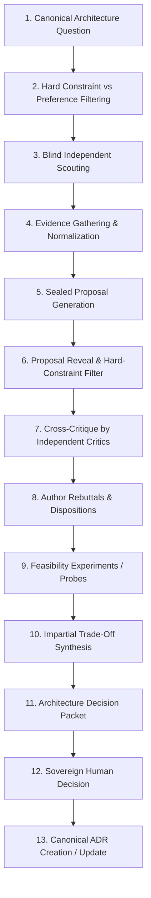
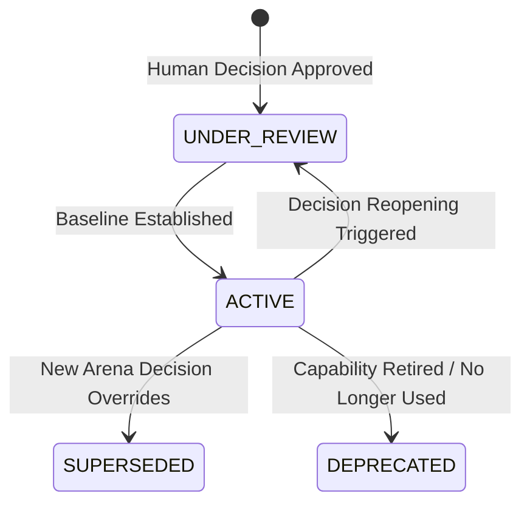

# ARCHITECTURE ARENA ARCHITECTURE
## Bounded Multi-Agent Decision System for Technical Architecture & Strategy

**Status:** ARCHITECTURAL SPECIFICATION — P5 BASELINE  
**Date:** 2026-09-30  
**Git Baseline Commit:** `516e01c82cb4c3afd1080e72e68a4e1e56687335`  
**Governing Invariants:**
- $\text{ROLE} \neq \text{EXECUTOR} \neq \text{HARNESS} \neq \text{MODEL} \neq \text{PROVIDER} \neq \text{GATEWAY} \neq \text{PROCESS}$
- $\text{CAPABILITY} \neq \text{TOOL} \neq \text{TRANSPORT} \neq \text{CREDENTIAL} \neq \text{AUTHORITY}$
- $\text{DISCOVERY} \neq \text{INSTALLATION} \neq \text{AUTHENTICATION} \neq \text{TRUST}$
- $\text{ARCHITECTURE CONTRACT} \neq \text{CURRENT IMPLEMENTATION}$
- $\text{UNKNOWN} \neq \text{ASSUMED}$
- $\mathbf{HUMAN\ DECISION \neq AGENT\ CONSENSUS}$
- $\mathbf{SCOUT \neq ADVOCATE \neq CRITIC \neq SYNTHESIZER \neq DECISION\ MAKER}$
- $\mathbf{NUMBER\ OF\ AGENTS \neq STRENGTH\ OF\ EVIDENCE}$
- $\mathbf{CONSENSUS \neq CORRECTNESS}$
- $\mathbf{CONFIDENCE \neq EVIDENCE\ QUALITY}$
- $\mathbf{AUTONOMOUS\_INCREMENTAL\_SPEND = 0}$
- $\mathbf{UNKNOWN\_COST \neq FREE \quad (\text{FAIL CLOSED})}$
- $\mathbf{AGENT\_PAYMENT\_AUTHORITY = NONE}$
- $\mathbf{FREE\_QUOTA\_EXHAUSTED \longrightarrow STOP \mid SAFE\_FREE\_FALLBACK \mid WAIT \quad (\text{NEVER } \longrightarrow BILL)}$

---

## 1. Executive Summary & Core Principles

The GRAVITAS Architecture Arena is a bounded, multi-agent decision system designed to answer the foundational engineering question:

$$\textbf{"What should we build, and why?"}$$

The Arena exists to thoroughly expose trade-offs, structural failure modes, operational friction, and empirical contradictions *before* implementation begins. It explicitly rejects:
1. **Model Monoculture & Personal Opinion:** Relying on the ungrounded preference of a single model checkpoint.
2. **Fashion & Popularity:** Choosing technologies because they are trendy, widely blogged about, or possess high GitHub star counts.
3. **Vendor Marketing:** Accepting vendor documentation, marketing collateral, or unvalidated benchmark graphs as architectural truth.
4. **Majority Voting:** Deciding architecture by polling multiple agents and selecting the majority option.
5. **Recency Bias:** Adopting whichever proposal or argument was emitted last in an interaction thread.

### The Canonical Arena Flow

The Arena follows a strictly bounded, non-majoritarian, multi-phase lifecycle:



---

## 2. Architecture Question Contract

Every Arena engagement begins with a single, formally specified `ArchitectureQuestion`. Scouts are strictly forbidden from privately re-interpreting or expanding the question scope.

```typescript
export type ConstraintClass = 
  | 'HARD_CONSTRAINT'      // Absolute gating requirement; failure = immediate disqualification
  | 'SOFT_PREFERENCE'     // Desirable property; evaluated during comparative trade-off analysis
  | 'OPTIMIZATION_GOAL';  // Directional metric to maximize/minimize (e.g. latency, memory)

export interface ArchitectureConstraint {
  readonly id: string;
  readonly description: string;
  readonly classification: ConstraintClass;
  readonly evaluationCriteria: string;
  readonly source: 'OPERATOR' | 'SYSTEM_INVARIANT' | 'PLATFORM_LIMITATION';
}

export interface ArchitectureQuestion {
  readonly questionId: string;
  readonly title: string;
  readonly decisionRequired: string;
  readonly motivation: string;
  readonly currentState: string;
  readonly desiredOutcome: string;
  readonly constraints: readonly ArchitectureConstraint[];
  readonly knownEvidenceRefs: readonly string[];
  readonly explicitUnknowns: readonly string[];
  readonly prohibitedAssumptions: readonly string[];
  readonly financialCeiling: {
    readonly autonomousIncrementalSpend: 0; // Invariant
    readonly allowComparisonWithPaidTech: boolean;
  };
  readonly securityParameters: {
    readonly requiredContainmentLevel: 'HOST_SHARED' | 'RESTRICTED_SANDBOX' | 'ISOLATED_PROCESS';
    readonly forbiddenAuthorities: readonly string[];
  };
  readonly platformTarget: {
    readonly os: 'WINDOWS_11';
    readonly targetArch: 'x64' | 'arm64';
    readonly backgroundExecutionRequired: boolean;
  };
  readonly targetWaveOwner: 'P6' | 'P7' | 'P8' | 'P9' | 'FUTURE';
  readonly humanAuthorityBoundary: string;
}
```

### Constraint Classification Rules
* **Hard Constraints:** Non-negotiable boundary conditions. Examples: `AUTONOMOUS_INCREMENTAL_SPEND = 0`, full functionality on Windows 11 without admin rights, zero raw secrets in logs. Any proposal violating a hard constraint is marked `INELIGIBLE` and eliminated from competitive consideration.
* **Soft Preferences:** Desirable operator priorities. Examples: TypeScript-first stack, local-first data storage, fast startup time.
* **Optimization Goals:** Metrics where more/less is preferred, subject to diminishing returns. Examples: binary size, idle RAM usage, message dispatch latency.

---

## 3. Architectural Proposal Contract

Proposals represent concrete architectural strategies authored by Scouts. Proposals must explicitly expose trade-offs and are prohibited from concealing weaknesses or negative operational consequences.

```typescript
export type ReversibilityTier = 
  | 'EASILY_REVERSIBLE'      // Isolated behind adapter; swapped in < 1 day
  | 'MODERATELY_REVERSIBLE'  // Subsystem refactor; requires multi-day migration
  | 'EXPENSIVE_TO_REVERSE'   // Cross-cutting architectural dependency
  | 'FOUNDATIONAL';          // Core runtime identity; reversal requires full rewrite

export interface ComponentSpecification {
  readonly name: string;
  readonly role: string;
  readonly technologyCandidate: string;
  readonly license: string;
  readonly isExistingComponent: boolean;
  readonly migrationDelta: string;
}

export interface ArchitectureProposal {
  readonly proposalId: string;
  readonly questionId: string;
  readonly title: string;
  readonly authorScoutId: string;
  readonly proposedApproachSummary: string;
  readonly coreAssumptions: readonly string[];
  readonly components: readonly ComponentSpecification[];
  readonly dataAndControlFlow: string;
  readonly satisfiedConstraintIds: readonly string[];
  readonly violatedConstraintIds: readonly string[];
  readonly externalDependencies: readonly {
    readonly name: string;
    readonly version: string;
    readonly license: string;
    readonly maintenanceStatus: 'ACTIVE' | 'MAINTENANCE_ONLY' | 'STALE' | 'ABANDONED';
    readonly zeroSpendCategory: string;
  }[];
  readonly migrationImpact: {
    readonly existingCodeReused: readonly string[];
    readonly existingCodeReplaced: readonly string[];
    readonly migrationCostEstimate: 'TRIVIAL' | 'LOW' | 'MEDIUM' | 'HIGH' | 'EXTREME';
  };
  readonly securityImpact: {
    readonly attackSurfaceAdded: readonly string[];
    readonly requiredPermissions: readonly string[];
    readonly containmentFeasibility: string;
  };
  readonly financialImpact: {
    readonly autonomousCost: 0;
    readonly optionalPaidTiers: string;
    readonly localResourceFootprint: string;
  };
  readonly operationalComplexity: {
    readonly debuggingMechanisms: string;
    readonly failureModes: readonly string[];
    readonly loggingAndTelemetry: string;
  };
  readonly reversibility: ReversibilityTier;
  readonly lockInRisks: readonly string[];
  readonly supportingEvidenceIds: readonly string[];
  readonly explicitUnknowns: readonly string[];
  readonly rejectedAlternativesConsidered: readonly string[];
  readonly authorConfidenceScore: number; // 0.0 - 1.0 (metadata only; never used for ranking)
}
```

---

## 4. Multi-Agent Critic & Cross-Critique Protocol

Once blind proposals are revealed and filtered for hard constraints, independent Critics are assigned. The Critic's explicit duty is **falsification**: attempting to break the proposal, expose unsupported assumptions, and identify overlooked risks.

### Structural Separation Invariant
$$\mathbf{CRITIC \neq AUTHOR \quad (\text{Self-Review Strictly Prohibited})}$$
No agent may act as a Critic for its own proposal, nor may two agents engage in reciprocal self-approving pacts.

```typescript
export interface CriticAssignment {
  readonly critiqueId: string;
  readonly proposalId: string;
  readonly criticScoutId: string;
  readonly focusAreas: readonly (
    | 'SECURITY_CONTAINMENT'
    | 'WINDOWS_FEASIBILITY'
    | 'ZERO_SPEND_RISK'
    | 'OPERATIONAL_COMPLEXITY'
    | 'SUPPLY_CHAIN_MAINTENANCE'
    | 'PERFORMANCE_RESOURCE'
    | 'MIGRATION_COST'
  )[];
}

export interface CritiqueFinding {
  readonly findingId: string;
  readonly severity: 'FATAL_FLAW' | 'MAJOR_RISK' | 'MINOR_CONCERN' | 'UNSUPPORTED_ASSUMPTION';
  readonly targetedSection: string;
  readonly description: string;
  readonly counterEvidenceIds: readonly string[];
  readonly falsificationArgument: string;
}

export interface CritiqueReport {
  readonly critiqueId: string;
  readonly proposalId: string;
  readonly criticScoutId: string;
  readonly findings: readonly CritiqueFinding[];
  readonly overallRecommendation: 'RECOMMEND_REJECTION' | 'REQUIRE_MODIFICATION' | 'ACCEPTABLE_WITH_RISKS';
}
```

---

## 5. Rebuttal & Defense Protocol

Authors receive the `CritiqueReport` and have one bounded turn to provide a structured rebuttal. The goal of rebuttal is not to "win" a debate, but to clarify facts, incorporate valid criticisms, or acknowledge fatal flaws.

```typescript
export type RebuttalDisposition = 
  | 'DEFENDED'             // Critic's claim refuted using verifiable primary evidence
  | 'CORRECTED'            // Valid critique accepted; proposal modified to mitigate concern
  | 'PARTIALLY_ACCEPTED'   // Trade-off recognized and documented as an accepted risk
  | 'WITHDRAWN'            // Critic identified a fatal flaw; author withdraws proposal
  | 'REQUIRES_EXPERIMENT'; // Genuine empirical question that cannot be resolved via documentation

export interface ProposalRebuttal {
  readonly rebuttalId: string;
  readonly proposalId: string;
  readonly findingId: string;
  readonly authorScoutId: string;
  readonly disposition: RebuttalDisposition;
  readonly reasoning: string;
  readonly supportingEvidenceRef?: string;
  readonly proposedExperimentRef?: string;
}
```

---

## 6. Feasibility Experiment Request Protocol

When a critique-rebuttal pair identifies an empirical unknown that cannot be resolved through documentation, the Arena generates an `ExperimentRequest`.

```typescript
export interface ExperimentRequest {
  readonly experimentId: string;
  readonly questionId: string;
  readonly targetProposalId: string;
  readonly hypothesis: string;
  readonly testMethodology: string;
  readonly requiredCapabilities: readonly string[];
  readonly estimatedExecutionSeconds: number;
  readonly authorizationStatus: 
    | 'SAFE_IN_PROCESS_PROBE'           // Executable within current authorized sandbox
    | 'REQUIRES_HUMAN_AUTHORIZATION';   // Requires package install, toolchain setup, or external auth
}
```

* **Governance Rule:** In Wave P5, no code modifications or package installations are authorized. Any experiment requiring external tools, installations, or auth must be flagged `REQUIRES_HUMAN_AUTHORIZATION` and deferred as a recommendation for future waves.

---

## 7. Synthesizer Architecture & Anti-Majoritarian Rules

The Synthesizer is an impartial analytical role. It does **not** make decisions, rank winners, or count votes.

### The Anti-Majoritarian Invariants
$$\mathbf{NUMBER\ OF\ AGENTS \neq STRENGTH\ OF\ EVIDENCE}$$
$$\mathbf{CONSENSUS \neq CORRECTNESS}$$
$$\mathbf{MAJORITY\ VOTE = 0\ ARCHITECTURAL\ WEIGHT}$$

If four agents propose a fragile, complex framework because it is fashionable, and one agent provides a simple, verified standard-library alternative backed by primary evidence, the Synthesizer **must** highlight the single agent's primary evidence and cannot down-rank it due to lack of consensus.

### Synthesizer Responsibilities
1. **Hard-Constraint Verification:** Confirm that disqualified proposals remain disqualified.
2. **De-duplication:** Merge conceptually identical proposals authored by different Scouts.
3. **Contradiction Preservation:** Extract empirical contradictions between opposing claims and register them in the Decision Packet without prematurely picking a side.
4. **Trade-Off Matrix Formulation:** Map proposals along objective trade-off axes (Reversibility, Complexity, Maintenance, Performance, Zero-Spend Safety).
5. **Decision Packet Compilation:** Produce the complete, human-readable Decision Packet.

---

## 8. Human Decision Contract & Sovereignty

The human operator (Smarak) is the sole architectural authority. Agents recommend, analyze, critique, and synthesize; only humans authorize.

```typescript
export type HumanDecisionDisposition =
  | 'APPROVE_PROPOSAL'         // Adopt proposal as canonical architecture baseline
  | 'APPROVE_WITH_CONDITIONS' // Adopt subject to specific constraints/modifications
  | 'REQUEST_MORE_EVIDENCE'   // Reopen scouting with targeted research directives
  | 'REQUEST_EXPERIMENT'      // Authorize a bounded proof-of-concept spike or benchmark
  | 'REJECT_ALL'              // Reject all candidate proposals; reformulate problem
  | 'DEFER'                   // Postpone decision until later project wave
  | 'CHANGE_CONSTRAINT';      // Modify question constraints and re-run Arena

export interface HumanDecisionRecord {
  readonly decisionId: string;
  readonly questionId: string;
  readonly packetId: string;
  readonly disposition: HumanDecisionDisposition;
  readonly selectedProposalId?: string;
  readonly conditionsOrDirectives: string;
  readonly humanOperatorSignature: string;
  readonly timestamp: string;
}
```

---

## 9. Architecture Decision Record (ADR) Lifecycle

An approved `HumanDecisionRecord` immediately triggers the generation or update of a canonical Architecture Decision Record (ADR) stored in `docs/adr/`.



### Decision Reopening Triggers
An `ACTIVE` ADR cannot be casually discarded, but it is never permanently immutable. An ADR enters `UNDER_REVIEW` when any of the following triggers are met:
1. **Critical Security Vulnerability:** Upstream dependency incurs an unpatchable vulnerability.
2. **Upstream Abandonment:** Repository archived, maintenance ceased, or breaking license shift.
3. **Cost Invariant Breach:** Service removes free tier or alters billing structure, violating $\text{AUTONOMOUS\_INCREMENTAL\_SPEND} = 0$.
4. **Windows Compatibility Failure:** Breaking platform update makes headless/background operation non-functional.
5. **Empirical Implementation Failure:** A downstream wave (e.g. P6/P7) executes an authorized experiment proving the architecture cannot achieve its performance or containment bounds.

---

## 10. Arena Boundedness, Budgets & Provenance

To prevent runaway loops, infinite debates, or quota exhaustion, every Arena engagement is governed by a strict `ArenaBudgetPolicy`.

```typescript
export interface ArenaBudgetPolicy {
  readonly maxScouts: number;                   // [NON-NORMATIVE EXAMPLE: 3 to 6]
  readonly maxRoundsPerScout: number;           // [NON-NORMATIVE EXAMPLE: 2 turns]
  readonly maxCritiqueRounds: number;           // [NON-NORMATIVE EXAMPLE: 1 round]
  readonly maxRebuttalRounds: number;           // [NON-NORMATIVE EXAMPLE: 1 round]
  readonly maxTotalInteractionTurns: number;    // [NON-NORMATIVE EXAMPLE: 16 turns]
  readonly maxDurationSeconds: number;          // [NON-NORMATIVE EXAMPLE: 1800s]
  readonly tokenBudgetCap: number;              // [NON-NORMATIVE EXAMPLE: 250,000 tokens]
  readonly autonomousIncrementalCostCeiling: 0; // Hard Invariant
}
```

### Comprehensive 16-Point Arena Provenance
Every generated Decision Packet includes verifiable cryptographic provenance:
1. `questionDigest`: SHA-256 hash of original `ArchitectureQuestion`.
2. `initiator`: Identity of operator or upstream wave requesting the decision.
3. `startTime` & `completionTime`: ISO 8601 UTC timestamps.
4. `activeBudgetPolicy`: Hash and content of applied `ArenaBudgetPolicy`.
5. `scoutAssignments`: List of all Scouts, assigned roles, and constraints.
6. `scoutHarnessMetadata`: Observed model, provider, and execution harness per Scout.
7. `sourceCitations`: Complete inventory of all external URLs, repos, and docs consulted.
8. `evidenceDigests`: SHA-256 digests of all normalized `EvidenceItem` records.
9. `contradictionRegistryRef`: Reference to registered empirical contradictions.
10. `sealedProposalDigests`: Cryptographic hashes of proposals *before* reveal.
11. `critiqueReports`: Complete logs of all critic findings and severity codes.
12. `rebuttalDispositions`: Structured dispositions recorded during rebuttal phase.
13. `experimentsRequested`: Inventory of requested and deferred experiments.
14. `synthesizerProvenance`: Identity, model, and trace of the Synthesizer pass.
15. `humanDecisionSignature`: Operator decision record and signature.
16. `resultingAdrRef`: Path and commit hash of canonical ADR generated.
