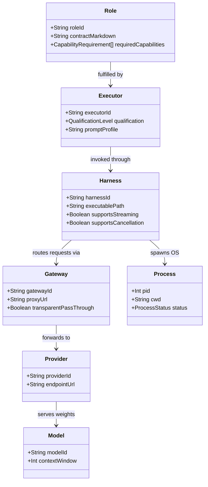

# GRAVITAS — CORE CONCEPTUAL BOUNDARIES
## Identity, Execution, and Infrastructure Disambiguation

**Document Status**: Current P0/P1 evidence and planning artifact. The frozen master planning contracts remain governing project context; repository/runtime evidence is ultimate ground truth.

---

### Foundational Invariant
$$\text{ROLE} \neq \text{EXECUTOR} \neq \text{HARNESS} \neq \text{MODEL} \neq \text{PROVIDER} \neq \text{GATEWAY} \neq \text{PROCESS}$$

In the GRAVITAS architecture, conflating an organizational responsibility with an AI model, a CLI wrapper, or an operating system process corrupts system security, governance, and user mental models. This document establishes the strict separation between all seven layers of the execution hierarchy.

---

## 1. Definitional Taxonomy

### 1. ROLE (Logical Responsibility)
- **Definition**: The durable, organizational role assigned to a task or capability domain. A role defines **what** needs to be accomplished, what domain standards must be upheld, what prompts/contracts govern behavior, and what capabilities are required.
- **Characteristics**:
  - Independent of any specific LLM, vendor, or toolchain.
  - Defined by a Markdown contract in `docs/agents/` (e.g., `04-BACKEND-ENGINEER.md`, `07-VERIFIER.md`).
  - Represented visually as a functional character in the Command Center / 3D HQ.
- **Examples**: `Supervisor/Planner`, `Backend Engineer`, `Frontend Engineer`, `Verifier`, `Browser QA`, `Security/Capability Auditor`.

### 2. EXECUTOR (Qualified Agent Entity)
- **Definition**: The qualified logical agent identity that GRAVITAS selects to fulfill a given Role for a specific WorkSession or Task.
- **Characteristics**:
  - Evaluated against a capability matrix and security qualification status.
  - May have distinct behavioral profiles or prompt wrappers tailored for specific problem types.
  - A role can be fulfilled by different executors across different tasks.
- **Examples**: `Standard TypeScript Coder`, `Adversarial Security Auditor`, `Fast Code Reviewer`.

### 3. HARNESS (Execution Interface / Adapter)
- **Definition**: The software application, CLI binary, SDK, or IPC mechanism used by GRAVITAS to invoke, supervise, and control an executor.
- **Characteristics**:
  - Responsible for stdio piping, process lifecycle, argument passing, output parsing, and error capture.
  - Must pass rigorous qualification tests (process isolation, clean termination via `taskkill`, timeout handling, directory scoping).
  - A tool being installed on the OS does NOT make it a qualified harness.
- **Examples**: `Codex CLI`, `Claude Code CLI`, `fcc-claude`, `Antigravity CLI (agy)`, programmatic SDK adapter.

### 4. MODEL (Specific Inference Weights)
- **Definition**: The specific large language model weights and checkpoint used to generate tokens during an execution step.
- **Characteristics**:
  - Specified by model identifiers supplied by a qualified harness/provider at runtime. Concrete model IDs must come from current evidence; this architecture document does not preselect them.
  - Determines token economics, context window, and raw reasoning capabilities.
  - Swapping a model does NOT alter the Role or the Harness.

### 5. PROVIDER (Inference Host / Vendor)
- **Definition**: The organization, cloud service, or local backend serving the model inference.
- **Characteristics**:
  - Holds commercial relationship, API keys, rate limit tiers, and service SLAs.
  - Provider names must NEVER be used as agent role names (e.g., there is no "OpenAI Agent" or "Anthropic Agent").
- **Examples**: `OpenAI`, `Anthropic`, `Google Cloud / Vertex AI`, `Ollama (Local)`.

### 6. GATEWAY (Routing / Proxy Abstraction Layer)
- **Definition**: An optional intermediate routing, proxying, caching, fallback, or telemetry layer interposed between the harness and the provider.
- **Characteristics**:
  - Handles multi-provider failover, local load balancing, request logging, or corporate policy enforcement.
  - Operates transparently: must not mutate prompts, inject unvetted system messages, or corrupt tool calls.
- **Examples**: `OmniRoute (Local Gateway)`, `Enterprise API Proxy`, `Direct (None)`.

### 7. PROCESS (Operating System Execution Unit)
- **Definition**: The actual operating system process instance (PID) executing on the host machine.
- **Characteristics**:
  - Owned by the OS kernel with specific memory, CPU, environment variables, working directory, and user security descriptors.
  - Subject to OS-level signals, exit codes, and process-tree termination.
  - Multiple processes may be spawned for a single harness invocation (e.g., child subshells, compiler checks).
- **Examples**: `node.exe (PID 12200)`, `codex-windows-sandbox-service.exe (PID 8684)`.

---

## 2. Structural Relationship

---

## 3. Concrete Hypothetical Mappings

*(Note: The following configurations are illustrative scenarios demonstrating boundary separation. They do not assert that these specific runtime links currently exist in the repository.)*

### Hypothetical Scenario A: Backend Refactoring Task
| Layer | Instance / Value | Rationale |
| :--- | :--- | :--- |
| **Role** | `Backend Engineer` | Responsible for API refactor in accordance with `04-BACKEND-ENGINEER.md`. |
| **Executor** | `Qualified Node/TS Specialist` | Evaluated and approved for TypeScript backend mutations. |
| **Harness** | `Codex CLI (v0.153.4)` | Invoked headlessly with restricted filesystem sandbox and `--ask-for-approval never`. |
| **Model** | `model-X` (hypothetical) | Placeholder only; actual model must be proven by runtime configuration/provenance. |
| **Provider** | `provider-X` (hypothetical) | Placeholder only; provider is not assumed by the role. |
| **Gateway** | `Direct (No intermediate proxy)` | Direct authenticated connection to provider API. |
| **Process** | `PID 14220 (node.exe)` | OS process executing the CLI wrapper inside the isolated git worktree. |

### Hypothetical Scenario B: Complex Plan Review & Cross-Model Audit
| Layer | Instance / Value | Rationale |
| :--- | :--- | :--- |
| **Role** | `Independent Reviewer` | Responsible for adversarial architectural critique. |
| **Executor** | `Senior Systems Reviewer` | Configured with high skepticism and zero edit authority. |
| **Harness** | `Claude Code CLI (v2.1.276)` | Invoked with `--permission-mode readOnly` and `--no-session-persistence`. |
| **Model** | `model-Y` (hypothetical) | Placeholder only; actual model must be proven by runtime configuration/provenance. |
| **Provider** | `provider-Y` (hypothetical) | Placeholder only; provider is not assumed by the role. |
| **Gateway** | `gateway-Y` or `None` (hypothetical) | Placeholder only; current OmniRoute runtime is not available at the P0/P1 checkpoint. |
| **Process** | `PID 18452 (claude.exe)` | Host child process running in read-only sandbox. |

### Hypothetical Scenario C: Automated Browser Verification
| Layer | Instance / Value | Rationale |
| :--- | :--- | :--- |
| **Role** | `Browser QA` | Responsible for end-to-end visual assertions and user-flow validation. |
| **Executor** | `Playwright Deterministic Test Runner` | Executes deterministic browser test specs. |
| **Harness** | `Programmatic Playwright Core Runner` | Invoked directly via local test engine, not through an LLM wrapper. |
| **Model** | `None (Deterministic)` | Pure deterministic code execution; no inference consumed. |
| **Provider** | `None (Local Host)` | Not applicable. |
| **Gateway** | `None` | Not applicable. |
| **Process** | `PID 16668 (msedgewebview2.exe / chromium)` | Headless browser process rendering DOM and capturing screenshots. |

---

## 4. Governance and Security Rules

1. **Role Integrity**: A Role cannot expand its own capability scope. Only GRAVITAS can issue a scoped `CapabilityGrant`.
2. **Harness Neutrality**: Changing a Harness must not break prompt contracts or alter task requirements.
3. **Provider Agnosticism**: Roles must never refer to specific model vendors in their primary behavioral specifications.
4. **Process Containment**: Worker mutation processes must be bounded to approved execution scopes/worktrees where applicable. Process-tree termination, timeout and cancellation behavior must be implemented and proven per harness; deterministic/background infrastructure may require different scoped containment models.
