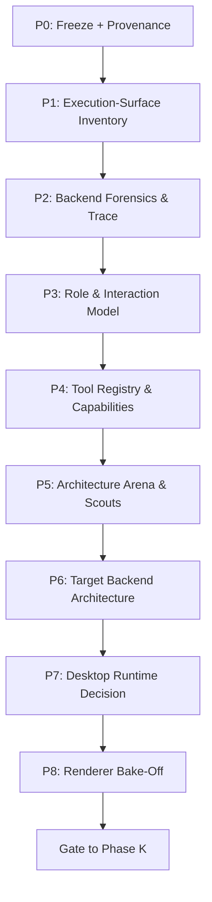
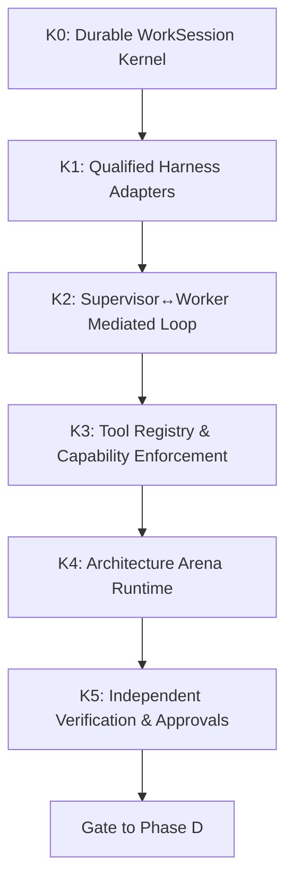
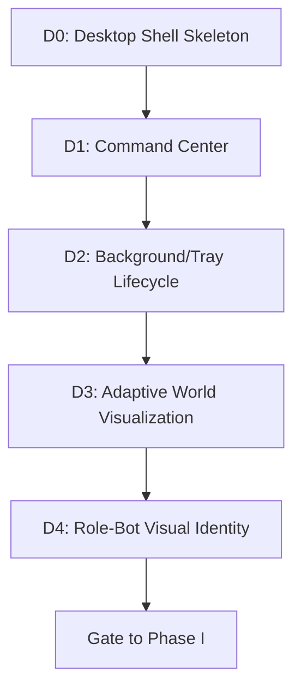

# GRAVITAS — MASTER EXECUTION ROADMAP
## Operational Roadmap for Desktop-First Multi-Agent Operating System

**Document Status**: Current P0/P1 evidence and planning artifact. The frozen master planning contracts remain governing project context; repository/runtime evidence is ultimate ground truth.

---

### Foundational Program Invariant
$$\text{ROLE} \neq \text{EXECUTOR} \neq \text{HARNESS} \neq \text{MODEL} \neq \text{PROVIDER} \neq \text{GATEWAY} \neq \text{PROCESS}$$

The desktop/3D/2.5D/2D UI is strictly a projection of canonical runtime truth, never the source of truth.

---

## 1. Program Structure Overview

GRAVITAS evolves through four strictly gated phases:
1. **Phase P — Forensics & Architecture (Waves P0 – P8)**: Machine baseline, execution-surface discovery, codebase forensics, interaction design, security/tool registry, Architecture Arena model, target backend selection, desktop runtime decision, and renderer bake-off.
2. **Phase K — Kernel Implementation (Waves K0 – K5)**: WorkSession persistence, qualified harness adapters, supervised loop execution, capability enforcement, arena engine, and evidence/approval integration.
3. **Phase D — Desktop Product (Waves D0 – D4)**: Desktop daemon shell, command center, headless background/tray lifecycle, adaptive multi-tier renderer, and role visual identity.
4. **Phase I — Integrations / Personal OS**: Isolated modules for Calendar, Communications, Study/Personal Coaching, Research, Leads, and Couriers.

**Execution Rule**: No wave self-approves. Every wave terminates at a human review gate with reproducible evidence. No architectural decision is made by familiarity; all stack selections require empirical evidence from prior phases.

---

## 2. Phase P — Forensics & Architecture

---

### Wave P0 — Freeze + Provenance
- **Goal**: Establish the authoritative Git, toolchain, package, lockfile, dependency, and process baseline while freezing repository state against uncoordinated mutation.
- **Prerequisites**: Access to host system shell and repository root.
- **Files Expected to be Inspected**: `.git/`, `package.json`, `package-lock.json`, workspace `package.json` files, lockfiles, process tables, listening network ports.
- **Expected Outputs**:
  - `docs/architecture-v2/CURRENT_GIT_BASELINE.md`
  - `docs/architecture-v2/CURRENT_TOOLCHAIN_BASELINE.md`
  - `docs/architecture-v2/CURRENT_DEPENDENCY_BASELINE.md`
- **Evidence Requirements**: Direct command output for git SHAs, remotes, diffs, node/npm versions, installed CLIs, process lists, and network listeners.
- **Tests/Probes Required**: `git status`, `git rev-parse`, `node --version`, `npm --version`, `npm audit`, `Get-Process`, `Get-NetTCPConnection`.
- **Risks**: Modifying `main`, discarding untracked artifacts, or mutating lockfiles prematurely.
- **Dependencies on Earlier Waves**: None (Genesis Wave).
- **Explicit Things That Must NOT Happen Yet**: No code changes to existing packages/apps; no dependency installations; no git stash or clean.
- **Human Review Gate**: `WAVE P0 READY FOR REVIEW`.
- **Blocking Conditions**: Dirty or ambiguous git status on protected branches without clear provenance; unreadable files.
- **Unresolved Questions Passed to Next Wave**: Which discovered binaries are executable and callable headlessly?

---

### Wave P1 — Execution-Surface Inventory
- **Goal**: Audit, probe, and catalog every execution surface, CLI, harness, API, MCP server, plugin, and runtime container available on the host machine. Establishing the true empirical qualification ceiling of each surface completes P1 without requiring every harness to be `READY`.
- **Prerequisites**: P0 baseline established and verified.
- **Files/Surfaces Expected to be Inspected**: `codex`, `claude`, `fcc-claude`, `fcc-server`, `agy`, `gemini`, `gh`, `playwright`, `omniroute`, MCP directories, local configs (`~/.codex`, `~/.claude.json`, `~/.gemini`).
- **Expected Outputs**:
  - `docs/architecture-v2/EXECUTION_SURFACE_INVENTORY.md`
  - `docs/architecture-v2/INTEGRATION_FEASIBILITY_MATRIX.md`
- **Evidence Requirements**: Qualification ladder traversal for each surface:
  $$\text{DISCOVERED} \rightarrow \text{INSTALLED} \rightarrow \text{AUTHENTICATED} \rightarrow \text{REACHABLE} \rightarrow \text{CAPABILITY\_PROBED} \rightarrow \text{CONTAINMENT\_TESTED} \rightarrow \text{QUALIFIED} \rightarrow \text{READY}$$
- **Tests/Probes Required**: Non-destructive `--version` and doctor/help calls; safe auth-presence checks without token leakage; network reachability checks.
- **Risks**: Exposing user tokens/secrets; triggering rate limits or billable calls; assuming GUI existence equals programmatic accessibility.
- **Dependencies on Earlier Waves**: Wave P0.
- **Explicit Things That Must NOT Happen Yet**: No authentication flows initiated; no installations (`npm install`, `pip install`, etc.); no backend redesign.
- **Human Review Gate**: `WAVES P0-P1 READY FOR HUMAN REVIEW`.
- **Blocking Conditions**: Inability to inspect key CLI paths without credential exposure; lack of local shell access.
- **Unresolved Questions Passed to Next Wave**: What is the actual runtime trace of the current codebase in `packages/` and `apps/`?
- **Review Status**: P0/P1 corrective pass complete. All required fields and surfaces are accounted for with empirical evidence tags. Ready for human review; P2 must not start until human review clears this gate.

---

### Wave P2 — Current Backend Forensics
- **Goal**: Trace the existing codebase end-to-end from source code to understand current task scheduling, role resolution, execution worktrees, verifier checks, evidence logging, and persistence.
- **Prerequisites**: P0 and P1 review approval.
- **Files Expected to be Inspected**: `packages/core/`, `packages/orchestrator/`, `packages/harnesses/`, `packages/verifier/`, `packages/gateways/`, `apps/server/`, `apps/web/`, `architecture/`, existing tests.
- **Expected Outputs**:
  - `docs/architecture-v2/CURRENT_SYSTEM_FORENSICS.md`
  - `docs/architecture-v2/CURRENT_RUNTIME_TRACE.md`
  - `docs/architecture-v2/TECHNICAL_DEBT_AND_RISKS.md`
- **Evidence Requirements**: Source-level references with file paths and line numbers tracing:
  $$\text{Goal} \rightarrow \text{Plan} \rightarrow \text{DAG} \rightarrow \text{Scheduler} \rightarrow \text{Role} \rightarrow \text{Grant} \rightarrow \text{Harness} \rightarrow \text{Worktree} \rightarrow \text{Candidate} \rightarrow \text{Verifier} \rightarrow \text{Browser QA} \rightarrow \text{Approval}$$
- **Tests/Probes Required**: Static code analysis, test suite inspection, schema verification.
- **Risks**: Believing legacy architectural documentation over actual source code implementation.
- **Dependencies on Earlier Waves**: Waves P0, P1.
- **Explicit Things That Must NOT Happen Yet**: No refactoring; no deleting legacy packages; no runtime rewrites.
- **Human Review Gate**: `WAVE P2 READY FOR REVIEW`.
- **Blocking Conditions**: Source code missing key lifecycle implementations claimed in ADRs.
- **Unresolved Questions Passed to Next Wave**: How do we model multi-agent interactions and question routing safely?

---

### Wave P3 — Role/Agent Interaction Model
- **Goal**: Design the durable WorkSession model, question routing taxonomy, supervisor-worker protocol, and agent loop safety mechanisms.
- **Prerequisites**: Wave P2 forensics completed.
- **Files Expected to be Inspected**: `gravitas-agent-specs/agents/`, `packages/prompts/`, `packages/agents/`.
- **Expected Outputs**:
  - `docs/architecture-v2/ROLE_WORKER_PROVIDER_MODEL.md`
  - `docs/architecture-v2/AGENT_INTERACTION_PROTOCOL.md`
  - `docs/architecture-v2/WORK_SESSION_MODEL.md`
  - `docs/architecture-v2/QUESTION_ROUTING_MODEL.md`
  - `docs/architecture-v2/SUPERVISOR_WORKER_PROTOCOL.md`
  - `docs/architecture-v2/AGENT_LOOP_SAFETY.md`
- **Evidence Requirements**: Formal state machine specifications, question routing classifications:
  - `LOCAL_QUESTION`
  - `TOOL_QUESTION`
  - `SUPERVISOR_QUESTION`
  - `SPECIALIST_QUESTION`
  - `HUMAN_DECISION`
- **Tests/Probes Required**: Protocol validation schemas, loop-termination formal proofs.
- **Risks**: Allowing direct, unmediated agent-to-agent infinite loops; bypassing human sovereign gates.
- **Dependencies on Earlier Waves**: Waves P0–P2.
- **Explicit Things That Must NOT Happen Yet**: No implementation of websocket/IPC daemons or communication code.
- **Human Review Gate**: `WAVE P3 READY FOR REVIEW`.
- **Blocking Conditions**: Unclear boundary between supervisor guidance and human approval.
- **Unresolved Questions Passed to Next Wave**: How are tools and capabilities scoped, granted, and audited across harnesses?

---

### Wave P4 — Tool Registry + MCP/Plugin Architecture
- **Goal**: Design a provider-neutral Tool Registry and scoped CapabilityGrant security model across native tools, MCP servers, plugins, and harnesses.
- **Prerequisites**: Wave P3 interaction model completed.
- **Files Expected to be Inspected**: MCP schemas, plugin manifests, existing harness execution code.
- **Expected Outputs**:
  - `docs/architecture-v2/MCP_PLUGIN_TOOL_REGISTRY.md`
  - `docs/architecture-v2/CAPABILITY_SECURITY_MODEL.md`
  - `docs/architecture-v2/CREDENTIAL_BOUNDARY_V2.md`
- **Evidence Requirements**: Schema specifications for CapabilityGrants covering read, write, external, destructive, and financial authorities.
- **Tests/Probes Required**: Static permission boundary analysis, credential isolation audit.
- **Risks**: Over-granting shell/fs privileges to autonomous workers; leaking credentials into execution logs.
- **Dependencies on Earlier Waves**: Waves P0–P3.
- **Explicit Things That Must NOT Happen Yet**: No installation of new MCP servers; no runtime permission middleware coding.
- **Human Review Gate**: `WAVE P4 READY FOR REVIEW`.
- **Blocking Conditions**: Inability to isolate tool execution environments.
- **Unresolved Questions Passed to Next Wave**: How do we prevent default-stack bias and evaluate competing architectures objectively?

---

### Wave P5 — Architecture Arena + Knowledge/Library Scouts
- **Goal**: Design the Architecture Arena competition protocol and library scouting mechanisms (Design Library Scout, Pattern Librarian, Technical Library Scout) to ensure decisions are evidence-backed.
- **Prerequisites**: Waves P0–P4 completed.
- **Files Expected to be Inspected**: `gravitas-agent-specs/agents/02-ARCHITECTURE-ARENA.md`, `10-DESIGN-LIBRARY-SCOUT.md`, `11-PATTERN-LIBRARIAN.md`.
- **Expected Outputs**:
  - `docs/architecture-v2/ARCHITECTURE_ARENA_MODEL.md`
  - `docs/architecture-v2/SUBAGENT_STRATEGY_MODEL.md`
  - `docs/architecture-v2/INTER_HARNESS_COMPETITION.md`
  - `docs/architecture-v2/ARCHITECTURE_DECISION_RUBRIC.md`
  - `docs/architecture-v2/ARENA_COST_CONTROL.md`
  - `docs/architecture-v2/TECH_STACK_DECISION_PROTOCOL.md`
  - `docs/architecture-v2/DESIGN_LIBRARY_SCOUT.md`
  - `docs/architecture-v2/PRIOR_PROJECT_PATTERN_REGISTRY.md`
  - `docs/architecture-v2/TECHNICAL_LIBRARY_SCOUT.md`
- **Evidence Requirements**: Concrete evaluation rubrics with hard constraints, cost limits, and reproducibility standards.
- **Tests/Probes Required**: Dry-run rubric scoring on historical architectural decisions.
- **Risks**: Unbounded LLM spend during arena battles; subjective or circular judging.
- **Dependencies on Earlier Waves**: Waves P0–P4.
- **Explicit Things That Must NOT Happen Yet**: No live arena execution; no stack pre-selection.
- **Human Review Gate**: `WAVE P5 READY FOR REVIEW`.
- **Blocking Conditions**: Inability to establish independent, non-collusive judge criteria.
- **Unresolved Questions Passed to Next Wave**: Given P0–P5 constraints, which backend architecture satisfies local desktop-first requirements?

---

### Wave P6 — Target Backend Architecture
- **Goal**: Execute the Architecture Decision Protocol to select the target backend architecture (runtime language, API/IPC, persistence, queueing, supervision) based strictly on evidence and benchmarks.
- **Prerequisites**: Wave P5 arena framework and scoring rubrics approved.
- **Candidates Evaluated**: Monolith vs. Modular Daemon; Node/TS vs. Python vs. Go vs. Rust vs. Hybrid; SQLite vs. embedded KV; SSE vs. WebSocket vs. Named Pipes/Domain Sockets.
- **Expected Outputs**:
  - `docs/architecture-v2/TARGET_PRODUCT_MODEL.md`
  - `docs/architecture-v2/TARGET_BACKEND_ARCHITECTURE.md`
  - `docs/architecture-v2/PERSISTENCE_AND_RECOVERY.md`
  - `docs/architecture-v2/EVENT_AND_API_CONTRACT.md`
  - `docs/architecture-v2/BACKGROUND_SERVICES_MODEL.md`
- **Evidence Requirements**: Comparative benchmark matrices covering startup time, memory footprint, Windows compatibility, and process IPC latency.
- **Tests/Probes Required**: Micro-benchmarks on host OS for IPC latency and persistence durability.
- **Risks**: Stack familiarity bias; choosing over-complex distributed infrastructure for a local single-user system.
- **Dependencies on Earlier Waves**: Waves P0–P5.
- **Explicit Things That Must NOT Happen Yet**: No implementation of the chosen backend; no repository migrations.
- **Human Review Gate**: `WAVE P6 READY FOR REVIEW`.
- **Blocking Conditions**: Failing to evaluate at least two viable alternatives per major component.
- **Unresolved Questions Passed to Next Wave**: Which desktop shell wrapper best hosts this backend architecture?

---

### Wave P7 — Desktop Runtime Decision
- **Goal**: Evaluate and decide the desktop application shell (Electron vs. Tauri vs. Native/Webview2) based on backend requirements, memory, packaging, and Windows OS integration.
- **Prerequisites**: Wave P6 backend architecture finalized.
- **Candidates to Evaluate**: At minimum Electron and Tauri, plus other plausible local shells if evidence from P6 supports them. WebView2/native-host approaches may be included as candidates, but are not preselected.
- **Expected Outputs**:
  - `docs/architecture-v2/DESKTOP_RUNTIME_ARCHITECTURE.md`
  - `docs/architecture-v2/DESKTOP_SHELL_DECISION_MATRIX.md`
- **Evidence Requirements**: Measured memory consumption, bundle sizes, tray/background process support, and Windows sandbox compatibility.
- **Tests/Probes Required**: Prototype harness probe verifying background operation with window closed.
- **Risks**: Picking a runtime that cannot support chosen renderer or native Windows service interop.
- **Dependencies on Earlier Waves**: Wave P6.
- **Explicit Things That Must NOT Happen Yet**: No desktop shell app initialization or packaging.
- **Human Review Gate**: `WAVE P7 READY FOR REVIEW`.
- **Blocking Conditions**: Lack of viable background/tray daemon persistence.
- **Unresolved Questions Passed to Next Wave**: Which renderer meets the 60 FPS performance bar for canonical world visualization?

---

### Wave P8 — Renderer Bake-Off
- **Goal**: Benchmark the master-plan renderer set on the user's actual host machine using the same canonical world projection: lightweight Three.js, a Spline-based prototype/export if technically viable, 2.5D, and accessible 2D.
- **Prerequisites**: Wave P7 runtime decision approved.
- **Evaluation Criteria**: Warmup FPS (target ~60 FPS), P95/P99 frame time, GPU/CPU usage, memory footprint, bundle size, accessibility fallback.
- **Expected Outputs**:
  - `docs/architecture-v2/RENDERER_BAKEOFF_PLAN.md`
  - `docs/architecture-v2/RENDERER_BAKEOFF_RESULTS.md`
  - `docs/architecture-v2/RENDERER_DECISION.md`
- **Evidence Requirements**: Telemetry logs and performance profiling captures from actual host hardware runs.
- **Tests/Probes Required**: Define realistic task-density and event-churn scenarios before benchmarking; do not freeze arbitrary agent counts until P8 planning establishes representative workloads.
- **Risks**: Accepting theoretical or headless FPS benchmarks that degrade on real user display.
- **Dependencies on Earlier Waves**: Waves P6, P7.
- **Explicit Things That Must NOT Happen Yet**: No permanent UI feature construction.
- **Human Review Gate**: `WAVE P8 READY FOR REVIEW` (Completes Phase P).
- **Blocking Conditions**: Inability to sustain acceptable frame rates under realistic task density.
- **Unresolved Questions Passed to Phase K**: How do we implement the durable kernel that powers this verified system?

---

## 3. Phase K — Kernel Implementation

---

### Wave K0 — Durable WorkSession Kernel
- **Goal**: Implement canonical WorkSession state persistence, participants, messages, decisions, artifacts, budgets, and crash-resilient recovery.
- **Prerequisites**: Full Phase P sign-off; backend architecture contract approved (P6).
- **Expected Outputs**: Core session engine, persistence layer, session schema migrations, crash recovery tests.
- **Human Review Gate**: `WAVE K0 READY FOR REVIEW`.

### Wave K1 — Harness Adapters
- **Goal**: Implement fully qualified, sandboxed subprocess adapters for approved execution harnesses (e.g., Codex, Claude Code, FCC, Antigravity CLI).
- **Prerequisites**: Wave K0 WorkSession kernel.
- **Expected Outputs**: Harness adapter implementations, strict stdio streaming, taskkill process tree lifecycle management.
- **Human Review Gate**: `WAVE K1 READY FOR REVIEW`.

### Wave K2 — Supervisor↔Worker Mediated Loop
- **Goal**: Eliminate manual copy/paste by orchestrating automated query-response cycles:
  $$\text{Worker} \rightarrow \text{GRAVITAS} \rightarrow \text{Supervisor/Specialist} \rightarrow \text{GRAVITAS} \rightarrow \text{Worker}$$
- **Prerequisites**: Waves K0, K1.
- **Expected Outputs**: Automated question routing dispatcher, bounded iteration guards, loop safety circuit breakers.
- **Human Review Gate**: `WAVE K2 READY FOR REVIEW`.

### Wave K3 — Tool Registry + CapabilityGrants
- **Goal**: Runtime enforcement of scoped capability grants across native tools and MCP servers.
- **Prerequisites**: Waves K0–K2.
- **Expected Outputs**: Tool authorization middleware, credential boundary enforcement, audit logging.
- **Human Review Gate**: `WAVE K3 READY FOR REVIEW`.

### Wave K4 — Architecture Arena Runtime
- **Goal**: Implement bounded multi-agent proposal generation, blind evaluation, and cost-controlled arena execution.
- **Prerequisites**: Waves K0–K3.
- **Expected Outputs**: Arena execution engine, token expenditure limiter, evaluation report synthesizer.
- **Human Review Gate**: `WAVE K4 READY FOR REVIEW`.

### Wave K5 — Independent Verification/Evidence Integration
- **Goal**: Enforce sovereign human approval gates and independent verifier/evidence collection before state changes or commits.
- **Prerequisites**: Waves K0–K4.
- **Expected Outputs**: Evidence bundle generator, verifier check suites, human approval gating API.
- **Human Review Gate**: `WAVE K5 READY FOR REVIEW` (Completes Phase K).

---

## 4. Phase D — Desktop Product

---

### Wave D0 — Desktop Shell Skeleton
- **Goal**: Instantiate the chosen desktop application shell connecting securely to the persistent local GRAVITAS core.
- **Prerequisites**: Phase K complete; Wave P7 shell decision.
- **Expected Outputs**: Native shell host, IPC bridge, startup/shutdown orchestration.
- **Human Review Gate**: `WAVE D0 READY FOR REVIEW`.

### Wave D1 — Command Center
- **Goal**: Implement the primary user interface: Sessions, Tasks, Questions, Approvals, Evidence, and System Telemetry.
- **Prerequisites**: Wave D0 desktop shell.
- **Expected Outputs**: Responsive command center UI, keyboard navigation, inbox and review panels.
- **Human Review Gate**: `WAVE D1 READY FOR REVIEW`.

### Wave D2 — Background/Tray Operation
- **Goal**: Enable continuous, safe background task execution and system tray status when the main window is closed.
- **Prerequisites**: Waves D0, D1.
- **Expected Outputs**: System tray integration, native OS notifications, background wake/sleep lifecycle handlers.
- **Human Review Gate**: `WAVE D2 READY FOR REVIEW`.

### Wave D3 — Adaptive World Visualization
- **Goal**: Implement the chosen renderer (Auto / 3D / 2.5D / 2D) rendering canonical agent state projections with dynamic performance scaling.
- **Prerequisites**: Waves D0–D2; Wave P8 renderer decision.
- **Expected Outputs**: World canvas component, state synchronizer, adaptive degradation controller.
- **Human Review Gate**: `WAVE D3 READY FOR REVIEW`.

### Wave D4 — Role-Bot Visual Identity
- **Goal**: Implement distinctive, lightweight visual representations for logical roles (not provider brands) across the visual world.
- **Prerequisites**: Wave D3 visualization engine.
- **Expected Outputs**: Role-bot asset manifests, state animations (idle, working, blocked, waiting approval), character shaders/sprites.
- **Human Review Gate**: `WAVE D4 READY FOR REVIEW` (Completes Phase D).

---

## 5. Phase I — Integrations / Personal OS

All Phase I modules are strictly gated behind Phase D completion. Each integration requires:
1. Isolated permission domain and capability scope.
2. Zero persistent LLM polling (deterministic triggers only).
3. Dedicated audit logging and sovereign human approval policies.

### Potential Integration Waves:
- **I-CAL**: Calendar Integration (deterministic scheduling, conflict detection).
- **I-COM**: Inbox & Communication Courier (read triage, draft responses, approval-gated send).
- **I-STU**: Study Coach (curriculum planning, spaced repetition, flashcard synthesis).
- **I-PER**: Personal Coach (habit tracking, objective alignment, daily retrospectives).
- **I-RES**: Deep Research & Knowledge Courier (multi-source synthesis, citation extraction).
- **I-LEA**: Lead Discovery & Enrichment (market intelligence, contact discovery).
- **I-OUT**: Outreach Assistant (drafting outreach with mandatory human sign-off).
- **I-NOT**: Notification & System Automation (cross-app routing, webhook ingestion).
- **I-COU**: File Courier & Download Manager (safe file movement, hash verification).

---

## 6. Comprehensive Review Gate Matrix

| Wave | Scope | Output Artifacts | Sovereign Gate Condition |
| :--- | :--- | :--- | :--- |
| **P0** | Freeze + Provenance | `CURRENT_GIT_BASELINE.md`, `CURRENT_TOOLCHAIN_BASELINE.md`, `CURRENT_DEPENDENCY_BASELINE.md` | `WAVE P0 READY FOR REVIEW` |
| **P1** | Execution-Surface Inventory | `EXECUTION_SURFACE_INVENTORY.md`, `INTEGRATION_FEASIBILITY_MATRIX.md` | `WAVES P0-P1 READY FOR HUMAN REVIEW` |
| **P2** | Current Backend Forensics | `CURRENT_SYSTEM_FORENSICS.md`, `CURRENT_RUNTIME_TRACE.md`, `TECHNICAL_DEBT_AND_RISKS.md` | `WAVE P2 READY FOR REVIEW` |
| **P3** | Interaction Model | `ROLE_WORKER_PROVIDER_MODEL.md`, `AGENT_INTERACTION_PROTOCOL.md`, etc. | `WAVE P3 READY FOR REVIEW` |
| **P4** | Tool Registry & Security | `MCP_PLUGIN_TOOL_REGISTRY.md`, `CAPABILITY_SECURITY_MODEL.md`, etc. | `WAVE P4 READY FOR REVIEW` |
| **P5** | Architecture Arena | `ARCHITECTURE_ARENA_MODEL.md`, `TECH_STACK_DECISION_PROTOCOL.md`, etc. | `WAVE P5 READY FOR REVIEW` |
| **P6** | Target Backend | `TARGET_PRODUCT_MODEL.md`, `TARGET_BACKEND_ARCHITECTURE.md`, etc. | `WAVE P6 READY FOR REVIEW` |
| **P7** | Desktop Shell Decision | `DESKTOP_RUNTIME_ARCHITECTURE.md`, `DESKTOP_SHELL_DECISION_MATRIX.md` | `WAVE P7 READY FOR REVIEW` |
| **P8** | Renderer Bake-Off | `RENDERER_BAKEOFF_RESULTS.md`, `RENDERER_DECISION.md` | `WAVE P8 READY FOR REVIEW` |
| **K0–K5**| Kernel Engine | Durable session engine, qualified adapters, capability broker, verifier | `WAVE K{n} READY FOR REVIEW` |
| **D0–D4**| Desktop OS Product | Persistent desktop shell, command center, tray lifecycle, adaptive world | `WAVE D{n} READY FOR REVIEW` |
| **Phase I**| Personal OS Modules | Domain-specific integration packs with explicit capability boundaries | `INTEGRATION {x} APPROVED` |
