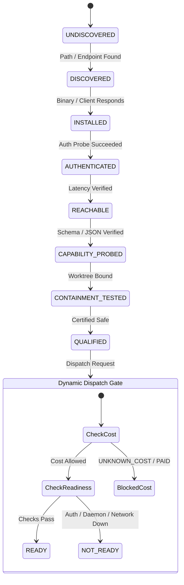

# GRAVITAS K1 — HARNESS ADAPTER ARCHITECTURE

**Wave**: K1 — Recursive Harness Adapter & Execution-Surface Qualification Loop  
**Date**: 2026-10-02  
**Status**: IMPLEMENTED & FROZEN  

---

## 1. Core Architectural Contract

### 1.1 Invariant Locks
```text
ROLE != EXECUTOR != HARNESS != MODEL != PROVIDER != GATEWAY != PROCESS
SKILL != TOOL != HARNESS != GATEWAY != PROVIDER != MODEL != PROCESS
CAPABILITY != TOOL != TRANSPORT != CREDENTIAL != AUTHORITY
TOOL DECLARATION != TOOL QUALIFICATION != TOOL AUTHORIZATION != TOOL EXECUTION
DISCOVERY != INSTALLATION != AUTHENTICATION != TRUST
HARNESS QUALIFICATION != HARNESS READINESS
MODEL ACCESS != PROVIDER ACCESS
PROVIDER ACCESS != BILLING AUTHORIZATION
SUBSCRIPTION IDENTITY != API ENTITLEMENT
PROMOTIONAL CREDIT != PERMANENTLY FREE
CLI PROCESS != API HARNESS
GATEWAY != PROVIDER
PROCESS LIVENESS != HARNESS READINESS
MODEL DIFFERENCE != COGNITIVE INDEPENDENCE
```

### 1.2 Canonical SQLite Boundary
`HARNESS != CANONICAL DATABASE WRITER`  
Harnesses, registry adapters, and execution boundaries NEVER hold write connections to the canonical SQLite database. All durable state transitions (work session, task, durable job leases) are performed strictly via typed `KernelCommand` envelopes submitted to the K0 WorkSession Kernel.

---

## 2. Adapter Taxonomy & Hierarchy

```mermaid
classDiagram
    class GravitasHarness {
        <<interface>>
        +id: string
        +kind: HarnessKind
        +qualify(): Promise~HarnessQualificationSnapshot~
        +checkReadiness(): Promise~ReadinessCheckResult~
        +execute(req): { result, cancellation }
    }

    class ProcessHarness {
        <<interface>>
        +kind: 'PROCESS'
        +getExecutablePath(): string
    }

    class ApiHarness {
        <<interface>>
        +kind: 'API'
        +providerId: string
    }

    class DaemonHarness {
        <<interface>>
        +kind: 'DAEMON'
        +daemonUrl: string
        +isDaemonRunning(): Promise~boolean~
    }

    GravitasHarness <|-- ProcessHarness
    GravitasHarness <|-- ApiHarness
    GravitasHarness <|-- DaemonHarness

    ProcessHarness <|.. K1CodexHarness
    ProcessHarness <|.. K1ClaudeCodeHarness
    ProcessHarness <|.. K1AgyHarness
    ProcessHarness <|.. K1PowerShellHarness
    DaemonHarness <|.. K1FccHarness
    ApiHarness <|.. K1BedrockHarness
```

---

## 3. Qualification vs. Readiness Lifecycle



---

## 4. Normalization Contracts

### 4.1 Normalized Execution Request
Every execution passed to a Gravitas harness is encapsulated by `ExecutionRequest`:
- `executionId`: Unique ID
- `workSessionId`: K0 WorkSession binding
- `durableJobId`: Optional K0 DurableJob lease reference
- `workingDirectory`: Validated absolute path
- `timeoutPolicy`: Non-normative initial timeout with K-phase calibration flag
- `environmentOverrides`: Scrubbed of secret patterns
- `credentialReference`: Opaque pointer; raw keys forbidden

### 4.2 Normalized Execution Result
- Exit codes are strictly scoped to `PROCESS` harnesses
- API and Daemon harnesses map responses without fabricating exit codes
- Cryptographic `resultDigest` binds execution outputs for durable provenance
