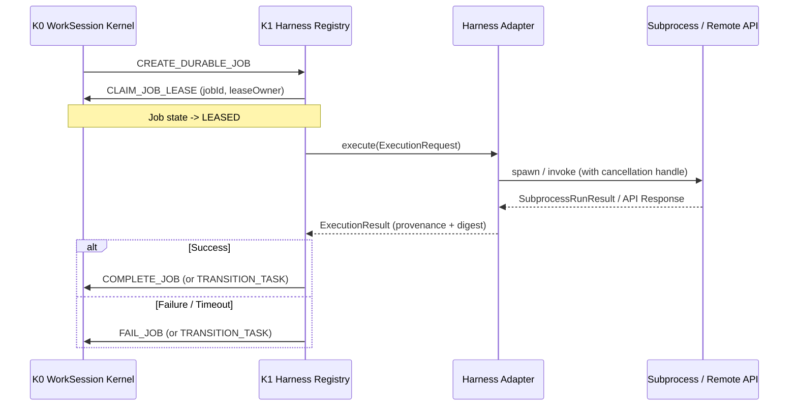

# GRAVITAS K1 — K0 KERNEL INTEGRATION CONTRACT

**Wave**: K1 — Recursive Harness Adapter & Execution-Surface Qualification Loop  
**Date**: 2026-10-02  
**Status**: APPROVED_CONTRACT  

---

## 1. Single Canonical Writer Invariant

```text
HARNESS != CANONICAL DATABASE WRITER
REGISTRY != CANONICAL DATABASE WRITER
```

Harness execution layers, process managers, and API dispatchers MUST NOT write to the K0 SQLite database. All mutations to work sessions, tasks, and durable jobs MUST be mediated through typed `KernelCommand` envelopes submitted to `Kernel.execute(command)`.

---

## 2. Durable Job Lifecycle for Harness Tasks



---

## 3. Idempotency and Lease Safety

1. **Lease Protection**: If a job lease expires before the harness completes, the K0 startup reconciler marks the lease `EXPIRED`.
2. **Cancellation Signal**: When K0 transitions a task or session to `CANCELLED`, the registered `CancellationHandle` triggers process tree termination (`taskkill /T /F` on Windows) to prevent orphan child processes.
3. **Receipt Matching**: Every command returned by K1 contains a cryptographically random `commandId` (UUIDv4) allowing deterministic replay and idempotent retries.
