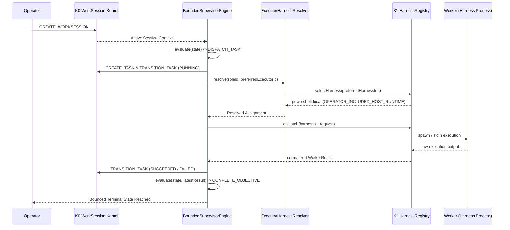

# GRAVITAS K2 — SUPERVISOR ↔ WORKER CLOSED-LOOP ARCHITECTURE

**Wave**: K2 — Supervisor ↔ Worker Closed-Loop Orchestration  
**Date**: 2026-10-02  
**Status**: IMPLEMENTED & EMPIRICALLY VERIFIED  

---

## 1. Architectural Contract & Invariants

```text
ROLE != EXECUTOR != HARNESS != MODEL != PROVIDER != GATEWAY != PROCESS
SUPERVISOR != WORKER
PLAN != TASK
TASK != EXECUTION
EXECUTION != RESULT
RESULT != VERIFICATION
VERIFICATION != APPROVAL
RETRY != REPLAN
WORKER SUCCESS CLAIM != VERIFIED SUCCESS
LLM OUTPUT != CANONICAL STATE
SUPERVISOR != CANONICAL DATABASE WRITER
WORKER != CANONICAL DATABASE WRITER
COMMAND IDEMPOTENCY != EXECUTION IDEMPOTENCY != EXTERNAL SIDE-EFFECT IDEMPOTENCY
TRANSACTION ATOMICITY != DATABASE CONSISTENCY != APPLICATION PROCESS CRASH RECOVERY != OS CRASH DURABILITY != POWER-LOSS DURABILITY
CROSS-RESOURCE ATOMICITY IS UNAVAILABLE
```

### 1.1 Canonical State Boundary
The K0 WorkSession Kernel remains the sole canonical state and persistence authority.
- The **Supervisor** computes bounded structural decisions (`SupervisorDecision`) but does **not** write to SQLite directly.
- The **Worker** receives structured `WorkerAssignment` payloads and returns normalized `WorkerResult` records.
- All session, run, task, and job lease transitions are committed via typed `KernelCommand` envelopes submitted to `kernel.execute(command)`.

---

## 2. Closed-Loop Execution Flow



---

## 3. Autonomy Budgets & Non-Normative Defaults

| Budget Parameter | Initial Non-Normative Default | Calibration Flag |
|---|---|---|
| `maxIterations` | `5` | `REQUIRES_K_PHASE_CALIBRATION` |
| `maxTaskRetries` | `2` | `REQUIRES_K_PHASE_CALIBRATION` |
| `maxWallClockDurationMs` | `300000` (5 min) | `REQUIRES_K_PHASE_CALIBRATION` |
| `maxExecutions` | `10` | `REQUIRES_K_PHASE_CALIBRATION` |
| `maxIncrementalSpendUsd` | `$0.00` | **ARCHITECTURAL INVARIANT** |

---

## 4. Failure Classification & Retry Semantics

- **Transient Failures** (`TRANSIENT_FAILURE`): Retried within `maxTaskRetries` budget.
- **Permanent Failures** (`PERMANENT_FAILURE`): Non-retriable; immediately fails objective.
- **Unknown External Outcomes** (`UNKNOWN_EXTERNAL_OUTCOME`): Blind retry forbidden; triggers `WAIT_FOR_HUMAN`.
- **Cost / Auth Blocks** (`COST_BLOCKED`, `AUTH_UNAVAILABLE`): Fails closed; never retried or hammered.
- **Budget Exhaustion** (`BUDGET_EXHAUSTED`): Transitions to `WAIT_FOR_HUMAN` requiring human sovereign intervention.

---

## 5. Crash Recovery & Idempotency Semantics

### 5.1 Command vs Execution Idempotency
- **Command Idempotency**: K0 provides operation-aware command receipt caching. Resending an identical `commandId` with the identical SHA-256 payload returns `ALREADY_COMMITTED` without duplicate mutations.
- **Execution Idempotency**: Starting an external process is not automatically idempotent. Distributed exactly-once external execution cannot be guaranteed across host processes, networks, or filesystems.
- **Ambiguous Outcomes**: If the orchestrator crashes between process dispatch and result persistence, the outcome is classified as `UNKNOWN_EXTERNAL_OUTCOME`. The system strictly prohibits blind automated retry and transitions to `WAIT_FOR_HUMAN`.

### 5.2 Crash Scenarios (CRASH A–E)
- **CRASH-A** (Supervisor decision persisted, crash before dispatch): Restart reads durable task state in `PENDING` without fabricating execution.
- **CRASH-B** (Job leased, worker dies before result): Active lease un-renewed; expires upon lease timeout; startup reconciler marks job `EXPIRED`.
- **CRASH-C** (Worker dispatched, crash before result persistence): Ambiguous boundary; outcome classified as `UNKNOWN_EXTERNAL_OUTCOME`; blind retry forbidden; human gate required.
- **CRASH-D** (Result persisted, supervisor dies before next decision): Restart reads persisted `SUCCEEDED`/`FAILED` task state; supervisor continues evaluation without re-running the worker.
- **CRASH-E** (Session in `WAITING_APPROVAL`, kernel dies): Restart preserves `WAITING_APPROVAL`; auto-advance, supervisor approval, and worker self-approval are strictly forbidden.

---

## 6. Durability & Persistence Invariants

- **K2 canonical mutations route exclusively through K0 SQLite transaction boundaries.**
- **K2 does not strengthen K0's durability guarantees.**
- **Application Crash**: Committed SQLite transactions remain durable across application crashes.
- **OS Crash / Power Loss**: With WAL + `synchronous=NORMAL`, database consistency is preserved, but recent un-checkpointed commits may roll back per SQLite documentation.
- **Cross-Resource Atomicity**: No distributed two-phase commit exists across SQLite, Git worktrees, filesystem mutations, and external processes. Partial states are detected via reconciliation.
