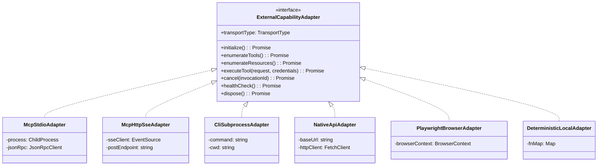
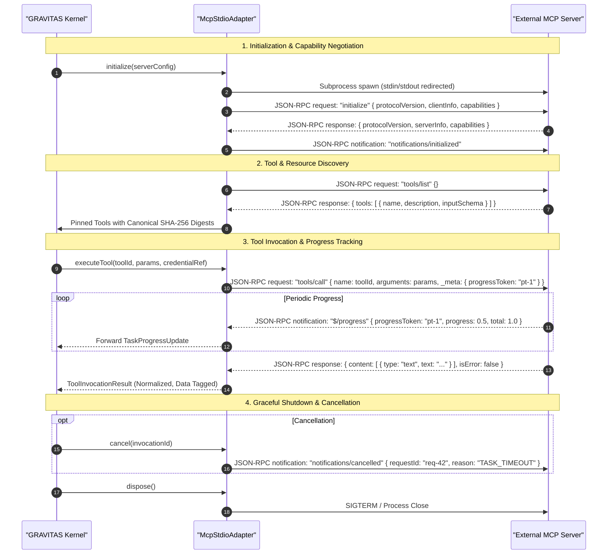

# GRAVITAS — MCP & EXTERNAL CAPABILITY ARCHITECTURE
## Transport Abstraction, Model Context Protocol Adapters, and Non-MCP Integrations

**Document Identifier**: `GRAVITAS-ARCH-P4-002`  
**Governing Milestone**: Wave P4 (Tool Registry + MCP / Plugin / Connector Architecture)  
**Requirement Mapping**: `REQ-P4-05`, `REQ-P4-06`, `REQ-P4-07`, `REQ-P4-14`  
**Document Status**: Final Architectural Contract  
**Date**: 2026-09-30  

---

### Foundational Invariants `[INVARIANT]`
$$\mathbf{CAPABILITY \neq TOOL \neq TRANSPORT \neq CREDENTIAL \neq AUTHORITY}$$
$$\mathbf{TOOL\ DECLARATION \neq TOOL\ QUALIFICATION \neq TOOL\ AUTHORIZATION \neq TOOL\ EXECUTION}$$
$$\mathbf{DISCOVERY \neq INSTALLATION \neq AUTHENTICATION \neq TRUST}$$
$$\mathbf{AUTONOMOUS\_INCREMENTAL\_SPEND = 0}$$
$$\mathbf{FREE\_QUOTA\_EXHAUSTED \longrightarrow STOP \mid SAFE\_FREE\_FALLBACK \mid WAIT \quad (\text{NEVER } \longrightarrow BILL)}$$
$$\mathbf{UNKNOWN\_COST \neq FREE \quad (\text{FAIL CLOSED})}$$

---

## 1. Transport Abstraction Layer `[ARCHITECTURAL CONTRACT]`

A tool's operational semantics must be strictly decoupled from the communication transport used to invoke it. A change in transport (e.g. migrating from a local CLI subprocess to an MCP server or a direct REST API) must **never** require altering agent logic, task specifications, or role prompts.

$$\text{Tool Definition} \quad \longleftrightarrow \quad \text{Tool Instance} \quad \longleftrightarrow \quad \text{Transport Adapter} \quad \longleftrightarrow \quad \text{Physical Substrate}$$



### Transport Comparison Matrix

| Transport Type | Protocol / Framing | Concurrency | Latency | OS Containment | Best Suited For |
| :--- | :--- | :---: | :---: | :---: | :--- |
| **`IN_PROCESS`** | Direct TypeScript call | Thread-safe async | $< 1\text{ms}$ | Process Boundary | Pure functions, tokenizers, diff engines, AST parsers |
| **`CHILD_PROCESS_STDIO`** | Raw stdin/stdout pipes | 1 process / task | $50\text{--}200\text{ms}$ | Windows Job Object / LowIL | Git CLI, compiler (`tsc`), test runner (`npm test`) |
| **`MCP_STDIO`** | JSON-RPC 2.0 over stdin/stdout | Multiplexed / persistent | $10\text{--}50\text{ms}$ | Child Process Sandbox | Local MCP servers (Filesystem, SQLite, Git, GitHub CLI) |
| **`MCP_SSE` / `MCP_HTTP`**| JSON-RPC 2.0 over SSE + POST | High | $50\text{--}300\text{ms}$ | Network Boundary (Loopback) | Remote/containerized MCP servers (Docker, Brave, Slack) |
| **`REST_HTTPS`** | HTTP/1.1 or HTTP/2 JSON | High | $100\text{--}800\text{ms}$ | TLS / Network Sandbox | External SaaS APIs (GitHub REST, Google Calendar, Supabase) |
| **`PLAYWRIGHT_CDP`** | Chrome DevTools Protocol | Tab-isolated | $20\text{--}100\text{ms}$ | Browser Sandbox | Visual QA, DOM inspection, accessibility trees, screenshots |
| **`WINDOWS_UI_AUTOMATION`**| Win32 COM / UIAutomationCore | Serialized | $50\text{--}200\text{ms}$ | Host OS API | Toast notifications, clipboard workflows, window inspection |

---

## 2. Generic Model Context Protocol (MCP) Adapter Architecture `[ARCHITECTURAL CONTRACT]`

GRAVITAS provides a fully conforming, high-performance MCP client implementation compliant with the official Model Context Protocol specification (JSON-RPC 2.0).

### 2.1 MCP Client-Server Lifecycle



### 2.2 Core MCP Primitives & GRAVITAS Mapping

| MCP Primitive | Protocol Specification | GRAVITAS Handling & Security Enforcement |
| :--- | :--- | :--- |
| **Tools (`tools/*`)** | Server exposes executable functions with JSON Schema parameters. | Mapped to `ToolDefinition`. Parameters hashed for anti-drift. Invocation requires kernel `CapabilityGrant` and human gate if mutating. |
| **Resources (`resources/*`)**| Server exposes readable data URIs (files, DB records, docs). | Mapped to `ContextPackage` evidence pointers (`EvidenceRef`). Resources are read-only and ingested with `UNTRUSTED_EXTERNAL_DATA` tagging. |
| **Prompts (`prompts/*`)** | Server provides prompt templates with pre-defined arguments. | Evaluated for inspection only. GRAVITAS **never** allows an external MCP server to override kernel prompt policies or role contracts. |
| **Sampling (`sampling/*`)** | Server requests the client to invoke an LLM on its behalf. | **INTERCEPTED BY KERNEL**: External servers cannot invoke LLMs autonomously. Requests are routed through `InferenceGateway` under strict token/budget ceilings and require Supervisor approval. |
| **Logging (`logging/*`)** | Server emits log messages to client via notifications. | Ingested into task telemetry logs. Secret redaction pipeline strips sensitive tokens from server logs. |
| **Progress (`$/progress`)** | Server reports streaming progress percentages. | Emitted across `AgentMessageEnvelope<ProgressUpdate>` to inform human operator and prevent false timeouts. |
| **Cancellation (`notifications/cancelled`)** | Client signals server to abort an in-flight request. | Dispatched automatically on task lease expiration, operator abort, or budget breach. |

---

## 3. Non-MCP Capability Adapters `[ARCHITECTURAL CONTRACT]`

MCP is an interoperability protocol, not a universal requirement. GRAVITAS incorporates first-class non-MCP adapters where native interfaces provide superior determinism, lower latency, or tighter OS containment.

### 3.1 CLI Subprocess Adapter (`CliSubprocessAdapter`)
- **Use Case**: Git operations, compilers (`tsc`, `eslint`), test runners (`npm test`, `pytest`, `cargo test`).
- **Architecture**:
  - Spawns child processes using Node `child_process.spawn` within a dedicated worktree directory (`cwd: worktreePath`).
  - Subprocess is bound to a native **Windows Job Object** (`JOB_OBJECT_LIMIT_KILL_ON_JOB_CLOSE`) ensuring atomic descendant termination.
  - Standard error and standard output captured in bounded memory rings; stdout/stderr truncation flags set if output exceeds 2MB.
  - Deterministic exit code mapping (`0` = success, `!= 0` = mechanical failure).

### 3.2 Native HTTPS REST / GraphQL Adapter (`NativeApiAdapter`)
- **Use Case**: High-frequency or latency-sensitive cloud APIs (GitHub REST API, Google Calendar v3, Vercel deployments, Supabase).
- **Architecture**:
  - Direct HTTP client using Node native `fetch` with strict timeouts (`timeoutMs: 15000`).
  - Ephemeral header injection via Credential Broker (`Authorization: Bearer <token>`).
  - Automatic exponential backoff with full jitter on HTTP 429 (Rate Limit) and HTTP 503 (Unavailable).
  - Response body streaming with strict size limits to prevent memory exhaustion.

### 3.3 Headless Browser QA Adapter (`PlaywrightBrowserAdapter`)
- **Use Case**: Visual regression testing, DOM element verification, console error listening, and end-to-end user flow simulation.
- **Architecture**:
  - Connects to Playwright Chromium instance via Chrome DevTools Protocol (CDP).
  - Operates strictly in isolated browser contexts (`browser.newContext()`) with separate cookies, local storage, and cache.
  - Network egress restricted to loopback (`127.0.0.1`, `localhost`) by default; external internet blocked unless task has `browser.navigate.external` authority.
  - Emits structured DOM snapshots and PNG screenshots directly to the immutable `.evidence/` vault.

### 3.4 Deterministic In-Process Adapter (`DeterministicLocalAdapter`)
- **Use Case**: Cryptographic SHA-256 digesting, JSON Schema validation, diff generation, AST linting, and state machine transition validation.
- **Architecture**:
  - Synchronous or asynchronous pure functions running within the orchestrator Node.js process.
  - Zero subprocess overhead; $< 1\text{ms}$ execution latency.
  - 100% deterministic and reproducible across platforms.

---

## 4. Unified External Capability Adapter Contract `[ARCHITECTURAL CONTRACT]`

```typescript
/**
 * Unified External Capability Adapter Interface
 * All transports (MCP, CLI, REST, Browser, Local) implement this contract.
 */
export interface ExternalCapabilityAdapter {
  readonly adapterId: string;
  readonly transportType: TransportType;
  readonly supportedCapabilities: readonly string[];

  /** Initializes the underlying transport (spawns process, connects socket, or tests API) */
  initialize(config: Record<string, unknown>): Promise<{
    readonly success: boolean;
    readonly serverInfo?: { name: string; version: string } | undefined;
    readonly discoveredTools: readonly ToolDefinition[];
  }>;

  /** Health probe asserting that the adapter is ready for immediate dispatch */
  healthCheck(): Promise<{
    readonly isHealthy: boolean;
    readonly latencyMs: number;
    readonly message?: string | undefined;
  }>;

  /** Executes a tool through this transport */
  executeTool<TInput = Record<string, unknown>, TOutput = unknown>(
    request: ToolInvocationRequest<TInput>,
    credentials?: ResolvedCredentials | undefined
  ): Promise<ToolInvocationResult<TOutput>>;

  /** Signals immediate cancellation of an in-flight tool invocation */
  cancel(invocationId: string): Promise<boolean>;

  /** Gracefully tears down connection, kills child processes, and releases locks */
  dispose(): Promise<void>;
}
```

---

## 5. Transport Failure & Recovery Model `[ARCHITECTURAL CONTRACT]`

When a tool invocation fails at the transport layer, GRAVITAS applies deterministic recovery logic governed by `TaskOperationalPolicy`:

| Failure Mode | Transport Detection | Recovery Strategy | Fallback Action |
| :--- | :--- | :--- | :--- |
| **Process Crash** | Subprocess exits with non-zero signal or EOF on pipe. | Re-spawn process once; increment transient retry count. | If crash repeats, mark instance `OFFLINE` and trigger safe fallback. |
| **Transport Timeout** | No response received within `timeoutMs`. | Send `notifications/cancelled`; kill child process tree via Job Object. | Escalate to supervisor; attempt alternative qualified tool instance. |
| **OAuth Token Expired** | HTTP 401 or MCP error `UNAUTHENTICATED`. | Request ephemeral token refresh via Credential Broker. | If refresh fails, mark instance `UNAUTHENTICATED` and notify operator. |
| **Rate Limited** | HTTP 429 or provider rate-limit error. | Extract `Retry-After` header; transition instance to `RATE_LIMITED`. | If alternative instance exists, dispatch to fallback; else wait or escalate. |
| **Schema Mismatch** | Response payload fails output schema validation. | Log validation errors; do not retry with identical input. | Mark result as `INVALID_TOOL_OUTPUT` and notify Reviewer. |
| **Containment Breach**| Subprocess attempts write outside `.worktrees/<taskId>`. | Instantly kill process tree via Job Object; freeze worktree. | Mark tool instance `BLOCKED`; record security incident; halt task. |

---

## 6. Provider-Specific Signal Normalization & Zero-Cost Transport Guardrails `[ARCHITECTURAL CONTRACT]`

All remote and subprocess capability adapters (`McpHttpSseAdapter`, `NativeApiAdapter`, `McpStdioAdapter`) specify zero-spend transport middleware that maps provider-specific observations into canonical kernel states:

### 6.1 Normalized Provider State Model
Providers communicate quota and billing conditions heterogeneously. Standard HTTP codes (such as HTTP 429, 402, or 403), `Retry-After` headers, and `X-RateLimit-*` headers are vendor-specific transport observations, **not** universal protocol constants. Adapters must map documented provider responses into standardized internal states:

```typescript
export type NormalizedProviderStatus =
  | 'OPERATIONAL'                // Normal execution; zero-cost quota verified
  | 'RATE_LIMITED'               // Temporal throughput exceeded (burst or RPM ceiling)
  | 'QUOTA_EXHAUSTED'            // Volume allowance depleted for the active period
  | 'PAYMENT_REQUIRED'           // Explicit billing paywall or metered debit signal
  | 'AUTHORIZATION_DENIED'       // Scopes, tokens, or permissions invalid
  | 'BILLING_STATE_CHANGED'      // Provider terms, tier, or card status transitioned
  | 'UNKNOWN_PROVIDER_REJECTION';// Unrecognized rejection format (fails closed safely)
```

### 6.2 Provider Signal Mapping Rules
1. **HTTP 403 Disambiguation**: HTTP 403 must **NOT** be universally assumed to indicate quota exhaustion. For GitHub API, HTTP 403 with `X-RateLimit-Remaining: 0` signifies rate-limiting/quota exhaustion, whereas HTTP 403 without rate-limit headers indicates an authorization scope denial (`AUTHORIZATION_DENIED`).
2. **HTTP 402 & Metering Detection**: HTTP 402 is **NOT** the sole signal of billing exposure. Many modern APIs return HTTP 200 with metadata warnings, or HTTP 400 with a JSON payload indicating billing meter activation. Adapters must inspect documented response bodies and headers.
3. **Absence of Rate-Limit Headers**: Adapters must **NOT** assume `X-RateLimit-*` headers exist. If an external service provides no telemetry headers, the adapter falls back to documented body inspection or client-side request-rate tracking.
4. **Unknown Responses Fail Safely**: Any unparsed or unexpected error response is mapped to `UNKNOWN_PROVIDER_REJECTION` and fails closed without attempting billable retries.

### 6.3 Rate Limit & Burst Handling
When an adapter determines that an endpoint is in state `RATE_LIMITED`:
1. **Never Trigger Paid Escalation**: The adapter is strictly prohibited from upgrading service tiers, adding billing methods, or purchasing credits.
2. **Configurable Jittered Backoff**: If backoff metadata (such as `Retry-After`) is observable and within the active `ToolRetryBudget`, the request is paused in a queue.
3. **Instance State Transition**: If the rate limit represents a period-level quota exhaustion (e.g. monthly cap), the tool instance is transitioned to `readinessState = 'RATE_LIMITED'`.
4. **Zero-Cost Fallback**: The kernel scheduler evaluates `resolveCapability`, selecting the next best qualified zero-cost candidate (`LOCAL_FOSS` or alternative `FREE_TIER`). If no zero-cost candidate is available, the task transitions to `WAIT` or escalates to the human operator.

### 6.4 Quota Exhaustion & Payment Protection
When an adapter detects `QUOTA_EXHAUSTED` or `PAYMENT_REQUIRED`:
- Execution is **immediately aborted** for that candidate.
- The candidate's `CostProfile` is updated with `remainingObservable = 0`.
- The system executes **`FREE_QUOTA_EXHAUSTED → STOP | SAFE_FREE_FALLBACK | WAIT`**.
- Proposed implementations shall never automate payment, present stored credit card details, or automate checkout forms.

