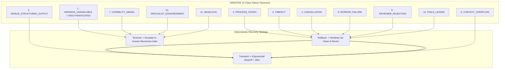
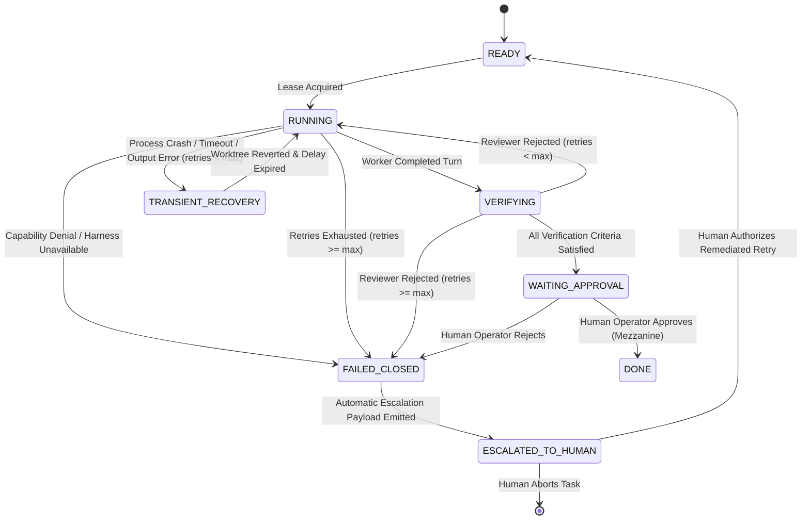

# GRAVITAS — FAILURE TAXONOMY & DETERMINISTIC RECOVERY MODEL
## Comprehensive Failure Classification, Deterministic Recovery Policies, Lease Semantics & Sovereign Escalation

**Document Status**: Authoritative Architecture Specification (Wave P3)  
**Governing Invariant**:
$$\text{ROLE} \neq \text{EXECUTOR} \neq \text{HARNESS} \neq \text{MODEL} \neq \text{PROVIDER} \neq \text{GATEWAY} \neq \text{PROCESS}$$
**Git Baseline Commit**: `516e01c82cb4c3afd1080e72e68a4e1e56687335`  
**Dependencies**: `PROGRAM_INVARIANTS.md`, `GRAVITAS_CONCEPTUAL_BOUNDARIES.md`, `ROLE_EXECUTOR_HARNESS_ARCHITECTURE.md`

---

## 1. Executive Summary & Core Principles

In an autonomous multi-agent operating system, failures are not exceptional events—they are routine operational conditions. Without an exhaustive, deterministic recovery architecture, autonomous workflows succumb to deadlocks, silent security degradations, infinite retry storms, stale lease lockouts, and premature completion hallucinations.

This document defines the authoritative Failure Taxonomy, Deterministic Recovery Model, Lease & Concurrency Specification, and Sovereign Escalation Protocol for GRAVITAS.

### Core Architectural Axioms

1. **Fail-Closed Security**: Security and containment failures (such as capability denials or unauthorized path mutations) must **never** be retried automatically. They immediately isolate execution and fail closed.
2. **Deterministic Rollback**: Every failed execution turn in an isolated Git worktree must be deterministically rolled back to its snapshot baseline (`baseCommitSha`) before any retry is attempted.
3. **Strict Bounded Retries**: Retries are governed by exponential backoff with full jitter and a strict maximum ceiling (`maxRetries`). Infinite retry loops are structurally prohibited.
4. **Idempotency Preservation**: Every retry inherits a deterministic idempotency key and monotonic fence token, preventing duplicate execution or split-brain worktree mutations.
5. **Human Sovereignty on Terminal Failure**: When retries are exhausted, deadlock is detected, or containment is challenged, execution unconditionally halts and escalates to human authority on the Mezzanine.

---

## 2. The 12-Class Failure Taxonomy



### 2.1 Detailed Class Definitions

#### 1. `HARNESS_UNAVAILABLE` / `HARNESS_UNAUTHENTICATED`
- **Domain**: Infrastructure / Toolchain Environment.
- **Root Cause**: The selected execution surface binary is missing, uninstalled, lacking OS execute permissions, or missing credentials (e.g. Codex missing `auth.json`, Claude Code unauthenticated, FCC server daemon offline).
- **Classification**: `TERMINAL_ENVIRONMENTAL` (cannot be resolved by repeating the same invocation).
- **Detection**: Pre-flight qualification check fails or process exit code indicates missing login credentials.

#### 2. `PROCESS_CRASH`
- **Domain**: Host Operating System / Execution Lifecycle.
- **Root Cause**: Subprocess abnormal termination, fatal signal (`SIGSEGV`, `SIGBUS`, unhandled exception), out-of-memory killer (`OOM`), or Windows structured exception.
- **Classification**: `TRANSIENT_SYSTEM` (eligible for bounded retry).
- **Detection**: Subprocess exits with non-zero code or null exit code with OS termination signal.

#### 3. `TIMEOUT`
- **Domain**: Resource / Latency Management.
- **Root Cause**: Subprocess execution exceeded `timeoutMs` without terminating, or external provider API stalled.
- **Classification**: `TRANSIENT_RESOURCE` (eligible for bounded retry with increased timeout if permitted).
- **Detection**: GRAVITAS execution supervisor timer fires before child process stream close.

#### 4. `CANCELLATION`
- **Domain**: Governance / Preemption.
- **Root Cause**: Human operator issued an explicit abort command, or parent goal was cancelled, or dependent task failed causing DAG cancellation.
- **Classification**: `TERMINAL_INTENTIONAL` (no retry).
- **Detection**: AbortController signal received by execution coordinator.

#### 5. `INVALID_STRUCTURED_OUTPUT`
- **Domain**: Syntactic / Protocol Parsing.
- **Root Cause**: LLM returned unparseable JSON, Markdown code block fences surrounding JSON, corrupted payload, or schema validation failure (`ZodError`).
- **Classification**: `TRANSIENT_REASONING` (eligible for prompt-repair retry).
- **Detection**: Schema validator throws `ValidationError` on response parsing.

#### 6. `CONTEXT_OVERFLOW`
- **Domain**: Model / Token Boundary.
- **Root Cause**: Input prompt plus generated tokens exceed model's maximum context window (`contextWindowTokens`), or provider returns HTTP 400 Context Length Exceeded.
- **Classification**: `RECOVERABLE_REDUCTION` (eligible for retry with context pruning/minimization).
- **Detection**: Provider returns context length error or token counter exceeds safety threshold.

#### 7. `CAPABILITY_DENIAL`
- **Domain**: Security / Containment Boundary.
- **Root Cause**: Worker attempted to read/write outside designated worktree directory, execute an unpermitted tool, invoke an unauthorized network endpoint, or execute a forbidden Git command (`git push --force`, `git merge main`).
- **Classification**: `TERMINAL_SECURITY` (strictly non-retryable; immediate fail-closed).
- **Detection**: Path boundary interceptor or capability middleware flags unauthorized action.

#### 8. `WORKER_FAILURE`
- **Domain**: Logical / Domain Execution.
- **Root Cause**: Worker script executed, but domain compiler/linter/test failed within the worktree (e.g. TypeScript compile error, syntax error, failed build).
- **Classification**: `TRANSIENT_LOGICAL` (eligible for self-correction retry with compiler stderr feedback).
- **Detection**: Deterministic build/lint check returns non-zero exit code during worker phase.

#### 9. `REVIEWER_REJECTION`
- **Domain**: Quality / Independent Verification.
- **Root Cause**: Independent Reviewer or deterministic Verifier inspected the candidate worktree and rejected the changes due to failed acceptance criteria, regression, or diff scope violation.
- **Classification**: `RETRYABLE_DEFECT` (eligible for worker rework turn up to `maxRetries`).
- **Detection**: Independent Verifier emits `VerificationResult { outcome: 'REJECTED' }`.

#### 10. `SPECIALIST_DISAGREEMENT`
- **Domain**: Cognitive / Architectural Conflict.
- **Root Cause**: Two peer specialist roles (e.g. Frontend Engineer and Backend Engineer, or Architect and Security Auditor) propose contradictory interface designs or incompatible schema contracts that cannot be reconciled automatically.
- **Classification**: `TERMINAL_CONSENSUS` (immediate escalation to Chief Planner or Human Authority).
- **Detection**: Consensus arbitration module detects irreconcilable contract diffs after arbitration turn.

#### 11. `DEADLOCK`
- **Domain**: Concurrency / Task Graph Scheduling.
- **Root Cause**: Circular task dependency introduced in runtime DAG, or mutual wait on shared filesystem worktrees or database locks.
- **Classification**: `TERMINAL_STRUCTURAL` (requires graph restructuring or human preemption).
- **Detection**: Cycle detection algorithm on active dependency graph or lock wait-for graph timeout.

#### 12. `STALE_LEASES`
- **Domain**: Coordination / Distributed Heartbeat.
- **Root Cause**: Worker node or process halted, network partitioned, or hung without updating lease heartbeat within `heartbeatIntervalMs * 3`.
- **Classification**: `RECOVERABLE_COORDINATION` (lease revoked, worktree reclaimed, task re-queued).
- **Detection**: Stale Lease Reaper identifies `now() > expiresAt + gracePeriodMs`.

---

## 3. Exhaustive Failure Handling & Recovery Matrix `[ARCHITECTURAL CONTRACT]`

> **OPERATIONAL POLICY INVARIANT `[INVARIANT]`:**  
> Retries and revision limits are governed by the task's assigned `TaskOperationalPolicy` (`InteractionBudget` and `RevisionBudget`). Specific numerical bounds in the table below are **NON-NORMATIVE EXAMPLES** illustrating typical system defaults.

| Failure Mode | Detection Mechanism | Immediate Isolation Action | Rollback Strategy | Retry Policy | Max Retries (Policy-Governed) | Backoff Strategy | Escalation Gate |
| :--- | :--- | :--- | :--- | :--- | :--- | :--- | :--- |
| **`HARNESS_UNAVAILABLE`** | Pre-flight probe / exit code | Halt launch attempt; mark descriptor `NOT_READY` | None (no worktree mutation occurred) | **Zero Retries** (Permanent error) | 0 | None | Escalate to Operator on Mezzanine with installation/auth checklist |
| **`PROCESS_CRASH`** | OS exit code $\neq 0$ / null signal | Atomic process tree kill via candidate OS mechanism | Git clean & revert worktree to `baseCommitSha` | Retryable (Transient) | `InteractionBudget` (*2 retries example*) | Exponential backoff: base 2000ms, multiplier 2.0, full jitter | Escalate to Operator if crash recurs |
| **`TIMEOUT`** | Supervisor timeout timer | Force-kill child process tree via candidate OS mechanism | Git clean & revert worktree to `baseCommitSha` | Retryable (Transient) | `ExecutionTimeoutPolicy` (*2 retries example*) | Exponential backoff: base 3000ms; +50% timeout on retry 2 | Escalate to Operator if task times out |
| **`CANCELLATION`** | AbortSignal received | Terminate process tree; discard pending messages | Git clean & discard ephemeral worktree | **Zero Retries** | 0 | None | Mark task `CANCELLED`; notify requesting authority |
| **`INVALID_STRUCTURED_OUTPUT`** | Zod / JSON parse exception | Invalidate response payload; retain transcript | None (no worktree mutation occurred) | Retryable with schema feedback injected | `InteractionBudget` (*3 retries example*) | Immediate retry with structured error prompt injection | Escalate to Operator if consecutive schema failures persist |
| **`CONTEXT_OVERFLOW`** | Provider 400 / token limit check | Abort turn; flush non-essential context buffers | None (no worktree mutation occurred) | Retryable with pruned context package | `TokenBudget` (*2 retries example*) | Exponential backoff: base 1000ms; prune conversation history | Escalate to Chief Planner or Operator for subtask splitting |
| **`CAPABILITY_DENIAL`** | Capability boundary interceptor | **Immediate Kill**: Terminate process tree instantly | Hard Git reset (`git reset --hard baseSha && git clean -fd`) | **Zero Retries** (Security breach) | 0 | None | **SECURITY ESCALATION**: Freeze task, alert Operator, log forensic audit |
| **`WORKER_FAILURE`** | Linter / compiler non-zero exit | Retain worktree in dirty state for inspection | Keep worktree edits, inject compiler error log | Retryable (Logical correction) | `InteractionBudget` (*3 retries example*) | Linear backoff: base 1000ms; inject `stderr` as repair prompt | Escalate to Operator if compiler errors persist across turns |
| **`REVIEWER_REJECTION`** | Verifier emits `REJECTED` | Capture rejection evidence bundle | Revert worktree or preserve branch for rework | Retryable (Rework turn) | `RevisionBudget.maxRevisions` (*3 loops example*) | Invalidate review claim; re-assign to Worker with critique bundle | Escalate to Human Approver if rejected across max revisions |
| **`SPECIALIST_DISAGREEMENT`** | Arbitration diff check | Freeze task branch and dependent subtasks | Preserve diffs from both specialists | 1 Arbitration turn by Chief Planner | 1 | If Planner cannot resolve, halt | Escalate to Operator with side-by-side proposal comparison |
| **`DEADLOCK`** | Wait-for graph cycle detector | Identify lowest-priority cycle participant | Release acquired locks; revert participant task | **Zero Retries** of deadlock state | 0 | Re-sequence DAG; break dependency cycle | Escalate to Chief Planner / Operator to re-order tasks |
| **`STALE_LEASES`** | Reaper daemon heartbeat timeout | Break lease lock; terminate lingering PIDs | Inspect worktree; git reset to last clean commit | Re-queue task to `READY` state | `InteractionBudget` (*2 steals example*) | Increment `fenceToken`; assign to healthy Executor | Escalate to Operator if lease steals exceed threshold |

---

## 4. Concurrency, Ownership & Distributed Lease Management

### 4.1 Task Lease Protocol & Fencing Tokens `[ARCHITECTURAL CONTRACT]`

To guarantee that multiple executors never concurrently mutate the same task or race on worktree files, GRAVITAS implements a strict **Fencing Token Lease Protocol**.

$$\text{TaskLease} = \langle \text{leaseId}, \text{taskId}, \text{executorId}, \text{fenceToken}, \text{acquiredAt}, \text{expiresAt}, \text{operationalPolicy} \rangle$$

1. **Monotonic Fencing Tokens**: Every time a lease is granted or renewed, a strictly monotonically increasing 64-bit integer `fenceToken` is issued.
2. **Optimistic Concurrency Verification**: Any storage commit or Git branch push must present the current `fenceToken`. If a stale worker attempts a mutation with an outdated `fenceToken`, the transaction is unconditionally rejected (`STALE_FENCE_TOKEN`).
3. **Heartbeat Protocol**: Active workers must emit a heartbeat every $T_{\text{heartbeat}}$ (default 10,000 ms). If no heartbeat is received within $3 \times T_{\text{heartbeat}}$, the lease is marked expired.

```typescript
export interface TaskLeaseRecord {
  readonly leaseId: string;
  readonly taskId: string;
  readonly executorId: string;
  readonly roleId: AgentRoleId;
  readonly fenceToken: number;
  readonly acquiredAt: string;
  readonly lastHeartbeatAt: string;
  readonly expiresAt: string;
  readonly heartbeatIntervalMs: number;
  readonly operationalPolicy: TaskOperationalPolicy;
  readonly leaseState: 'ACTIVE' | 'EXPIRED' | 'REVOKED' | 'RELEASED';
}

export interface LeaseAcquisitionResult {
  readonly success: boolean;
  readonly lease?: TaskLeaseRecord | undefined;
  readonly conflict?: {
    readonly currentHolderId: string;
    readonly expiresAt: string;
    readonly remainingMs: number;
  } | undefined;
}
```

### 4.2 Ephemeral Worktree Lock & Repository Concurrency Serialization

#### Required Behavioral Contract `[ARCHITECTURAL CONTRACT]`
Linked Git worktrees share the common `.git/objects/` database, `.git/packed-refs`, and repository configuration. Concurrent operations across parallel tasks (`git worktree add`, `git worktree remove`, `git cherry-pick`, `git commit`, `git pack-refs`) can cause fatal collisions on `.git/index.lock` or `packed-refs.lock` on Windows NTFS and POSIX filesystems.
- The architecture requires that **all structural Git mutations that modify shared repository state MUST be serialized deterministically**.

#### Candidate Concurrency Implementation `[CANDIDATE IMPLEMENTATION]`
- **In-Process & Filesystem Mutex (`AsyncRepositoryMutex`)**: A process-wide lock with optional file lock fallback serializing worktree additions/removals and shared ref updates. Mutex acquisition waits up to a configurable timeout (non-normative example default: `30,000ms`) with exponential backoff before failing with `GIT_REPOSITORY_LOCK_TIMEOUT`.
- **Per-Worktree Task Lock**: An atomic JSON lockfile at `.worktrees/<taskId>/.gravitas-lock` created with `O_EXCL | O_CREAT` tracking active holder PID and fencing token.

### 4.3 Stale Lease Reaper Daemon & Process Tree Termination

#### Required Architectural Behavior `[ARCHITECTURAL CONTRACT]`
The kernel runs a background reaper service that monitors active leases:
1. Identifies stale leases where $\text{now}() > \text{expiresAt} + \text{gracePeriodMs}$.
2. Enforces **atomic termination of the complete process tree** associated with the expired task lease.
3. Performs clean rollback of uncommitted worktree mutations under repository mutex.
4. Increments `leaseStealCount` and escalates to human operator if threshold is breached.

#### Candidate Process Termination Mechanisms `[CANDIDATE IMPLEMENTATION]`
- **Windows Job Objects (`JOB_OBJECT_LIMIT_KILL_ON_JOB_CLOSE`)**: Evaluated for Windows systems to mitigate PID recycling hazards by assigning child processes to an explicit kernel Job Object. Closing the Job handle atomically terminates all descendants.
- **POSIX Process Groups / `pkill`**: Signal broadcasting to `-PID` process group leader.
- **Fallback**: `taskkill.exe /PID <pid> /T /F` on Windows.

### 4.4 Deadlock Prevention & Cycle Detection Architecture

#### Required Architectural Behavior `[ARCHITECTURAL CONTRACT]`
1. **DAG Topological Validation**: Before DAG execution begins, the dependency graph MUST be verified to be strictly acyclic. Cyclic DAGs must be rejected prior to task dispatch.
2. **Dynamic Lock Ordering**: Resources shared between concurrent tasks must be acquired in a deterministic canonical sequence (e.g. lexicographical order) to eliminate hold-and-wait deadlock conditions.
3. **Agent Dependency Deadlock Detection**: Blocking interactions in the Agent Wait-For Graph ($G_W$) must be checked before wait-state transition, failing closed on cycle creation.

#### Reference Implementation Algorithms `[REFERENCE ALGORITHM]`
- Static DAG cycle check and dynamic $G_W$ cycle detection are implemented via **Tarjan's Strongly Connected Components (SCC)** or depth-first search (DFS) cycle checks. Alternative algorithms satisfying linear-time deterministic cycle identification are authorized.

---

## 5. Complete TypeScript Contracts for Failure & Recovery

```typescript
/**
 * GRAVITAS ARCHITECTURE V2 — FAILURE & RECOVERY CONTRACTS
 */

export type FailureCategory =
  | 'HARNESS_UNAVAILABLE'
  | 'PROCESS_CRASH'
  | 'TIMEOUT'
  | 'CANCELLATION'
  | 'INVALID_STRUCTURED_OUTPUT'
  | 'CONTEXT_OVERFLOW'
  | 'CAPABILITY_DENIAL'
  | 'WORKER_FAILURE'
  | 'REVIEWER_REJECTION'
  | 'SPECIALIST_DISAGREEMENT'
  | 'DEADLOCK'
  | 'STALE_LEASES';

export type ErrorSeverity = 'TRANSIENT' | 'RETRYABLE_DEFECT' | 'SECURITY_CRITICAL' | 'TERMINAL';

export interface GravitasFailure {
  readonly failureId: string;
  readonly category: FailureCategory;
  readonly severity: ErrorSeverity;
  readonly taskId: string;
  readonly roleId: AgentRoleId;
  readonly executorId: string;
  readonly harnessId: string;
  readonly occurredAt: string;
  readonly message: string;
  readonly details: Record<string, unknown>;
  readonly processExitCode: number | null;
  readonly processSignal: string | null;
  readonly worktreeDirty: boolean;
  readonly fenceToken: number;
}

export interface RetryPolicy {
  readonly maxRetries: number;
  readonly baseDelayMs: number;
  readonly maxDelayMs: number;
  readonly backoffMultiplier: number;
  readonly useJitter: boolean;
}

export interface RecoveryAction {
  readonly type: 'RETRY' | 'ROLLBACK_AND_RETRY' | 'REASSIGN_HARNESS' | 'FAIL_CLOSED_ESCALATE' | 'REAP_AND_REQUEUE';
  readonly failureId: string;
  readonly taskId: string;
  readonly targetHarnessId?: string | undefined;
  readonly delayMs: number;
  readonly idempotencyKey: string;
  readonly nextFenceToken: number;
  readonly rollbackRequired: boolean;
  readonly escalationPayload?: HumanEscalationPayload | undefined;
}

export interface HumanEscalationPayload {
  readonly escalationId: string;
  readonly taskId: string;
  readonly roleId: AgentRoleId;
  readonly failureCategory: FailureCategory;
  readonly reason: string;
  readonly diagnosticSummary: string;
  readonly suggestedRemediations: readonly string[];
  readonly worktreeSnapshotPath: string;
  readonly requiresApprovalGate: boolean;
}

/**
 * Global Task Turn Ceiling across ALL failure categories combined.
 * Prevents multi-category loop oscillation (e.g. timeout -> crash -> failure -> reject).
 * NOTE: Invariant architecture dictates that turn bounds are governed by TaskOperationalPolicy.interactionBudget.
 * The constant below provides an optional non-normative default fallback if no explicit policy is provided.
 */
export const DEFAULT_NON_NORMATIVE_GLOBAL_TURN_CEILING = 8;

export const DEFAULT_RETRY_POLICIES: Record<FailureCategory, RetryPolicy> = {
  HARNESS_UNAVAILABLE: { maxRetries: 0, baseDelayMs: 0, maxDelayMs: 0, backoffMultiplier: 1.0, useJitter: false },
  PROCESS_CRASH: { maxRetries: 2, baseDelayMs: 2000, maxDelayMs: 10000, backoffMultiplier: 2.0, useJitter: true },
  TIMEOUT: { maxRetries: 2, baseDelayMs: 3000, maxDelayMs: 15000, backoffMultiplier: 2.0, useJitter: true },
  CANCELLATION: { maxRetries: 0, baseDelayMs: 0, maxDelayMs: 0, backoffMultiplier: 1.0, useJitter: false },
  INVALID_STRUCTURED_OUTPUT: { maxRetries: 3, baseDelayMs: 500, maxDelayMs: 2000, backoffMultiplier: 1.5, useJitter: false },
  CONTEXT_OVERFLOW: { maxRetries: 2, baseDelayMs: 1000, maxDelayMs: 5000, backoffMultiplier: 2.0, useJitter: false },
  CAPABILITY_DENIAL: { maxRetries: 0, baseDelayMs: 0, maxDelayMs: 0, backoffMultiplier: 1.0, useJitter: false },
  WORKER_FAILURE: { maxRetries: 3, baseDelayMs: 1000, maxDelayMs: 8000, backoffMultiplier: 2.0, useJitter: true },
  REVIEWER_REJECTION: { maxRetries: 3, baseDelayMs: 1000, maxDelayMs: 5000, backoffMultiplier: 1.5, useJitter: false },
  SPECIALIST_DISAGREEMENT: { maxRetries: 1, baseDelayMs: 2000, maxDelayMs: 5000, backoffMultiplier: 1.0, useJitter: false },
  DEADLOCK: { maxRetries: 0, baseDelayMs: 0, maxDelayMs: 0, backoffMultiplier: 1.0, useJitter: false },
  STALE_LEASES: { maxRetries: 2, baseDelayMs: 1000, maxDelayMs: 5000, backoffMultiplier: 2.0, useJitter: true },
};

/**
 * Calculates exponential backoff with full jitter.
 */
export function calculateBackoffDelay(
  policy: RetryPolicy,
  attemptNumber: number
): number {
  if (attemptNumber <= 0 || policy.maxRetries === 0) return 0;
  
  const exponential = policy.baseDelayMs * Math.pow(policy.backoffMultiplier, attemptNumber - 1);
  const bounded = Math.min(exponential, policy.maxDelayMs);
  
  if (!policy.useJitter) {
    return Math.round(bounded);
  }
  
  // Full jitter: random between 0 and bounded
  return Math.round(Math.random() * bounded);
}
```

---

## 6. Deterministic FSM State Transitions on Failure



### Deterministic Transition Rules

1. **`RUNNING` $\rightarrow$ `TRANSIENT_RECOVERY`**:
   - Condition: Failure category is retryable (`PROCESS_CRASH`, `TIMEOUT`, `INVALID_STRUCTURED_OUTPUT`, `WORKER_FAILURE`), AND `currentRetries < policy.maxRetries`.
   - Action: Kill process tree, reset worktree to `baseCommitSha`, increment retry counter, schedule wakeup timer with calculated jittered delay.
2. **`RUNNING` $\rightarrow$ `FAILED_CLOSED`**:
   - Condition: Failure category is terminal (`CAPABILITY_DENIAL`, `HARNESS_UNAVAILABLE`, `DEADLOCK`) OR `currentRetries >= policy.maxRetries`.
   - Action: Halt process tree, isolate worktree branch, emit `TaskFailedClosedEvent`, construct `HumanEscalationPayload`.
3. **`FAILED_CLOSED` $\rightarrow$ `ESCALATED_TO_HUMAN`**:
   - Condition: Unconditional upon entering `FAILED_CLOSED`.
   - Action: Transition task to Mezzanine review queue, project diagnostic view on Command Center 3D HQ, await sovereign human authorization.

---

## 7. Verification & Architectural Sign-Off

This failure and recovery architecture strictly upholds all 20 GRAVITAS Program Invariants:
- **No silent downgrades**: Enforced by strict fail-closed capability gates.
- **No auto-merges or unapproved mutations**: Enforced by isolated worktree resets and human escalation gates.
- **No infinite retry storms**: Enforced by bounded exponential backoff policies and atomic lease fencing tokens.
- **Unwavering human sovereignty**: Enforced by mandatory escalation on all terminal failure paths.
