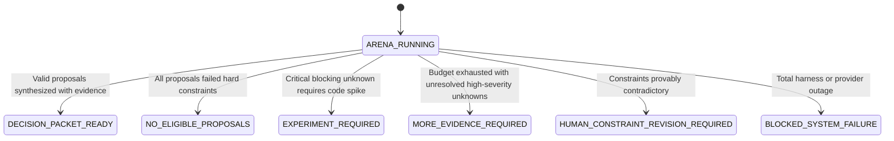

# P5 ARENA FAILURE AND RECOVERY MODEL
## Fault Tolerance, Stall Detection, Loop Prevention & Deterministic Escalation

**Status:** ARCHITECTURAL SPECIFICATION — P5 BASELINE  
**Date:** 2026-09-30  
**Git Baseline Commit:** `516e01c82cb4c3afd1080e72e68a4e1e56687335`  
**Governing Invariants:**
- $\mathbf{HUMAN\ DECISION \neq AGENT\ CONSENSUS}$
- $\mathbf{CONSENSUS \neq CORRECTNESS}$
- $\mathbf{AUTONOMOUS\_INCREMENTAL\_SPEND = 0}$
- $\mathbf{UNKNOWN\_COST \neq FREE \quad (\text{FAIL CLOSED})}$
- $\mathbf{FAIL\_CLOSED > SILENT\_FAILURE}$

---

## 1. Overview and Design Philosophy

The Architecture Arena operates in an inherently noisy, adversarial environment. Scouts query external networks, ingest untrusted web data, evaluate third-party dependencies, and conduct multi-agent debates. 

The Arena failure model enforces **deterministic boundedness**:
1. No debate may run indefinitely.
2. No agent failure or crash can stall the parent pipeline.
3. No hallucinated claim or untrusted prompt injection can manipulate architectural conclusions.
4. If the Arena cannot safely reach a valid decision, it fails closed to `HUMAN_INTERVENTION_REQUIRED`.

---

## 2. Arena Failure Taxonomy & Deterministic Mitigations

| Failure Code | Description | Root Cause / Trigger | Automated Mitigation & Recovery Path |
| :--- | :--- | :--- | :--- |
| **FAIL-ARENA-01** | **Scout Process Crash / Timeout** | Subagent hits timeout, unhandled error, or OOM. | Mark Scout as `CRASHED`. If $\ge 2$ valid Scouts remain, proceed with remaining proposals. If $< 2$ Scouts remain, spawn fallback Scout once; if fallback fails, escalate to operator. |
| **FAIL-ARENA-02** | **Hallucinated or Fabricated Source** | Scout cites a non-existent URL, commit, or RFC. | Cryptographic verification of URL/digest fails. Mark evidence `EVIDENCE_FABRICATION_FLAG`. Strip claim from proposal; proposal author receives severe credibility penalty in critique. |
| **FAIL-ARENA-03** | **Zero Valid Proposals (Constraint Breach)** | All submitted proposals violate a hard constraint. | Mark Arena state as `ALL_PROPOSALS_DISQUALIFIED`. Emit diagnostic report detailing which constraints each proposal violated. Halt Arena; request operator review of constraints. |
| **FAIL-ARENA-04** | **Circular Critique / Rebuttal Debate** | Critic and author repeat identical arguments without new evidence. | Step counter triggers max rounds limit (1 round default). Arena coordinator terminates debate phase. Unresolved argument converted into `UNRESOLVED_CONTRADICTION`. |
| **FAIL-ARENA-05** | **Synthesizer Majoritarian Bias** | Synthesizer attempts to rank proposals by vote count. | Deterministic schema validation rejects synthesis output containing vote tallies or majority-rule rankings. Output regenerated with explicit anti-majoritarian template. |
| **FAIL-ARENA-06** | **External Source Rate Limit / Block** | Search API or URL fetch encounters 429/403 or Cloudflare block. | Apply jittered exponential backoff. If exhausted, mark source `SOURCE_UNAVAILABLE`. Scout must pivot to alternative sources or flag topic as `UNKNOWN`. Never pay to bypass. |
| **FAIL-ARENA-07** | **Prompt Injection via Research Data** | Web page or issue contains embedded instructions to hijack agent. | Research data labeled via `<<<BEGIN_UNTRUSTED_RESEARCH_DATA>>>`. Layered defense enforces zero instruction authority, strict capability token constraints, and parser command detection; logs `INJECTION_ATTEMPT_DEFUSED`. |
| **FAIL-ARENA-08** | **Critic-Author Collusion (Fake Critique)** | Critic emits superficial praise without probing flaws. | Coordinator runs automated structural check (minimum 1 finding required). If critique contains zero critical findings, assign a secondary `Contrarian Scout` to mount an attack. |
| **FAIL-ARENA-09** | **Irreconcilable Benchmark Conflict** | Two proposals rely on conflicting synthetic benchmarks. | Classify as `INCOMPARABLE_BENCHMARKS`. Strip benchmark claims from ranking matrix; mark metric as `REQUIRES_EXPERIMENT` for downstream wave. |
| **FAIL-ARENA-10** | **Total Token / Time Budget Depletion** | Arena run exceeds `ArenaBudgetPolicy` limits. | Coordinator issues immediate emergency pause. Partial findings synthesized into an `INCOMPLETE_ARENA_PACKET` detailing exact progress and remaining unknowns. |

---

## 3. Terminal Arena Exit States

The Arena state machine deterministically resolves into one of six terminal exit states:

1. **`DECISION_PACKET_READY`:** Normal successful completion. Packet delivered to human operator.
2. **`NO_ELIGIBLE_PROPOSALS`:** The problem as constrained has no viable technical solution under current policy (e.g. zero-spend prohibits all existing cloud options).
3. **`EXPERIMENT_REQUIRED`:** Theoretical research is exhausted; an authorized downstream experiment is required before an architectural choice can be justified.
4. **`MORE_EVIDENCE_REQUIRED`:** Research was truncated by budget or search limits. Operator may allocate more tokens or adjust scope.
5. **`HUMAN_CONSTRAINT_REVISION_REQUIRED`:** The hard constraints are mutually contradictory (e.g. "Must be 100% native Rust" AND "Must not install Rust toolchain").
6. **`BLOCKED_SYSTEM_FAILURE`:** Severe external infrastructure outage preventing multi-agent coordination.
