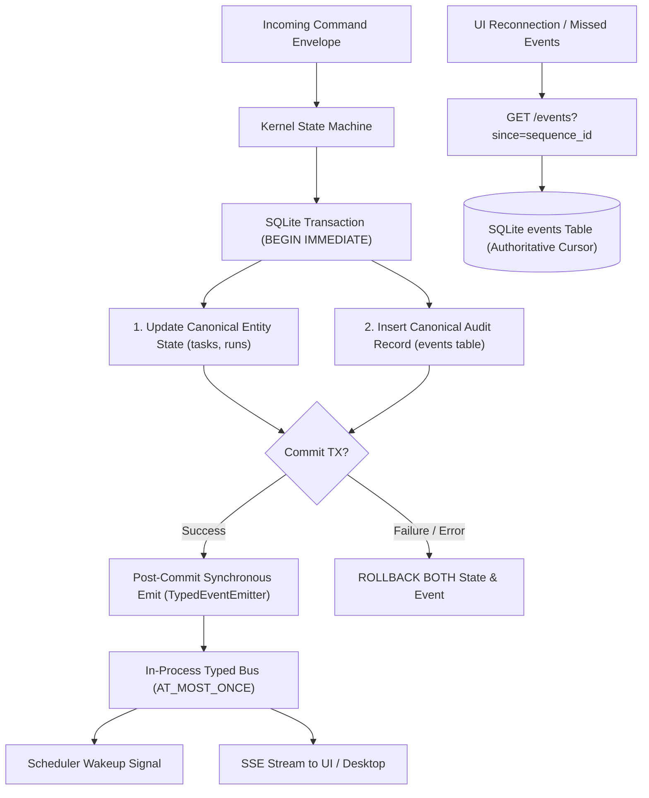

# GRAVITAS — TARGET EVENTING & BACKGROUND JOB MODEL
## Dual-Tier Event Architecture, Transactional Atomicity, Delivery Semantics, and Durable Job Execution (Hardened Edition)

**Document Status:** CANONICAL TARGET SPECIFICATION (Wave P6 — Hardened)  
**Date:** 2026-10-01  
**Target Subsystems:** `packages/core`, `packages/orchestrator`, `apps/server`  
**Governing Invariants:**
- $\mathbf{EVENT\ DELIVERY \neq STATE\ AUTHORITY}$
- $\mathbf{QUEUE \neq STATE\ MACHINE}$
- $\mathbf{COMMAND \neq EVENT}$
- $\mathbf{DURABILITY \neq IN\text{-}MEMORY\ CACHE}$
- $\mathbf{WORKER\ PROCESS \neq CANONICAL\ DATABASE\ WRITER}$
- $\mathbf{TIMEOUT \neq FAILURE}$
- $\mathbf{PROCESS\ TERMINATED \neq EXTERNAL\ SIDE\ EFFECT\ REVERSED}$

---

## 1. Dual-Tier Event Architecture & Transactional Atomicity

GRAVITAS coordinates in-memory execution and durable auditability through a dual-tier event pipeline:



### 1.1 Atomic Event Persistence Contract
$$\mathbf{STATE\ COMMIT + EVENT\ FAILURE = TRANSACTION\ ROLLBACK}$$
- Every canonical state transition and its corresponding audit event record are executed within the **same atomic SQLite transaction**.
- If the event write fails (e.g. constraint violation or disk I/O error), the entity mutation rolls back completely.
- Invariant: **No canonical state transition can exist without its corresponding audit event record.**

### 1.2 Post-Commit Ephemeral Bus Contract
- The in-process `TypedEventEmitter` fires **only after** the SQLite transaction commits successfully.
- If an in-memory listener throws or fails during notification processing, the canonical database state remains safely committed.
- Invariant: **Event delivery does NOT equal state authority.** In-memory bus delivery is ephemeral. If an observer misses an in-memory event, it reconstructs truth by querying SQLite.

---

## 2. Delivery Semantics & Ordering Guarantees

| Channel | Delivery Guarantee | Ordering Guarantee | Recovery Mechanism |
| :--- | :--- | :--- | :--- |
| **SQLite `events` Table** | **`DURABLE`** (ACID Committed) | Strictly monotonic global commit order (`sequence_id AUTOINCREMENT`) | Persistent database recovery |
| **In-Process `TypedEventEmitter`** | **`AT_MOST_ONCE`** | Synchronous execution order within Node.js event loop | Query SQLite `events` table with cursor |
| **Loopback SSE / Desktop Shell**| **`AT_MOST_ONCE`** (Stream) | Monotonic per connection stream | Client reconnection with `Last-Event-ID` cursor |
| **Durable Background Jobs Queue**| **`AT_LEAST_ONCE`** | Scheduled timestamp order + priority queue | Automatic retry with exponential backoff |

### Monotonic Ordering Principle:
- Every event is assigned a globally unique, strictly increasing `sequence_id` managed by SQLite `AUTOINCREMENT`.
- Clients (such as the desktop UI or external loggers) track the highest observed `sequence_id`. Upon reconnecting after a disconnect or crash, the client queries:
  ```sql
  SELECT * FROM events WHERE sequence_id > ? ORDER BY sequence_id ASC;
  ```
  This guarantees that missed notifications are recovered deterministically without event loss or duplication.

---

## 3. Closed Event Taxonomy (Phase K Standard)

```typescript
export type GravitasEventType =
  // WorkSession Lifecycle
  | 'WorkSessionCreated'
  | 'WorkSessionPaused'
  | 'WorkSessionResumed'
  | 'WorkSessionCompleted'
  | 'WorkSessionCancelled'

  // Run Lifecycle
  | 'RunPlanCreated'
  | 'RunStarted'
  | 'RunPaused'
  | 'RunCompleted'
  | 'RunFailed'
  | 'RunCancelled'

  // Task Lifecycle
  | 'TaskCreated'
  | 'TaskReady'
  | 'TaskScheduled'
  | 'TaskAssigned'
  | 'TaskStarted'
  | 'TaskWorktreeAllocated'
  | 'TaskMutationCaptured'
  | 'TaskVerificationStarted'
  | 'TaskVerificationFinished'
  | 'TaskBrowserQaStarted'
  | 'TaskBrowserQaFinished'
  | 'TaskWaitingApproval'
  | 'TaskApproved'
  | 'TaskRejected'
  | 'TaskSucceeded'
  | 'TaskFailed'
  | 'TaskDependencyFailed'
  | 'TaskCancelled'
  | 'TaskInterrupted'
  | 'TaskRecoveryRequired'
  | 'TaskBillingStateChanged'

  // Capability & Tool Lifecycle
  | 'CapabilityGrantIssued'
  | 'CapabilityGrantRevoked'
  | 'ToolInvocationRequested'
  | 'ToolInvocationAuthorized'
  | 'ToolInvocationStarted'
  | 'ToolInvocationCompleted'
  | 'ToolInvocationFailed'
  | 'ToolInvocationBlocked'

  // Integration & Materialization
  | 'IntegrationCandidateFormed'
  | 'IntegrationVerified'
  | 'IntegrationMaterialized'
  | 'IntegrationConflictDetected'

  // Background Job Lifecycle
  | 'JobScheduled'
  | 'JobOccurrenceClaimed'
  | 'JobOccurrenceCompleted'
  | 'JobOccurrenceFailed'
  | 'JobInterruptedReconciled'
```

---

## 4. Durable Background Job Execution Model

### 4.1 Storage & Atomic Occurrence Claims
- Background jobs are stored in `jobs` and claimed via `occurrence_claims`:
  ```sql
  INSERT INTO occurrence_claims (
    occurrence_id, job_id, claimed_at, claimed_by_process, status
  ) VALUES (@occurrenceId, @jobId, datetime('now'), @pid, 'RUNNING');
  ```
  `PRIMARY KEY (occurrence_id)` prevents race conditions and duplicate claims across concurrent loops.

### 4.2 Leases, Heartbeats & Crash Recovery
- Executing jobs update their heartbeat every 30 seconds.
- On startup, the `Startup Reconciler` audits `occurrence_claims`:
  - Any claim with status `RUNNING` whose heartbeat has expired or whose process PID is dead is transitioned to `TIMED_OUT` or `FAILED`.
  - The job's `next_run_at` is recalculated, preventing job starvation.

### 4.3 Cancellation Interaction
- If a Run is cancelled while a scheduled background job is queued, the job claim verifies the parent Run state. If `runs.status = 'CANCELLED'`, the claim completes immediately with `SKIPPED_CANCELLED_RUN`.
