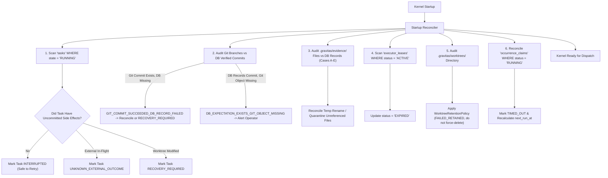
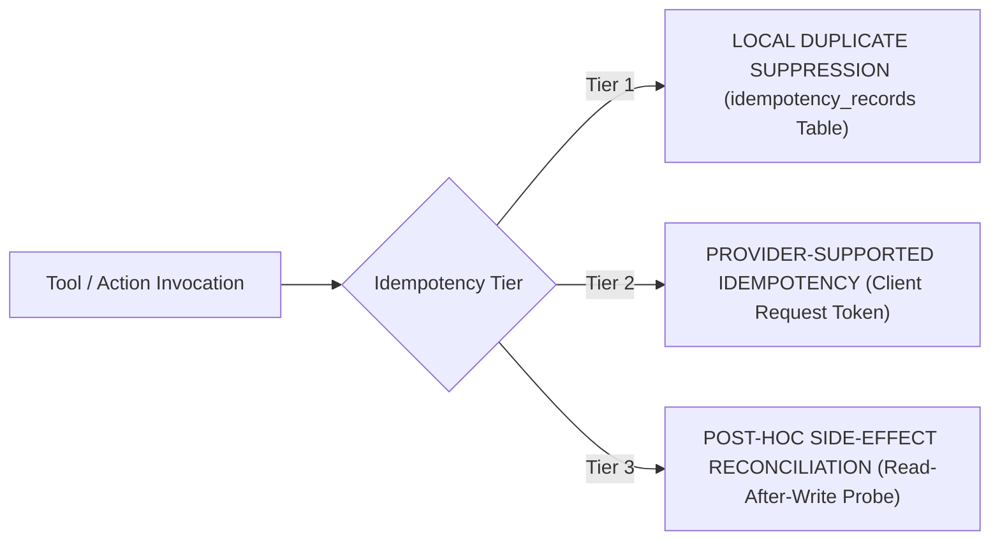

# GRAVITAS — TARGET FAILURE RECOVERY & IDEMPOTENCY MODEL
## Comprehensive Failure Taxonomy, 16 Hardened Failure Scenarios, Crash Recovery, and Operation-Aware Idempotency (Hardened Edition)

**Document Status:** CANONICAL TARGET SPECIFICATION (Wave P6 — Hardened)  
**Date:** 2026-10-01  
**Target Subsystems:** `packages/core`, `packages/orchestrator`, `packages/git`, `packages/harnesses`  
**Governing Invariants:**
- $\mathbf{UNKNOWN \neq ASSUMED}$
- $\mathbf{DURABILITY \neq IN\text{-}MEMORY\ CACHE}$
- $\mathbf{ONE\ CANONICAL\ OWNER\ PER\ MUTABLE\ DOMAIN}$
- $\mathbf{AUTONOMOUS\_INCREMENTAL\_SPEND = 0}$
- $\mathbf{TIMEOUT \neq FAILURE}$
- $\mathbf{PROCESS\ TERMINATED \neq EXTERNAL\ SIDE\ EFFECT\ REVERSED}$
- $\mathbf{WORKER\ PROCESS \neq CANONICAL\ DATABASE\ WRITER}$
- $\mathbf{CROSS\text{-}RESOURCE\ ATOMICITY\ IS\ UNAVAILABLE}$
- $\mathbf{PARTIAL\ STATES\ MUST\ BE\ DETECTABLE + RECONCILABLE}$

---

## 1. Crash Recovery Architecture & Startup Reconciler

When the GRAVITAS Kernel boots, the **Startup Reconciler** executes before accepting any commands or dispatching tasks:



### 1.1 Nuanced Crash Recovery States
Instead of collapsing all interrupted executions into a generic `FAILED` state, GRAVITAS classifies recovery:
- **`INTERRUPTED`:** Pure local computation was running without external side effects. Safe for immediate automated retry under `ConcurrencyPolicy`.
- **`RECOVERY_REQUIRED`:** Local mutations exist, or cross-resource partial states were detected. The worktree is preserved in `FAILED_RETAINED` for diff auditing.
- **`UNKNOWN_EXTERNAL_OUTCOME`:** An external tool mutation was in flight when the process crashed. Automated retry is strictly prohibited; reconciliation executes read-after-write probes.
- **`BILLING_STATE_CHANGED`:** Mid-flight cost transition detected. Execution paused before any billable side effect occurred.
- **`GIT_COMMIT_SUCCEEDED_DB_RECORD_FAILED`:** Git commit exists on `task/<taskId>` branch, but SQLite has no record or records task as `RUNNING`/`INTERRUPTED`. Startup Reconciler audits Git branch, detects unrecorded commit SHA, and completes DB record or transitions to `RECOVERY_REQUIRED` for operator review. Evidence is never destroyed.
- **`DB_EXPECTATION_EXISTS_GIT_OBJECT_MISSING`:** SQLite records `verified_commit_sha = <sha>`, but `git cat-file -e <sha>` fails in the repository object database. Startup Reconciler flags this as a critical missing-object anomaly, transitions task to `RECOVERY_REQUIRED`, blocks dependent merges, and alerts operator.

### 1.2 Filesystem $\leftrightarrow$ SQLite Crash Window & Partial State Matrix
Cross-resource atomicity across filesystem files and SQLite records is physically unavailable. The crash window occurs after SQLite commit but before final file rename (or after temp write before SQLite commit). The Startup Reconciler evaluates all 5 partial states:
- **Case A (Temp artifact exists; DB metadata does NOT exist):** Unreferenced temporary artifact in `.gravitas/evidence/tmp/`. Safely cleaned or quarantined according to `WorktreeRetentionPolicy`.
- **Case B (DB metadata exists; Temp artifact exists; Final artifact does NOT exist):** Process crashed post-commit before final rename. Reconciler verifies temp file digest against committed `content_sha256`. If valid, it completes the rename to final path; if corrupt, marks evidence `RECOVERY_REQUIRED`.
- **Case C (Final artifact exists; DB metadata does NOT exist):** Unreferenced artifact found on disk. Quarantined; never silently promoted to canonical status.
- **Case D (DB metadata exists; Final artifact exists; Digest matches):** Normal consistent state.
- **Case E (DB metadata exists; Final artifact exists; Digest does NOT match):** Critical integrity violation. Marks task `INTEGRITY_CHECK_FAILED`, quarantines file, and blocks dependent approval and integration.

---

## 2. Operation-Aware Idempotency Architecture

GRAVITAS rejects simplistic global hashing formulas. Idempotency is structured around **three distinct operational tiers**:



### 2.1 The Three Idempotency Tiers
1. **Tier 1 (Local Duplicate Suppression):**
   - Guards internal kernel operations (e.g. scheduling a task, issuing a capability grant, writing an evidence bundle).
   - Key Schema:
     $$\text{key} = \text{sha256}(\text{operationType} + ":" + \text{targetResource} + ":" + \text{taskId} + ":" + \text{rfc8785}(\text{normalizedPayload}))$$
   - Prevents identical commands from being executed twice by the kernel event loop.
2. **Tier 2 (Provider-Supported Idempotency):**
   - Injected into external API headers (e.g. `Idempotency-Key` or `client_request_token` in Stripe, GitHub, or AWS).
   - If a network timeout occurs, re-submitting with the same key returns the existing created resource rather than generating a duplicate.
3. **Tier 3 (Post-Hoc Side-Effect Reconciliation):**
   - Applies to providers that do NOT support native idempotency keys (e.g. generic Git remotes, email dispatchers).
   - Before attempting any retry after a timeout or crash, the kernel executes a **Read-After-Write Verification Probe** (e.g. checking whether a PR with the candidate title/commit already exists).

### 2.2 The `TIMEOUT \neq FAILURE` Invariant
$$\mathbf{TIMEOUT \neq FAILURE}$$
A timeout signifies that the outcome is **UNKNOWN**. If a tool invocation times out:
1. The invocation record status transitions to `UNKNOWN_EXTERNAL_OUTCOME`.
2. The scheduler does NOT blindly retry.
3. Post-hoc side-effect reconciliation probes the external system. If the external resource was created, the outcome is marked `COMMITTED`; if absent, safe retry proceeds.

---

## 3. Worktree Retention Policy

$$\mathbf{WORKTREE\ RETENTION\ POLICY}$$

Worktrees are valuable forensic artifacts. The target architecture replaces immediate `remove --force` with a deliberate retention lifecycle:
1. **`ACTIVE`:** Currently assigned to an active task execution.
2. **`COMPLETED_PENDING_EVIDENCE`:** Task completed; verifier is capturing evidence bundle and computing diff digests.
3. **`FAILED_RETAINED`:** Task failed or crashed. Worktree is **preserved on disk** to allow the operator or specialist to inspect exact uncommitted files and logs.
4. **`APPROVED_FOR_CLEANUP`:** Verification passed and commit materialized, OR operator explicitly consented to discard failed workspace.
5. **`QUARANTINED`:** Anomalous file activity or path traversal attempt detected; locked read-only for security audit.
6. **`CLEANED`:** Safely pruned via `git worktree remove` after approval.
- **Human Preservation Rule:** Uncommitted human modifications in a worktree are NEVER forcefully deleted by autonomous routines.

---

## 4. Deep-Dive Traces for the 16 Mandatory Failure Scenarios

### Scenario A: Process crashes while Task is RUNNING
- **Failure:** Power cut or kernel process killed while Task $T_1$ was executing.
- **Recovery:** Startup Reconciler detects $T_1$ with dead PID:
  1. Inspects Git worktree status. If clean and no external tools were invoked, marks $T_1 \to \text{INTERRUPTED}$.
  2. If retry quota is available under `ConcurrencyPolicy`, transitions $T_1 \to \text{READY}$ and re-dispatches.
  3. If uncommitted mutations exist in worktree, marks $T_1 \to \text{RECOVERY_REQUIRED}$ and preserves worktree in `FAILED_RETAINED`.

### Scenario B: Process crashes while WAITING_APPROVAL
- **Failure:** Kernel crashes while Task $T_2$ is in `WAITING_APPROVAL` with evidence written.
- **Recovery:** State is committed to SQLite. On restart, $T_2$ remains in `WAITING_APPROVAL`. The `approvals` table contains the candidate commit SHA, evidence digest, and contextual scope. The operator sees the approval prompt immediately upon UI reconnection. Zero state is lost.

### Scenario C: Harness dies without returning result
- **Failure:** External CLI (`agy`, `codex`, `claude`) crashes or exits with non-zero code without emitting structured JSON.
- **Recovery:** Subprocess exit handler catches `close` event. Windows Job Object ensures all child descendants are terminated (`KILL_ON_JOB_CLOSE`). Task enters `FAILED` with error `HARNESS_PROCESS_CRASHED(exitCode)`. Upstream dependencies are halted; downstream tasks are marked `DEPENDENCY_FAILED`.

### Scenario D: Tool mutation completes externally but response is lost
- **Failure:** Network drops after GitHub PR created or email drafted via tool, before response is received by kernel.
- **Recovery:** Invocation is marked `UNKNOWN_EXTERNAL_OUTCOME`. Invariant: `TIMEOUT != FAILURE`. On recovery, Tier 3 Read-After-Write reconciliation queries the external provider. Locating the created PR, the kernel records the PR reference and marks the tool invocation `COMPLETED` without duplicate creation.

### Scenario E: SQLite transaction fails
- **Failure:** Disk full or transient lock timeout during transaction.
- **Recovery:** `DatabaseSync` throws; `ROLLBACK` executes automatically. In-memory scheduler catches the rejection and cancels the attempted in-memory state transition. Task remains in its prior valid state and emits an operational alert.

### Scenario F: Worktree disappears unexpectedly
- **Failure:** External process or user deletes `.gravitas/worktrees/<taskId>/` during execution.
- **Recovery:** Next Git command or verifier invocation fails with `ENOENT`. Subprocess runner catches failure, transitions task to `FAILED` with `WORKTREE_VANISHED`, cleans up Git worktree registration via `git worktree prune`, and permits policy-governed retry.

### Scenario G: Git commit succeeds but evidence write fails
- **Failure:** `git commit` succeeds in worktree, but disk write to `.gravitas/evidence/` fails due to filesystem error.
- **Recovery:** Handled as cross-resource state `GIT_COMMIT_SUCCEEDED_DB_RECORD_FAILED`. The commit on `task/<taskId>` exists, but evidence bundle insertion rolls back. The task transitions to `RECOVERY_REQUIRED` (preventing unverified candidate promotion). The commit is retained on the task branch for forensic inspection without destroying evidence.

### Scenario H: Evidence writes but approval persistence fails
- **Failure:** Evidence files are written to disk, but SQLite write to `approvals` table fails.
- **Recovery:** Handled by Filesystem $\leftrightarrow$ SQLite Case A. The atomic transaction encompassing `tasks.state = 'WAITING_APPROVAL'` and `INSERT INTO approvals` rolls back. The temporary evidence artifact in `.gravitas/evidence/tmp/` is unreferenced in SQLite and is safely quarantined or cleaned according to `WorktreeRetentionPolicy`.

### Scenario I: Human approves exactly while worker completion event races
- **Failure:** Worker emits task completion event at the exact millisecond human submits approval command.
- **Recovery:** State transitions are guarded by `tasks.state` checks inside an immediate transaction:
  ```sql
  UPDATE tasks SET state = 'APPROVED' WHERE id = @id AND state = 'WAITING_APPROVAL';
  ```
  If the state is no longer `WAITING_APPROVAL`, the update affects 0 rows, rejecting the stale approval gracefully.

### Scenario J: Duplicate job worker claims same Task
- **Failure:** Two concurrent scheduler loops attempt to claim Task $T_k$.
- **Recovery:** Handled by SQLite `executor_leases` table with `UNIQUE(task_id)`:
  ```sql
  INSERT INTO executor_leases (task_id, executor_id, ...) VALUES (?, ?, ...);
  ```
  Worker 1 succeeds; Worker 2 throws `SQLITE_CONSTRAINT_UNIQUE`, aborts its dispatch, and proceeds to the next ready task.

### Scenario K: Credential expires during execution
- **Failure:** API token expires midway through multi-step harness execution.
- **Recovery:** Harness returns authentication error (`AUTH_EXPIRED`). Dynamic dispatch-time readiness check marks the harness as `UNAUTHENTICATED`. Execution pauses with `WAITING_CREDENTIAL_REFRESH`.

### Scenario L: Tool becomes billing-ineligible midway
- **Failure:** Operator runs out of included free credits or provider turns on pay-per-token pricing mid-operation.
- **Recovery:** Pre-invocation zero-spend interceptor detects category change. Execution halts immediately **before the next billable side effect**. Task transitions to `BILLING_STATE_CHANGED`. Autonomy pauses pending operator decision.

### Scenario M: Base branch changes before final integration
- **Failure:** Main branch moves ahead while long-running task was executing on older base.
- **Recovery:** Integration Coordinator checks `git merge-base --is-ancestor <baseCommit> <currentBase>`. If base diverged, Integration Coordinator attempts a clean rebase in an ephemeral merge worktree. If merge conflicts occur, materialization halts and emits `INTEGRATION_CONFLICT_REQUIRES_HUMAN`.

### Scenario N: GRAVITAS restarts after OS reboot
- **Failure:** Host Windows machine reboots.
- **Recovery:** Startup Reconciler recovers database, applies `WorktreeRetentionPolicy`, marks interrupted tasks `INTERRUPTED`/`RECOVERY_REQUIRED`, re-evaluates DAG dependencies, and resumes active WorkSession deterministically from SQLite.

### Scenario O: Schema migration fails
- **Failure:** Migration script encounters syntax error or incompatible data.
- **Recovery:** Migration transaction rolls back completely. The pre-migration backup `.gravitas/backup/gravitas.db.backup-<timestamp>` is untouched. Kernel aborts boot with `FATAL_MIGRATION_FAILED`, leaving production data intact.

### Scenario P: Background job wakes after its Run was cancelled
- **Failure:** Scheduled job timer fires for a Run that was cancelled while the timer was queued.
- **Recovery:** When the job worker claims the occurrence, its first query checks `runs.status WHERE id = ?`. Observing `status = 'CANCELLED'`, the worker aborts execution immediately and marks the claim `COMPLETED(SKIPPED_CANCELLED_RUN)`.
