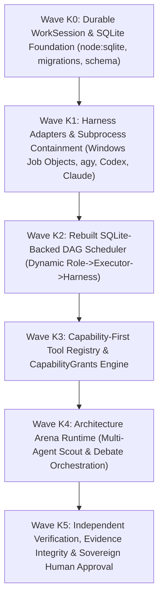

# GRAVITAS — TARGET MIGRATION PLAN
## Subsystem-by-Subsystem Source Code Mapping: Current P2 Reality to Target P6 Architecture

**Document Status:** CANONICAL TARGET SPECIFICATION (Wave P6)  
**Date:** 2026-09-30  
**Target Execution:** Phase K (Kernel Implementation Waves K0 through K5)  
**Git Baseline Commit:** `516e01c82cb4c3afd1080e72e68a4e1e56687335`  
**Governing Invariant:**
- $\mathbf{ARCHITECTURE\ CONTRACT \neq CURRENT\ IMPLEMENTATION}$
- $\mathbf{REUSE > ADD\_DEPENDENCY}$
- $\mathbf{P6\ TARGET\ ARCHITECTURE \neq CURRENT\ P2\ RUNTIME}$

---

## 1. Migration Classification Matrix

Every existing source subsystem is categorized under one of the 5 canonical migration dispositions:
- **`REUSE`**: High architectural fidelity; used directly with minimal or no structural changes.
- **`ADAPT`**: Core logic is sound, but requires interface adjustments or persistence integration.
- **`REWRITE`**: Architectural mismatch, volatile in-memory coupling, or missing durability; requires fresh implementation adhering to P6 contracts.
- **`DEPRECATE`**: Legacy subsystem superseded by target architecture; preserved temporarily for test compatibility.
- **`REMOVE`**: Obsolete, broken, or anti-pattern code; deleted entirely during Phase K.

| Subsystem | Existing Source Location | Classification | Migration Action & Rationale |
| :--- | :--- | :--- | :--- |
| **DAG Validator** | `packages/orchestrator/src/validator.ts` | **`REUSE`** | Dependency cycle detection, task plan validation, and structural DAG checks are mathematically sound and fully tested. |
| **Git Worktree Manager** | `packages/git/src/worktree.ts` | **`ADAPT`** | Ephemeral worktree allocation, path canonicalization, and cleanup routines are robust. Adapt to support `WorktreeRetentionPolicy` (retention of failed worktrees for debugging, safe cleanup without force deletion) and Windows Job Object process-tree association. |
| **Verification Engine** | `packages/verifier/src/verifier.ts`, `runner.ts` | **`REUSE`** | Test execution harness, test result parser, and verification plan execution are high-fidelity and decoupled. |
| **Browser QA Engine** | `packages/browser-qa/src/` | **`REUSE`** | Playwright test benches, screenshot capture, and visual inspection logic function reliably. |
| **Evidence Writer** | `packages/verifier/src/evidence.ts` | **`ADAPT`** | Artifact collection and hash computation are sound; adapt to store hashes and metadata into SQLite `evidence_bundles` and artifacts into `.gravitas/evidence/`. |
| **SQLite Job Store** | `packages/orchestrator/src/jobs/sqliteJobStore.ts` | **`ADAPT`** | Excellent foundation using `node:sqlite DatabaseSync` with WAL, foreign keys, and `reconcileInterruptedRuns`. Adapt into general kernel job runner. |
| **Connector Store & Broker**| `packages/orchestrator/src/connectors/` | **`ADAPT`** | SQLite connector store and sanitized audit log are production-grade. Adapt into Capability-First Tool Registry connector adapters. |
| **Prompt Compiler** | `packages/prompts/src/compiler.ts` | **`ADAPT`** | 3-layer prompt compilation (Contract, Task, Policy) and SHA-256 caching are excellent. Adapt to incorporate P4 RFC 8785 schema digests. |
| **Core State Machine** | `packages/core/src/state-machine.ts` | **`ADAPT`** | Task state transitions are well-defined. Adapt to enforce synchronous writes into SQLite `task_state_transitions` table. |
| **Event Definitions** | `packages/core/src/events.ts` | **`ADAPT`** | Existing event factory functions are sound. Adapt to include 14-point execution provenance fields (`causation_id`, `correlation_id`, `actor_executor_id`). |
| **DAG Scheduler** | `packages/orchestrator/src/scheduler.ts` | **`REWRITE`** | Current scheduler stores all task states, allocations, and commits in volatile in-memory `Map`s and has a hardcoded single harness. Rewrite as SQLite-backed engine with dynamic Role $\to$ Executor $\to$ Harness resolution. |
| **WorkSession Kernel** | *New in Phase K* (`packages/core/src/work-session/`)| **`REWRITE`** (New) | No WorkSession entity exists in current source. Implement durable WorkSession coordinator owning Run lifecycles. |
| **Tool Registry & Grants** | *New in Phase K* (`packages/core/src/tools/`) | **`REWRITE`** (New) | Current codebase lacks Capability-First Tool Registry and 4-tier CapabilityGrant engine. Implement P4 architecture contracts. |
| **Run Integration Engine** | *New in Phase K* (`packages/orchestrator/src/integration/`)| **`REWRITE`** (New) | Current codebase lacks run-level multi-task commit integration and materialization. Implement sequential merge coordinator. |
| **Harness Process Manager**| `packages/harnesses/src/process.ts` | **`ADAPT`** | Subprocess execution exists. Adapt to enforce Windows Job Objects (`killOnJobClose`) and proper process-tree termination (`taskkill /T /F`). |
| **Server Control API** | `apps/server/src/` | **`ADAPT`** | Fastify/HTTP server exists. Adapt routes to command/query pattern over local SQLite kernel, secured via local session token. |
| **Legacy Global Harness** | `packages/orchestrator/src/types.ts` (`harness: AgentHarness`)| **`REMOVE`** | Violates invariant $\text{ROLE} \neq \text{EXECUTOR} \neq \text{HARNESS}$. Remove global harness injection from scheduler constructor. |
| **In-Memory Volatile Stores**| `packages/orchestrator/src/scheduler.ts` (`private readonly tasks = new Map()`) | **`REMOVE`** | Violates durability invariants. Replace with SQLite queries and ephemeral read-caches. |

---

## 2. Phase K Migration Sequencing

### Milestone Steps:
1. **Wave K0 (Persistence Foundation):** Establish `node:sqlite DatabaseSync` connection manager, `schema_migrations` runner, and durable `work_sessions` / `runs` tables.
2. **Wave K1 (Harness Containment):** Build Windows Job Object wrapper and subprocess runners for verified local execution surfaces (`agy`, Codex sandbox, Claude).
3. **Wave K2 (Scheduler Rebuild):** Re-implement `BoundedScheduler` backed by SQLite, dynamic role resolution, and Wait-For Graph cycle detection.
4. **Wave K3 (Tool Registry):** Wire Capability-First Tool Registry with 4-tier enforcement and zero-spend quota filters.
5. **Wave K4 (Architecture Arena):** Implement dogfooded P5 Scout & Decision Packet runtime inside kernel.
6. **Wave K5 (Verification & Materialization):** Wire evidence bundle persistence, sovereign approval gates, and run-level Git integration.
