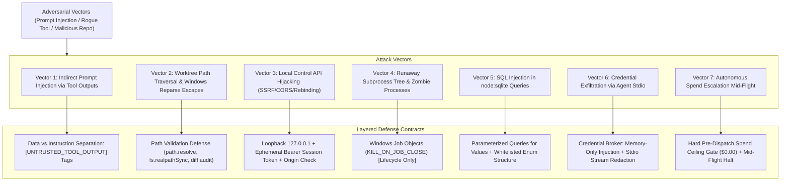

# GRAVITAS — TARGET BACKEND SECURITY REVIEW
## Adversarial Threat Modeling, Privilege Boundary Audit, and Composable Containment Review (Hardened Edition)

**Document Status:** ADVERSARIAL RED-TEAM SECURITY AUDIT (Wave P6 — Hardened)  
**Date:** 2026-10-01  
**Target Architecture:** `docs/architecture-v2/TARGET_BACKEND_ARCHITECTURE.md`  
**Git Baseline Commit:** `516e01c82cb4c3afd1080e72e68a4e1e56687335`  
**Review Standards:** STRIDE Threat Model + OWASP Top 10 for LLMs + Windows Privilege Boundary Analysis  
**Governing Invariants:**
- $\mathbf{CAPABILITY \neq TOOL \neq TRANSPORT \neq CREDENTIAL \neq AUTHORITY}$
- $\mathbf{AUTONOMOUS\_INCREMENTAL\_SPEND = 0}$
- $\mathbf{AGENT\_PAYMENT\_AUTHORITY = NONE}$
- $\mathbf{HUMAN\ DECISION \neq AGENT\ CONSENSUS}$
- $\mathbf{PROCESS\ LIFECYCLE\ CONTAINMENT \neq AUTHORITY\ CONTAINMENT}$
- $\mathbf{PROCESS\ TERMINATED \neq EXTERNAL\ SIDE\ EFFECT\ REVERSED}$

---

## 1. Adversarial Attack Surface & Composable Containment Layers

GRAVITAS rejects the claim that a single operating system mechanism (such as Windows Job Objects or path canonicalization) provides complete security isolation. Security relies on **composable defense-in-depth layers**:

---

## 2. Threat Vector Evaluations & Hardened Defense Contracts

### 2.1 Threat Vector 1: Indirect Prompt Injection via Tool Outputs
- **Attack Scenario:** Web pages fetched by Playwright, emails from calendar/mail connectors, or PR review comments contain adversarial prompt injections instructing the worker agent to modify unintended files or invoke unauthorized tools.
- **Risk Level:** HIGH.
- **Hardened Defense Contract:**
  1. Data vs. Instruction Framing: Tool outputs are wrapped in cryptographic data delimiters:
     `[UNTRUSTED_TOOL_OUTPUT id="..." digest="..."] ... [/UNTRUSTED_TOOL_OUTPUT]`.
  2. The prompt compiler filters out prompt directive tokens (`System:`, `Instruction:`) before context ingestion.
  3. Pre-dispatch capability enforcement ensures an injected prompt cannot invoke tools outside the task's authorized `CapabilityGrant`.

### 2.2 Threat Vector 2: Filesystem Escape & Windows Path Vulnerabilities
- **Attack Scenario:** A worker attempts to write outside `.gravitas/worktrees/<taskId>/` using directory traversal (`../../`), Windows junctions, symbolic links, reparse points, UNC paths (`\\?\C:\`), or alternate data streams.
- **Risk Level:** CRITICAL.
- **Hardened Defense Contract:**
  1. **Classification:** `PATH VALIDATION DEFENSE` (NOT an impenetrable filesystem sandbox).
  2. `path.resolve()` and `fs.realpathSync()` canonicalize all target paths. Any target resolving outside the worktree root is rejected before execution.
  3. Conceptually accounts for Windows junctions and reparse points: Symlinks and junctions targeting outside the worktree are detected and blocked.
  4. Defense-in-depth: Pre-commit Git diff inspection audits all staged mutations before candidate commit creation.
  5. OS-level filesystem sandboxing via Windows Restricted Tokens or LowIL is explicitly marked as `REQUIRES_K_PHASE_VALIDATION`.

### 2.3 Threat Vector 3: Local Control API Hijacking (CORS / SSRF / DNS Rebinding)
- **Attack Scenario:** A malicious script on an external browser tab attempts cross-origin requests to `http://127.0.0.1:<port>` to issue kernel commands.
- **Risk Level:** HIGH.
- **Hardened Defense Contract:**
  1. Transport Classification: `REFERENCE LOCAL TRANSPORT` (P7 retains authority to choose native IPC).
  2. The reference HTTP server strictly enforces `Host` and `Origin` headers, rejecting any non-loopback or cross-origin requests.
  3. All non-GET endpoints require an ephemeral Bearer token:
     `Authorization: Bearer <sessionToken>`.
     The token is generated with 256 bits of CSPRNG entropy at kernel boot, stored in `.gravitas/session.token` with Windows NTFS ACLs restricting read permissions strictly to the current user SID.
  4. The session token is rotated on kernel restart and invalidated upon graceful shutdown.

### 2.4 Threat Vector 4: Runaway Subprocess Tree & Zombie Processes
- **Attack Scenario:** An external CLI harness (`agy`, Codex, Claude) or compiler tool spawns child processes that refuse to exit, or survive kernel shutdown.
- **Risk Level:** MEDIUM.
- **Hardened Defense Contract:**
  1. **Job Objects Discipline:** Windows Job Objects provide *process lifecycle containment*, NOT security sandboxing.
  2. Subprocesses are assigned to a Job Object configured with `JOB_OBJECT_LIMIT_KILL_ON_JOB_CLOSE`. When the kernel closes the job handle or terminates, Windows automatically terminates all descendant processes in the tree.
  3. Explicit fallback on timeout: `taskkill /PID <pid> /T /F`.
  4. Crucial Invariant:
     $$\mathbf{PROCESS\ TERMINATED \neq EXTERNAL\ SIDE\ EFFECT\ REVERSED}$$
     Subprocess termination terminates CPU compute, but does NOT undo external Git commits, PR creations, or network writes. Recovery must reconcile external side effects via idempotency records.

### 2.5 Threat Vector 5: SQL Injection in `node:sqlite DatabaseSync`
- **Attack Scenario:** Malicious task titles, branch names, or error messages attempt SQL injection.
- **Risk Level:** HIGH.
- **Hardened Defense Contract:**
  1. **Value Parameterization Contract:**
     $$\mathbf{UNTRUSTED\ VALUES\ MUST\ USE\ BOUND\ PARAMETERS}$$
     100% of runtime data, external strings, and user arguments MUST be passed using bound parameters (`?` or `@param`). Dynamic string interpolation of runtime values into SQL query text is strictly prohibited.
  2. **Structure Whitelisting Contract:**
     $$\mathbf{DYNAMIC\ SQL\ STRUCTURE\ MUST\ COME\ FROM\ TRUSTED\ ENUMERATED/VALIDATED\ SOURCES}$$
     Dynamic SQL components (table names, column names for sorting, migration scripts) must be drawn exclusively from compile-time TypeScript enums or strict whitelists.
  3. Claim Discipline: We do NOT claim that parameterization "100% eliminates" SQL injection; we enforce strict structural contracts that prevent untrusted value interpolation.

### 2.6 Threat Vector 6: Credential Exfiltration & Token Leakage
- **Attack Scenario:** LLM reasoning outputs echo API keys or secrets into logs, commit messages, or evidence files.
- **Risk Level:** HIGH.
- **Hardened Defense Contract:**
  1. Credential Broker: Secrets are stored in-memory or retrieved via Windows Credential Manager. Raw secrets are NEVER persisted in SQLite tables, prompt templates, or `.gravitas/evidence/` files.
  2. Output Scrubbing: Stdio streams pass through an automated credential scrubbing filter redacting known patterns (`sk-*`, `ghp_*`, `Bearer *`).

### 2.7 Threat Vector 7: Autonomous Spend Escalation Mid-Flight
- **Attack Scenario:** An agent loops indefinitely calling a billable tool API or metered LLM endpoint.
- **Risk Level:** HIGH.
- **Hardened Defense Contract:**
  1. Invariant: $\mathbf{AUTONOMOUS\_INCREMENTAL\_SPEND = 0}$.
  2. The pre-dispatch interceptor verifies that every tool and harness has an assigned cost category. Any call with an incremental spend $> \$0.00$ without explicit human pre-authorization is blocked with error `BILLING_INELIGIBLE`.
  3. Mid-Flight Protection: If an account quota exhausts or pricing changes mid-operation, execution halts **immediately before the next billable side effect**, transitioning the task to `BILLING_STATE_CHANGED`.

---

## 3. Security Review Verdict

| Evaluation Domain | Evaluated Risk | Mitigations in Target Architecture | Status |
| :--- | :--- | :--- | :--- |
| **Process Lifecycle** | Zombie processes, runaway child trees | Windows Job Objects (`KILL_ON_JOB_CLOSE`) + explicit `taskkill /T /F` | Mitigated (Requires K-phase probe) |
| **Filesystem Boundary** | Out-of-tree writes, symlink traversal | Path validation defense (`path.resolve`, `fs.realpathSync`) + Git diff audit | Mitigated (OS Token requires K-phase probe) |
| **Local API Boundary** | Cross-origin browser hijack, SSRF | 127.0.0.1 binding + Ephemeral Bearer token + Origin check | Mitigated |
| **Persistence Security** | SQL injection via untrusted strings | Parameterized queries for values + Whitelisted structure | Mitigated |
| **Spend Safety** | Runaway cloud inference costs | Hard zero-spend gate + Mid-flight halt (`BILLING_STATE_CHANGED`) | Mitigated |

**Final Adversarial Review Conclusion:**
$$\mathbf{NO\ UNRESOLVED\ BLOCKING\ FINDINGS\ IDENTIFIED\ WITHIN\ P6\ REVIEW\ SCOPE}$$
The hardened target architecture provides a coherent, defense-in-depth model that respects the separation between process lifecycle containment and security authority containment, avoids overclaiming absolute security, and establishes rigorous contracts for Phase K implementation validation:
- **SQLite Atomicity Scope:** SQLite transactions provide ACID atomicity **strictly inside SQLite**.
- **Git Atomicity Scope:** Git operations operate under their own internal object-database atomicity semantics.
- **Filesystem Scope:** Filesystem atomic renames provide single-path metadata pointer updates with NTFS-level semantics.
- **Cross-Resource Boundary:** No shared distributed transaction spans SQLite + Git + NTFS filesystem. Cross-resource atomicity is physically unavailable on host OSs.
- **Consistency Architecture:** Cross-resource integrity relies on durable state sequencing, detection of partial states, two-phase reconciliation protocols, operation-aware idempotency, and human escalation where necessary.
