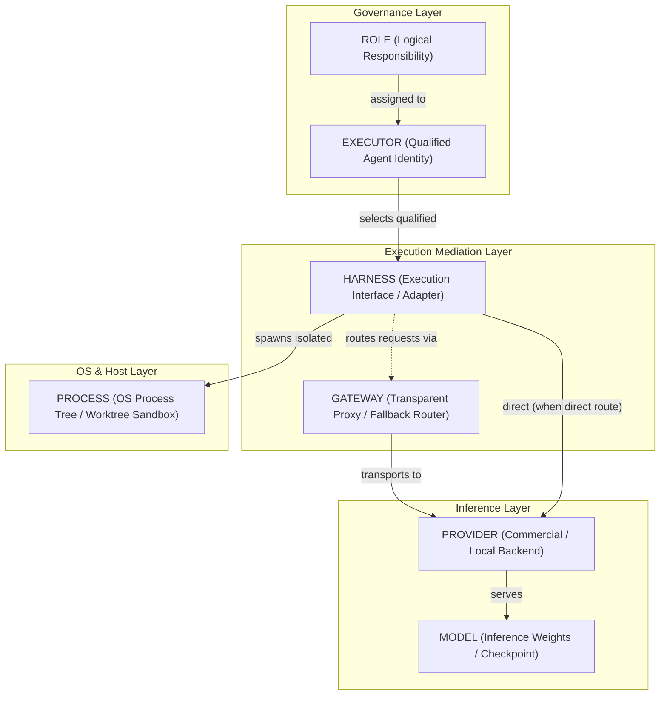

# GRAVITAS — ROLE, EXECUTOR & HARNESS ARCHITECTURE
## Formal Contracts, Sequential Qualification, Selection Algorithm & 14-Point Provenance Model

**Document Status**: Authoritative Architecture Specification (Wave P3)  
**Governing Invariant**:
$$\text{ROLE} \neq \text{EXECUTOR} \neq \text{HARNESS} \neq \text{MODEL} \neq \text{PROVIDER} \neq \text{GATEWAY} \neq \text{PROCESS}$$
**Git Baseline Commit**: `516e01c82cb4c3afd1080e72e68a4e1e56687335`  
**Dependencies**: `PROGRAM_INVARIANTS.md`, `GRAVITAS_CONCEPTUAL_BOUNDARIES.md`, `EXECUTION_SURFACE_INVENTORY.md`

---

## 1. Executive Architectural Summary & Classification Taxonomy

In GRAVITAS, conflating an organizational responsibility (`Role`) with an agent identity (`Executor`), an invocation wrapper (`Harness`), neural network weights (`Model`), a commercial endpoint (`Provider`), a network proxy (`Gateway`), or an operating system unit (`Process`) is a critical architectural violation.



### 1.1 Architectural Decision Classification Framework
Every technical specification in GRAVITAS is explicitly categorized into one of six governance tiers:

1. **`[INVARIANT]`**: Fundamental axioms and non-negotiable boundaries that must NEVER be breached by any configuration, algorithm, or execution mode. (e.g. `ROLE ≠ EXECUTOR ≠ HARNESS ≠ MODEL ≠ PROVIDER ≠ GATEWAY ≠ PROCESS`).
2. **`[ARCHITECTURAL CONTRACT]`**: Formal structural boundaries, interface schemas, state machines, and protocols required to satisfy invariants across subsystems.
3. **`[CONFIGURABLE POLICY]`**: Operational parameters, numerical bounds, budgets, timeouts, and thresholds owned by operators or supervisors, configurable per task or per run. (Numerical bounds are NEVER invariants).
4. **`[REFERENCE ALGORITHM]`**: Deterministic algorithms that satisfy an architectural contract. Alternative implementations are permitted provided they satisfy the contract.
5. **`[CANDIDATE IMPLEMENTATION]`**: Operating-system-specific facilities, libraries, or mechanisms subject to empirical validation in later waves before final selection.
6. **`[FUTURE-WAVE DECISION]`**: Forward-compatible hooks, capabilities, and external connector interfaces reserved for execution in subsequent waves.

---

### 1.2 The 25 Agent Specifications Semantic Mapping Table `[ARCHITECTURAL CONTRACT]`

Reinspecting all 25 agent specifications under `gravitas-agent-specs/agents/` (files `00` through `24`), each spec is semantically classified to prevent arbitrary truncation into generic "personas" or artificial count matching:

| Spec File | Spec Title | Semantic Classification | Canonical Mapping | Semantic Purpose & Scope | Authority Class | Execution Requirement |
| :--- | :--- | :--- | :--- | :--- | :--- | :--- |
| `00-AGENT-CONTRACT.md` | **Agent Contract** | `[ARCHITECTURAL CONTRACT]` | Meta-Contract Template | Establishes the standard contract schema, governance pipeline, and 7-layer invariant. | Governance Baseline | Meta-specification |
| `01-SUPERVISOR-PLANNER.md` | **Supervisor Planner** | `[ARCHITECTURAL CONTRACT]` | `role:strategy:chief-planner` | Decomposes human goals into bounded DAGs; routes questions; synthesizes reviews; manages budgets. | DAG & Budget Authority | Reasoning LLM (High Context) |
| `02-ARCHITECTURE-ARENA.md` | **Architecture Arena** | `[ARCHITECTURAL CONTRACT]` | `protocol:evaluation:architecture-arena` | Generates structured technical dissent and multi-perspective trade-off rubrics for consequential decisions. | Read-Only Proposal Authority | Multi-Agent Tournament |
| `03-FRONTEND-ENGINEER.md` | **Frontend Engineer** | `[ARCHITECTURAL CONTRACT]` | `role:engineering:frontend-engineer` | Implements accessible, performant UI components in worktree; queries design libraries. | Worktree Code Mutation | Reasoning & Code LLM |
| `04-BACKEND-ENGINEER.md` | **Backend Engineer** | `[ARCHITECTURAL CONTRACT]` | `role:engineering:backend-engineer` | Implements server runtimes, services, and APIs from explicit architectural specifications. | Worktree Code Mutation | Reasoning & Code LLM |
| `05-INTEGRATOR.md` | **Integrator** | `[ARCHITECTURAL CONTRACT]` | `role:integration:integration-engineer` | Authoritatively materializes only human-approved candidates into base branch; validates commit SHAs. | Base Branch Mutation Gate | Deterministic / Governed |
| `06-INDEPENDENT-REVIEWER.md` | **Independent Reviewer** | `[ARCHITECTURAL CONTRACT]` | `role:quality:independent-reviewer` | Audits code for contract compliance, regressions, edge cases, and security out-of-band. | Review & Veto Authority | Independent Reasoning LLM |
| `07-VERIFIER.md` | **Verifier** | `[ARCHITECTURAL CONTRACT]` | `service:verification:deterministic-runner` | Spawns deterministic tests, linters, and typecheckers in worktree; mechanical checks override opinion. | Non-LLM Attestation | Out-of-band Local Subprocess |
| `08-BROWSER-QA.md` | **Browser QA** | `[ARCHITECTURAL CONTRACT]` | `service:verification:browser-qa` | Deterministic Playwright browser automation for layout, responsive state, console, and accessibility. | Non-LLM Visual Attestation | Headless Browser Runner |
| `09-RESEARCHER.md` | **Researcher** | `[ARCHITECTURAL CONTRACT]` | `role:research:technical-researcher` | Investigates primary documentation, benchmarks, and credible prior art; strictly separates facts from inference. | Read-Only Research Authority | Search & Synthesis LLM |
| `10-DESIGN-LIBRARY-SCOUT.md` | **Design Library Scout** | `[ARCHITECTURAL CONTRACT]` | `role:design:design-library-scout` | Indexes and fact-checks open-source UI libraries, licenses, and components (21st.dev, shadcn, etc.). | Read-Only Scout Authority | Web / Repository Search LLM |
| `11-PATTERN-LIBRARIAN.md` | **Pattern Librarian** | `[ARCHITECTURAL CONTRACT]` | `role:architecture:pattern-librarian` | Queries and indexes proven components, motion primitives, and architectural decisions from prior runs. | Knowledge Base Query | Vector / SQLite Search LLM |
| `12-TOOL-MCP-PLUGIN-BROKER.md` | **Tool MCP Plugin Broker** | `[ARCHITECTURAL CONTRACT]` | `service:governance:mcp-tool-broker` | Manages tool registry, MCP connections, and scopes `CapabilityGrant` tokens; tracks qualification. | Tool Authority Minting | Deterministic Host Broker |
| `13-COURIER-BACKGROUND-JOBS.md` | **Courier Background Jobs** | `[ARCHITECTURAL CONTRACT]` | `service:infrastructure:courier-jobs` | Performs deterministic downloads, checksum verifications, file staging, and mechanical cron operations. | Host File Movement | Deterministic Daemon / Script |
| `14-STUDY-COACH.md` | **Study Coach** | `[ARCHITECTURAL CONTRACT]` | `profile:domain:study-coach` | Tracks learning objectives, knowledge gaps, and revision intervals from recorded evidence. | Personal Evidence Tracking | Domain Reasoning LLM |
| `15-PERSONAL-COACH.md` | **Personal Coach** | `[ARCHITECTURAL CONTRACT]` | `profile:domain:personal-coach` | Analyzes intentionally provided workload and routine signals; sensitive data requires explicit grant. | Non-Medical Workload Advice | Domain Reasoning LLM |
| `16-CALENDAR-AGENT.md` | **Calendar Agent** | `[FUTURE-WAVE DECISION]` | `profile:connector:calendar-agent` | Connects to local/cloud calendar connectors; consequential mutations strictly require approval. | Connector Read/Draft Authority | Connector Agent (Phase K) |
| `17-INBOX-COMMUNICATION.md` | **Inbox Communication** | `[FUTURE-WAVE DECISION]` | `profile:connector:inbox-agent` | Summarizes communications and drafts replies; read, draft, and send are separate capabilities. | Draft-Only Authority | Connector Agent (Phase K) |
| `18-LEAD-RESEARCHER.md` | **Lead Researcher** | `[ARCHITECTURAL CONTRACT]` | `profile:domain:lead-researcher` | Identifies legitimate prospective entities from permitted sources; strictly verified against fabrication. | Sourced Discovery | Research / Search LLM |
| `19-BUSINESS-ANALYST.md` | **Business Analyst** | `[ARCHITECTURAL CONTRACT]` | `profile:domain:business-analyst` | Evaluates organizations against business criteria; zero fabricated needs or contact data. | Domain Evaluation | Analytical Reasoning LLM |
| `20-OUTREACH-ASSISTANT.md` | **Outreach Assistant** | `[FUTURE-WAVE DECISION]` | `profile:external:outreach-assistant` | Drafts personalized outreach from verified evidence; message transmission requires batch human approval. | Draft-Only Authority | External Comms (Phase K) |
| `21-NOTIFICATION-AUTOMATION.md` | **Notification Automation** | `[ARCHITECTURAL CONTRACT]` | `service:infrastructure:notification-service` | Generates deterministic system alerts and desktop reminders from verified triggers. | Local Notification Authority | Deterministic Platform Service |
| `22-SECURITY-CAPABILITY-AUDITOR.md` | **Security Capability Auditor** | `[ARCHITECTURAL CONTRACT]` | `role:governance:security-auditor` | Audits process containment, credentials, network exposure, and capability grants against policy. | Security Veto Authority | Specialized Security LLM |
| `23-DESKTOP-RUNTIME-ENGINEER.md` | **Desktop Runtime Engineer** | `[ARCHITECTURAL CONTRACT]` | `role:engineering:desktop-engineer` | Maintains desktop shell, daemon lifecycles, IPC, tray integrations, crash recovery, and packaging. | Host Runtime Maintenance | System Engineering LLM |
| `24-WORLD-PROJECTION-RENDERER.md` | **World Projection Renderer** | `[ARCHITECTURAL CONTRACT]` | `service:presentation:world-projection` | Renders 3D/2.5D/2D visual projection of system state; never owns authoritative truth; accessible fallbacks. | Visual Projection Only | Presentation Service (Desktop) |

---

## 2. Formal Layer Contracts & Data Structures

### 2.1 The Seven-Layer Separation Principle `[INVARIANT]`

| Layer | Question Answered | Entity Type | Mutability / Lifecycle | Key Invariants |
| :--- | :--- | :--- | :--- | :--- |
| **1. ROLE** | *What* needs to be done? | Logical responsibility | Static specification | Vendor-neutral, non-presentation, never refers to models/providers. |
| **2. EXECUTOR** | *Who* performs the task? | Qualified agent identity | Session-bound lease | Holds persona, prompt composition profile, capability grant. |
| **3. HARNESS** | *How* is execution invoked? | Adapter software / CLI | Host-installed binary | Manages stdio, process tree, signals, exit codes, containment. |
| **4. GATEWAY** | *Where* does traffic route? | Proxy / Router | Local daemon / Direct | Strictly transparent: zero prompt mutation, zero message injection. |
| **5. PROVIDER** | *Who* serves the inference? | Cloud vendor / Backend | Commercial SLA | Holds API credentials; credentials never logged or committed. |
| **6. MODEL** | *Which* weights generate tokens? | Neural network weights | Versioned checkpoint | Defines context window, tokenizer, economics, tool-calling grammar. |
| **7. PROCESS** | *What* executes on the host OS? | OS Kernel PID tree | Ephemeral execution | Bounded to isolated git worktree, subject to OS kill tree. |

---

### 2.2 Configurable Operational Policy Interfaces `[CONFIGURABLE POLICY]`

> **CRITICAL ARCHITECTURAL PRINCIPLE:**  
> The architectural invariant is that **execution must be bounded**. The specific numerical limits are **configurable policies**. They must never be hard-coded into the architecture or engine as frozen constants.

```typescript
/**
 * Configurable Operational Policy Interfaces.
 * These interfaces decouple invariant execution mechanics from operator-tuned bounds.
 */

export interface InteractionBudget {
  /** Maximum total turns across ALL interaction positions combined before mandatory escalation */
  readonly maxTotalTurns: number;
  /** Maximum allowable clarification requests between workers and specialists */
  readonly maxClarificationTurns: number;
  /** Maximum allowable supervisor consultations */
  readonly maxSupervisorTurns: number;
  /** Maximum allowable delegation depth in the task orchestration tree */
  readonly maxInteractionDepth: number;
  /** Non-normative example default: maxTotalTurns: 8, maxClarificationTurns: 3, maxInteractionDepth: 4 */
}

export interface RevisionBudget {
  /** Maximum allowable review/correction cycles before mandatory operator escalation */
  readonly maxRevisions: number;
  /** Non-normative example default: 3 */
}

export interface TokenBudget {
  /** Maximum cumulative input tokens allowed for a task */
  readonly maxCumulativeInputTokens: number;
  /** Maximum cumulative output tokens allowed for a task */
  readonly maxCumulativeOutputTokens: number;
  /** Maximum allowable token size for a single ContextPackage payload */
  readonly maxContextPackageTokens: number;
  /** Non-normative example default: 200,000 input, 32,000 output, 12,000 context package */
}

export interface FinancialBudget {
  /** Hard financial ceiling in USD for a single task execution lease */
  readonly maxCostCeilingUsd: number;
  /** Action on breach: FAIL_CLOSED (kill process) vs ESCALATE_AND_WAIT (pause for human approval) */
  readonly onBudgetExceeded: 'FAIL_CLOSED' | 'ESCALATE_AND_WAIT';
  /** Non-normative example default: 2.50 USD */
}

export interface ExecutionTimeoutPolicy {
  /** Hard timeout in milliseconds for the worker execution phase */
  readonly workerExecutionTimeoutMs: number;
  /** Grace period in milliseconds between SIGTERM and SIGKILL */
  readonly terminationGracePeriodMs: number;
  /** Non-normative example default: workerExecutionTimeoutMs: 600,000 (10 min) */
}

export interface ReviewTimeoutPolicy {
  /** Hard timeout in milliseconds for independent reviewer or verifier attestation */
  readonly reviewTimeoutMs: number;
  /** Non-normative example default: 180,000 (3 min) */
}

export interface WaitTimeoutPolicy {
  /** Maximum wait duration in milliseconds for advisory consultations (clarifications/context) */
  readonly advisoryWaitTimeoutMs: number;
  /** Non-normative example default: 120,000 (2 min) */
}

export interface TaskOperationalPolicy {
  readonly interactionBudget: InteractionBudget;
  readonly revisionBudget: RevisionBudget;
  readonly tokenBudget: TokenBudget;
  readonly financialBudget: FinancialBudget;
  readonly executionTimeout: ExecutionTimeoutPolicy;
  readonly reviewTimeout: ReviewTimeoutPolicy;
  readonly waitTimeout: WaitTimeoutPolicy;
  readonly policySource: 'DEFAULT_SYSTEM' | 'RUN_OVERRIDE' | 'TASK_EXPLICIT' | 'OPERATOR_OVERRIDE';
  readonly appliedAt: string;
}
```

---

### 2.3 Complete TypeScript Layer Contracts `[ARCHITECTURAL CONTRACT]`

```typescript
/**
 * GRAVITAS ARCHITECTURE V2 — CORE EXECUTION CONTRACTS
 * Governing Invariant:
 * ROLE ≠ EXECUTOR ≠ HARNESS ≠ MODEL ≠ PROVIDER ≠ GATEWAY ≠ PROCESS
 */

// ─── LAYER 1: ROLE ───────────────────────────────────────────────────────────

export type AgentRoleId =
  | 'role:strategy:chief-planner'
  | 'role:engineering:frontend-engineer'
  | 'role:engineering:backend-engineer'
  | 'role:engineering:desktop-engineer'
  | 'role:quality:independent-reviewer'
  | 'role:integration:integration-engineer'
  | 'role:governance:security-auditor'
  | 'role:research:technical-researcher'
  | (string & {});

export type DepartmentId =
  | 'CONTROL_STRATEGY'
  | 'ENGINEERING'
  | 'QUALITY'
  | 'INTEGRATION'
  | 'GOVERNANCE'
  | 'RESEARCH';

export type AuthorityClass =
  | 'CODE_MUTATION'
  | 'DEPENDENCY_RESOLUTION'
  | 'INDEPENDENT_REVIEW'
  | 'INTEGRATION_GATE'
  | 'HUMAN_APPROVAL_BYPASS'
  | 'PRODUCTION_DEPLOY'
  | 'EXTERNAL_COMMUNICATION';

export interface AgentRoleDescriptor {
  readonly id: AgentRoleId;
  readonly displayName: string;
  readonly department: DepartmentId;
  readonly responsibilities: readonly string[];
  readonly requiredCapabilities: readonly string[];
  readonly prohibitedAuthorities: readonly AuthorityClass[];
  readonly contractMarkdownPath: string;
  readonly contractDigestSha256: string;
}

// ─── LAYER 2: EXECUTOR ───────────────────────────────────────────────────────

export type ExecutorTier = 'PRIMARY' | 'SPECIALIST' | 'FALLBACK' | 'DETERMINISTIC_RUNNER';

export interface ExecutorProfile {
  readonly executorId: string;
  readonly displayName: string;
  readonly tier: ExecutorTier;
  readonly supportedRoles: readonly AgentRoleId[];
  readonly promptProfileId: string;
  readonly defaultHarnessPreference: readonly string[];
  readonly modelPreferences: readonly ModelSpecification[];
  readonly providerPreferences: readonly string[];
  readonly minimumContainmentLevel: ContainmentLevel;
  readonly operationalPolicy: TaskOperationalPolicy;
}

export interface TaskLease {
  readonly leaseId: string;
  readonly taskId: string;
  readonly executorId: string;
  readonly roleId: AgentRoleId;
  readonly fenceToken: number;
  readonly acquiredAt: string;
  readonly expiresAt: string;
  readonly heartbeatIntervalMs: number;
  readonly operationalPolicy: TaskOperationalPolicy;
}

// ─── LAYER 3: HARNESS ────────────────────────────────────────────────────────

export type QualificationState =
  | 'DISCOVERED'
  | 'INSTALLED'
  | 'AUTHENTICATED'
  | 'REACHABLE'
  | 'CAPABILITY_PROBED'
  | 'CONTAINMENT_TESTED'
  | 'QUALIFIED'
  | 'READY';

export type ContainmentLevel =
  | 'L0_UNCONFINED'              // Raw host user process; zero OS containment
  | 'L1_PROCESS_TREE_ONLY'       // Clean process tree kill; uncontained filesystem
  | 'L2_WORKTREE_RESTRICTED'     // Strict cwd confinement; read-only root; path whitelist
  | 'L3_KERNEL_SANDBOX';         // OS container / Windows sandbox service / hypervisor boundary

export interface HarnessContainmentProfile {
  readonly level: ContainmentLevel;
  readonly mechanism: 'NONE' | 'PROCESS_GROUP' | 'DIRECTORY_CHROOT' | 'WINDOWS_SANDBOX_SERVICE' | 'APPCONTAINER';
  readonly networkIsolation: 'UNRESTRICTED' | 'LOOPBACK_ONLY' | 'ALLOWLIST_EGRESS' | 'BLOCKED';
  readonly worktreeRestricted: boolean;
  readonly supportsProcessTreeKill: boolean;
}

export interface HarnessDescriptor {
  readonly harnessId: string;
  readonly displayName: string;
  readonly executablePath: string;
  readonly version: string;
  readonly qualificationState: QualificationState;
  readonly containmentProfile: HarnessContainmentProfile;
  readonly supportedProtocols: readonly ('STDIO_JSON' | 'STDIO_STREAM' | 'CLI_FLAGS' | 'REST_IPC')[];
  readonly availableCapabilities: readonly string[];
  readonly estimatedCostPerInvocationUsd?: number | undefined;
  readonly lastHealthCheckAt: string;
  readonly isHealthy: boolean;
}

export interface AgentExecutionRequest {
  readonly executionId: string;
  readonly taskId: string;
  readonly roleId: AgentRoleId;
  readonly executorId: string;
  readonly modelId: string;
  readonly providerId: string;
  readonly modelSpecification?: ModelSpecification | undefined;
  readonly worktreePath: string;
  readonly compiledPrompt: string;
  readonly timeoutMs: number;
  readonly requiredCapabilities: readonly string[];
  readonly requiredContainmentLevel: ContainmentLevel;
  readonly gatewayRoute?: ResolvedGatewayRoute | undefined;
  readonly operationalPolicy: TaskOperationalPolicy;
}

export interface AgentExecutionResult {
  readonly executionId: string;
  readonly harnessId: string;
  readonly harnessVersion: string;
  readonly pid: number | null;
  readonly exitCode: number | null;
  readonly startedAt: string;
  readonly terminatedAt: string;
  readonly durationMs: number;
  readonly terminationReason: TerminationReason;
  readonly stdout: string;
  readonly stderr: string;
  readonly stdoutTruncated: boolean;
  readonly stderrTruncated: boolean;
  readonly worktreePath: string;
}

export type TerminationReason =
  | 'COMPLETED'
  | 'TIMEOUT'
  | 'CANCELLED'
  | 'PROCESS_CRASH'
  | 'CONTAINMENT_BREACH'
  | 'INVALID_OUTPUT'
  | 'BUDGET_EXCEEDED';

export interface AgentHarness {
  readonly descriptor: HarnessDescriptor;
  probeAvailability(): Promise<QualificationState>;
  execute(request: AgentExecutionRequest): Promise<AgentExecutionResult>;
  cancel(executionId: string): Promise<boolean>;
}

// ─── LAYER 4: GATEWAY ────────────────────────────────────────────────────────

export type GatewayTransportMode = 'DIRECT' | 'GATEWAY';

export interface GatewayDescriptor {
  readonly gatewayId: string;
  readonly name: string;
  readonly baseUrl: string;
  readonly qualificationState: 'UNQUALIFIED' | 'READY' | 'DEGRADED' | 'DISABLED';
  readonly transparentModeDigest: string;
  readonly securityProfile: string;
}

export interface ResolvedGatewayRoute {
  readonly routeId: string;
  readonly transportMode: GatewayTransportMode;
  readonly gatewayId?: string | undefined;
  readonly gatewayBaseUrl?: string | undefined;
  readonly requestedProvider?: string | undefined;
  readonly requestedModel?: string | undefined;
  readonly actualProvider?: string | undefined;
  readonly actualModel?: string | undefined;
  readonly providerFallbackOccurred: boolean;
  readonly transportFallbackOccurred: boolean;
  readonly reason: string;
}

export interface InferenceGateway {
  readonly descriptor: GatewayDescriptor;
  health(): Promise<{ isHealthy: boolean; latencyMs: number }>;
  route(payload: unknown, options?: { timeoutMs?: number }): Promise<unknown>;
}

// ─── LAYER 5: PROVIDER ───────────────────────────────────────────────────────

export interface ProviderDescriptor {
  readonly providerId: string;
  readonly displayName: string;
  readonly endpointBaseUrl: string;
  readonly authType: 'API_KEY' | 'OAUTH2' | 'LOCAL_NONE';
  readonly isLocal: boolean;
  readonly supportedModelIds: readonly string[];
  readonly rateLimitTiers?: { requestsPerMinute: number; tokensPerMinute: number } | undefined;
}

// ─── LAYER 6: MODEL ──────────────────────────────────────────────────────────

export interface ModelSpecification {
  readonly modelId: string;
  readonly providerId: string;
  readonly family: string;
  readonly contextWindowTokens: number;
  readonly maxOutputTokens: number;
  readonly supportsStructuredOutput: boolean;
  readonly supportsStreaming: boolean;
  readonly supportsTools: boolean;
  readonly costPerMillionInputTokensUsd?: number | undefined;
  readonly costPerMillionOutputTokensUsd?: number | undefined;
}

// ─── LAYER 7: PROCESS ────────────────────────────────────────────────────────

export interface OsProcessContext {
  readonly pid: number;
  readonly ppid: number | null;
  readonly executable: string;
  readonly commandLineRedacted: string;
  readonly cwd: string;
  readonly osUserSid: string | null;
  readonly spawnedAt: string;
  readonly memoryLimitBytes?: number | undefined;
  readonly cpuQuotaPercentage?: number | undefined;
}

export interface ProcessTreeHandle {
  readonly rootPid: number;
  readonly childPids: readonly number[];
  killTree(signal?: 'SIGTERM' | 'SIGKILL'): Promise<{ killedPids: readonly number[]; success: boolean }>;
}
```

---

## 3. Executor $\rightarrow$ Harness Selection & Qualification Architecture

### 3.1 The Sequential Qualification Ladder & Dynamic Readiness `[ARCHITECTURAL CONTRACT]`

GRAVITAS Invariant 14 mandates that every execution surface must advance sequentially:
$$\text{DISCOVERED} \rightarrow \text{INSTALLED} \rightarrow \text{AUTHENTICATED} \rightarrow \text{REACHABLE} \rightarrow \text{CAPABILITY\_PROBED} \rightarrow \text{CONTAINMENT\_TESTED} \rightarrow \text{QUALIFIED} \rightarrow \text{READY}$$

#### The Distinction Between `QUALIFIED` and `READY` `[ARCHITECTURAL CONTRACT]`
To prevent selecting technically approved harnesses that are currently offline or unauthenticated:
1. **`QUALIFIED` (Static Capability & Containment Ceiling)**:
   - Certification achieved through empirical testing, containment verification, and protocol compliance.
   - Proves what the harness *is capable of doing safely* (e.g. verified process tree kill, verified workspace restriction, capability coverage).
   - Does NOT guarantee that the surface is currently operational, authenticated, or reachable.
2. **`READY` (Dynamic Operational Dispatch State)**:
   - Operational state indicating that the harness is currently installed, authenticated with valid non-expired credentials, passing active health checks, reachable via IPC/CLI, and authorized by operator policy for immediate task assignment.
3. **Dispatch Eligibility Invariant `[INVARIANT]`**:
   $$\text{EligibleForDispatch}(H, \text{Task}) \iff \text{Harness.qualificationState} = \text{READY} \land \text{Harness.isHealthy} = \text{TRUE}$$
   A surface that is `QUALIFIED` but currently unauthenticated or unreachable is **ineligible** for immediate dispatch. It must be refreshed or moved to operational `READY` before selection. Surfaces at `DISCOVERED`, `INSTALLED`, `AUTHENTICATED`, `REACHABLE`, or `CAPABILITY_PROBED` are strictly **ineligible** for automated task execution.

---

### 3.2 Multi-Dimensional Safe Fallback Rule `[INVARIANT]`

> [!CAUTION]
> **Multi-Dimensional Safe Fallback Rule `[INVARIANT]`**: Fallback must **NEVER** silently weaken ANY mandatory requirement, security guarantee, containment constraint, or operational policy!

When an executor's primary or preferred harness is unavailable or unqualified, fallback selection is permitted **only** if the candidate harness strictly satisfies all mandatory criteria:

1. **Qualification & Readiness**: $\text{Candidate.qualificationState} = \text{READY} \land \text{Candidate.isHealthy} = \text{TRUE}$.
2. **Containment Non-Downgrade**: $\text{Candidate.containmentLevel} \ge \text{Task.requiredContainmentLevel}$. (Strictly forbids falling back from L2/L3 to L0/L1).
3. **Capability Coverage**: $\text{Task.requiredCapabilities} \subseteq \text{Candidate.availableCapabilities}$.
4. **Authority & Network Policy**: Candidate must respect task network isolation policy (`LOOPBACK_ONLY`, `BLOCKED`, etc.).
5. **Model & Provider Constraints**: Candidate must support requested model specification and comply with operator provider allow-lists.
6. **Budget & Cost Policy**: Estimated cost must remain within `FinancialBudget.maxCostCeilingUsd`.
7. **Operator Restrictions**: Candidate must not be subject to manual operator hold or security blacklist.

If no candidate satisfies all mandatory criteria, the selection algorithm **must fail closed**, record a structured rejection ledger in provenance, transition the task to `BLOCKED_NO_QUALIFIED_HARNESS`, and trigger human escalation on the Mezzanine.

---

### 3.3 Multi-Harness Resolution & Ranking `[REFERENCE ALGORITHM]`

When evaluating candidate harnesses for an assigned Role and Task:

1. **Hard Elimination Pass `[ARCHITECTURAL CONTRACT]`**:
   - `qualificationState === 'READY'`
   - `isHealthy === true`
   - `requiredCapabilities ⊆ availableCapabilities`
   - `candidate.containmentLevel >= requiredContainmentLevel`
   - `candidate complies with TaskOperationalPolicy`
2. **Preference Scoring Pass `[REFERENCE ALGORITHM]`**:
   - Rank 1: Preferred harness in `ExecutorProfile.defaultHarnessPreference` (+1000 pts)
   - Rank 2: Higher `ContainmentLevel` (+50 pts per rank)
   - Rank 3: Historical success rate ($P(\text{success} \mid \text{harness})$) (+100 pts max)
   - Rank 4: Lowest 95th-percentile latency (+50 pts max)
   - Tie-breaker: Lexicographical order of `harnessId` (zero non-determinism).
3. **Empty Set Handling `[ARCHITECTURAL CONTRACT]`**:
   - Fail closed: transition to `BLOCKED_NO_QUALIFIED_HARNESS`.
   - Record rejection ledger explaining exact failure reasons for all candidates.
   - Escalate to human operator.

---

### 3.4 Executable Selection Algorithm `[REFERENCE ALGORITHM]`

```typescript
export interface HarnessSelectionCriteria {
  readonly taskId: string;
  readonly roleId: AgentRoleId;
  readonly executorProfile: ExecutorProfile;
  readonly requiredCapabilities: readonly string[];
  readonly requiredContainmentLevel: ContainmentLevel;
  readonly operationalPolicy: TaskOperationalPolicy;
  readonly explicitHarnessOverride?: string | undefined;
}

export type SelectionOutcome =
  | {
      readonly status: 'SELECTED';
      readonly harnessId: string;
      readonly selectedHarness: AgentHarness;
      readonly isFallback: boolean;
      readonly fallbackReason?: string | undefined;
      readonly selectionProof: {
        readonly candidateCount: number;
        readonly eliminated: readonly { harnessId: string; reason: string }[];
        readonly selectedScore: number;
      };
    }
  | {
      readonly status: 'BLOCKED_NO_QUALIFIED_HARNESS';
      readonly errorCode: 'NO_QUALIFIED_HARNESS' | 'CONTAINMENT_DOWNGRADE_FORBIDDEN' | 'POLICY_VIOLATION';
      readonly rejectionLedger: readonly {
        readonly harnessId: string;
        readonly qualificationState: QualificationState;
        readonly containmentLevel: ContainmentLevel;
        readonly failureReason: string;
      }[];
    };

const CONTAINMENT_RANK: Record<ContainmentLevel, number> = {
  L0_UNCONFINED: 0,
  L1_PROCESS_TREE_ONLY: 1,
  L2_WORKTREE_RESTRICTED: 2,
  L3_KERNEL_SANDBOX: 3,
};

export function selectHarnessForExecutor(
  criteria: HarnessSelectionCriteria,
  availableHarnesses: readonly AgentHarness[]
): SelectionOutcome {
  const {
    executorProfile,
    requiredCapabilities,
    requiredContainmentLevel,
    operationalPolicy,
    explicitHarnessOverride,
  } = criteria;

  const rejectionLedger: {
    harnessId: string;
    qualificationState: QualificationState;
    containmentLevel: ContainmentLevel;
    failureReason: string;
  }[] = [];

  const requiredContainmentRank = CONTAINMENT_RANK[requiredContainmentLevel];

  // 1. Evaluate explicit operator override if provided
  if (explicitHarnessOverride) {
    const overrideHarness = availableHarnesses.find(
      (h) => h.descriptor.harnessId === explicitHarnessOverride
    );
    if (!overrideHarness) {
      return {
        status: 'BLOCKED_NO_QUALIFIED_HARNESS',
        errorCode: 'NO_QUALIFIED_HARNESS',
        rejectionLedger: [
          {
            harnessId: explicitHarnessOverride,
            qualificationState: 'DISCOVERED',
            containmentLevel: 'L0_UNCONFINED',
            failureReason: `Explicitly requested harness '${explicitHarnessOverride}' is not present in registry.`,
          },
        ],
      };
    }

    const state = overrideHarness.descriptor.qualificationState;
    if (state !== 'READY') {
      return {
        status: 'BLOCKED_NO_QUALIFIED_HARNESS',
        errorCode: 'NO_QUALIFIED_HARNESS',
        rejectionLedger: [
          {
            harnessId: explicitHarnessOverride,
            qualificationState: state,
            containmentLevel: overrideHarness.descriptor.containmentProfile.level,
            failureReason: `Explicitly requested harness '${explicitHarnessOverride}' is in state '${state}' (requires READY for dispatch).`,
          },
        ],
      };
    }

    if (!overrideHarness.descriptor.isHealthy) {
      return {
        status: 'BLOCKED_NO_QUALIFIED_HARNESS',
        errorCode: 'NO_QUALIFIED_HARNESS',
        rejectionLedger: [
          {
            harnessId: explicitHarnessOverride,
            qualificationState: state,
            containmentLevel: overrideHarness.descriptor.containmentProfile.level,
            failureReason: `Explicitly requested harness '${explicitHarnessOverride}' is reporting unhealthy status.`,
          },
        ],
      };
    }

    const candidateContainmentRank =
      CONTAINMENT_RANK[overrideHarness.descriptor.containmentProfile.level];
    if (candidateContainmentRank < requiredContainmentRank) {
      return {
        status: 'BLOCKED_NO_QUALIFIED_HARNESS',
        errorCode: 'CONTAINMENT_DOWNGRADE_FORBIDDEN',
        rejectionLedger: [
          {
            harnessId: explicitHarnessOverride,
            qualificationState: state,
            containmentLevel: overrideHarness.descriptor.containmentProfile.level,
            failureReason: `Explicitly requested harness '${explicitHarnessOverride}' violates containment guarantee: provides '${overrideHarness.descriptor.containmentProfile.level}', but '${requiredContainmentLevel}' is required.`,
          },
        ],
      };
    }

    const overrideMissingCaps = requiredCapabilities.filter(
      (cap) => !overrideHarness.descriptor.availableCapabilities.includes(cap)
    );
    if (overrideMissingCaps.length > 0) {
      return {
        status: 'BLOCKED_NO_QUALIFIED_HARNESS',
        errorCode: 'POLICY_VIOLATION',
        rejectionLedger: [
          {
            harnessId: explicitHarnessOverride,
            qualificationState: state,
            containmentLevel: overrideHarness.descriptor.containmentProfile.level,
            failureReason: `Explicitly requested harness '${explicitHarnessOverride}' lacks required capabilities: [${overrideMissingCaps.join(', ')}].`,
          },
        ],
      };
    }

    return {
      status: 'SELECTED',
      harnessId: overrideHarness.descriptor.harnessId,
      selectedHarness: overrideHarness,
      isFallback: false,
      selectionProof: {
        candidateCount: 1,
        eliminated: [],
        selectedScore: 999999, // Explicit override takes ultimate priority
      },
    };
  }

  // 2. Filter and evaluate all candidate harnesses
  const eligibleCandidates: { harness: AgentHarness; score: number }[] = [];

  for (const harness of availableHarnesses) {
    const desc = harness.descriptor;
    const candidateContainmentRank = CONTAINMENT_RANK[desc.containmentProfile.level];

    // Check Qualification & Dynamic Operational Readiness State
    if (desc.qualificationState !== 'READY') {
      rejectionLedger.push({
        harnessId: desc.harnessId,
        qualificationState: desc.qualificationState,
        containmentLevel: desc.containmentProfile.level,
        failureReason: `Surface is in state '${desc.qualificationState}' (must be in active operational READY state for dispatch).`,
      });
      continue;
    }

    // Check Health
    if (!desc.isHealthy) {
      rejectionLedger.push({
        harnessId: desc.harnessId,
        qualificationState: desc.qualificationState,
        containmentLevel: desc.containmentProfile.level,
        failureReason: 'Harness health check failing.',
      });
      continue;
    }

    // Check Containment Level Guarantee (MULTI-DIMENSIONAL SAFE FALLBACK RULE)
    if (candidateContainmentRank < requiredContainmentRank) {
      rejectionLedger.push({
        harnessId: desc.harnessId,
        qualificationState: desc.qualificationState,
        containmentLevel: desc.containmentProfile.level,
        failureReason: `Containment downgrade forbidden: provides '${desc.containmentProfile.level}' which is below required '${requiredContainmentLevel}'.`,
      });
      continue;
    }

    // Check Capability Coverage
    const missingCaps = requiredCapabilities.filter(
      (cap) => !desc.availableCapabilities.includes(cap)
    );
    if (missingCaps.length > 0) {
      rejectionLedger.push({
        harnessId: desc.harnessId,
        qualificationState: desc.qualificationState,
        containmentLevel: desc.containmentProfile.level,
        failureReason: `Missing required capabilities: [${missingCaps.join(', ')}].`,
      });
      continue;
    }

    // Check Financial Cost Ceiling against Operational Policy
    if (
      desc.estimatedCostPerInvocationUsd !== undefined &&
      desc.estimatedCostPerInvocationUsd > operationalPolicy.financialBudget.maxCostCeilingUsd
    ) {
      rejectionLedger.push({
        harnessId: desc.harnessId,
        qualificationState: desc.qualificationState,
        containmentLevel: desc.containmentProfile.level,
        failureReason: `Estimated cost ($${desc.estimatedCostPerInvocationUsd.toFixed(2)}) exceeds operational financial ceiling ($${operationalPolicy.financialBudget.maxCostCeilingUsd.toFixed(2)}).`,
      });
      continue;
    }

    // Candidate is fully eligible; calculate deterministic priority score
    let score = 0;

    // Preference index in Executor profile
    const prefIndex = executorProfile.defaultHarnessPreference.indexOf(desc.harnessId);
    if (prefIndex !== -1) {
      score += 1000 - prefIndex * 100;
    }

    // Extra weight for stronger containment
    score += candidateContainmentRank * 50;

    eligibleCandidates.push({ harness, score });
  }

  // 3. Evaluate results
  if (eligibleCandidates.length === 0) {
    const hasContainmentDowngrade = rejectionLedger.some((r) =>
      r.failureReason.includes('Containment downgrade forbidden')
    );
    return {
      status: 'BLOCKED_NO_QUALIFIED_HARNESS',
      errorCode: hasContainmentDowngrade
        ? 'CONTAINMENT_DOWNGRADE_FORBIDDEN'
        : 'NO_QUALIFIED_HARNESS',
      rejectionLedger,
    };
  }

  // 4. Deterministic sort: highest score, tie-breaker = lexicographical harnessId
  eligibleCandidates.sort((a, b) => {
    if (b.score !== a.score) {
      return b.score - a.score;
    }
    return a.harness.descriptor.harnessId.localeCompare(b.harness.descriptor.harnessId);
  });

  const best = eligibleCandidates[0];
  const preferredHarnessId = executorProfile.defaultHarnessPreference[0];
  const isFallback = best.harness.descriptor.harnessId !== preferredHarnessId;

  return {
    status: 'SELECTED',
    harnessId: best.harness.descriptor.harnessId,
    selectedHarness: best.harness,
    isFallback,
    fallbackReason: isFallback
      ? `Preferred harness '${preferredHarnessId}' was not eligible or scored lower than selected harness '${best.harness.descriptor.harnessId}'.`
      : undefined,
    selectionProof: {
      candidateCount: eligibleCandidates.length,
      eliminated: rejectionLedger.map((r) => ({
        harnessId: r.harnessId,
        reason: r.failureReason,
      })),
      selectedScore: best.score,
    },
  };
}
```

---

### 3.5 Current Execution Surfaces Forensic Status Matrix `[ARCHITECTURAL CONTRACT]`

Based on verified empirical evidence from `EXECUTION_SURFACE_INVENTORY.md` (P1/P2 ground truth):

| Surface Identifier | Discovered | Installed | Authenticated | Reachable | Capability Probed | Containment Tested | Static Qualification Ceiling | Dynamic Readiness State | Selection Disposition | Blocker & Required Remediation |
| :--- | :--- | :--- | :--- | :--- | :--- | :--- | :--- | :--- | :--- | :--- |
| **Antigravity CLI (`agy`)** | YES [P] | YES [P] | YES [P] | YES [P] | YES [P] | **NO [U]** | **`CAPABILITY_PROBED`** | **NOT_READY** | **INELIGIBLE** | CLI prompt works; containment (`--sandbox`) untested against breach. Advance to `CONTAINMENT_TESTED`. |
| **Codex CLI** | YES [P] | YES [P] | **NO [P]** | YES [P] | NO [U] | NO [U] | **`INSTALLED`** | **NOT_READY** | **INELIGIBLE** | Missing auth in `auth.json`. Requires human operator authentication (`codex login`). |
| **Claude Code CLI** | YES [P] | YES [P] | **NO [P]** | YES [P] | NO [U] | NO [U] | **`INSTALLED`** | **NOT_READY** | **INELIGIBLE** | Unauthenticated (`claude doctor` reports not signed in). Requires operator auth. |
| **Free Claude Code (FCC)** | YES [P] | YES [P] | UNVERIFIED | **NO [P]** | NO [U] | NO [U] | **`INSTALLED`** | **NOT_READY** | **INELIGIBLE** | Daemon `fcc-server.exe` is idle; port `8082` unreachable. Requires daemon startup. |
| **OmniRoute Gateway** | YES [P] | **NO [P]** | N/A | N/A | N/A | N/A | **`DISCOVERED`** | **NOT_READY** | **INELIGIBLE** | Package absent on disk (`node_modules` missing). Requires governed dependency installation. |
| **Manus Desktop App** | YES [P] | **NO [P]** | UNKNOWN | UNKNOWN | UNKNOWN | UNKNOWN | **`DISCOVERED`** | **NOT_READY** | **INELIGIBLE** | Discovered cache directory only; no CLI or programmatic binary on host. Remains ineligible. |
| **Playwright Automation** | YES [P] | YES [P] | N/A [P] | YES [P] | YES [P] | **NO [U]** | **`CAPABILITY_PROBED`** | **RESTRICTED** | **SERVICE_ONLY** | Usable for deterministic Browser QA verification only; not an LLM reasoning harness. |
| **PowerShell 5.1 Host** | YES [P] | YES [P] | N/A [P] | YES [P] | YES [P] | **NO [U]** | **`CAPABILITY_PROBED`** | **RESTRICTED** | **SERVICE_ONLY** | Usable for host compiler/git subprocesses only; unconfined for autonomous reasoning. |

---

## 4. The 14-Point Execution Provenance Model & Evidence Quality

### 4.1 Provenance Evidence Quality Taxonomy `[ARCHITECTURAL CONTRACT]`

To maintain cryptographic provenance integrity without fabricating values or overclaiming telemetry, every provenance property is classified into one of five evidence-quality tiers:

1. **`REQUIRED PROVENANCE FIELD`**: Mandatory architectural identity, timestamp, or digest that MUST be captured deterministically by GRAVITAS (e.g. `taskId`, `executorId`, `roleId`, `worktreePath`, `patchSha256`).
2. **`OBSERVABLE WHEN AVAILABLE`**: Telemetry observable directly from the host OS or process when supported by runtime hooks (e.g. `cpuUserMs`, `peakMemoryBytes`, token metrics returned in provider response headers). If unobservable, recorded as `null` or explicit `UnprovenField`.
3. **`VENDOR-UNPROVABLE`**: Black-box provider internals that proprietary cloud APIs do not expose (e.g. model checkpoint weights digest, true internal system prompt of closed CLI binaries). Must be explicitly marked `{ status: 'UNPROVEN', reason: 'VENDOR_PROPRIETARY_BLACKBOX' }` rather than fabricated.
4. **`DERIVED`**: Values computed deterministically by the GRAVITAS kernel from primary artifacts (e.g. `combinedInputDigestSha256`, unified git diffs).
5. **`UNKNOWN`**: Values for which evidence has not yet been probed or obtained. Unknown must remain strictly unknown.

---

### 4.2 Exact `ExecutionProvenance` Schema `[ARCHITECTURAL CONTRACT]`

```typescript
/**
 * Tamper-Proof 14-Point Execution Provenance Schema with Explicit Evidence Quality.
 * Governing Invariant: No fabricated values. Unknown must remain unknown.
 */

export interface UnprovenField {
  readonly status: 'UNPROVEN';
  readonly reason: 'VENDOR_PROPRIETARY_BLACKBOX' | 'UNSUPPORTED_BY_HOST' | 'UNOBSERVED' | 'MEASUREMENT_FAILED';
}

export type ProvenOrUnproven<T> = T | UnprovenField;

export interface ExecutionProvenance {
  /** 1. Who authorized the action? [REQUIRED PROVENANCE FIELD] */
  readonly authorization: {
    readonly authorityType: 'OPERATOR' | 'SUPERVISOR_PLANNER' | 'AUTOMATED_POLICY';
    readonly authorizationId: string;
    readonly authorizedAt: string;
    readonly authorizationDigest: string;
    readonly humanApprovalRef: string | null;
  };

  /** 2. What logical Role was executed? [REQUIRED PROVENANCE FIELD] */
  readonly role: {
    readonly roleId: AgentRoleId;
    readonly displayName: string;
    readonly department: DepartmentId;
    readonly contractMarkdownPath: string;
    readonly contractDigestSha256: string;
  };

  /** 3. What Executor identity executed it? [REQUIRED PROVENANCE FIELD] */
  readonly executor: {
    readonly executorId: string;
    readonly executorTier: ExecutorTier;
    readonly promptProfileId: string;
    readonly capabilityGrantId: string;
    readonly capabilityGrantDigestSha256: string;
    readonly appliedPolicyDigest: string;
  };

  /** 4. What Task was being solved? [REQUIRED PROVENANCE FIELD] */
  readonly task: {
    readonly taskId: string;
    readonly goalId: string;
    readonly title: string;
    readonly topologicalIndex: number;
    readonly acceptanceCriteriaDigests: readonly string[];
  };

  /** 5. What Harness mediated execution? [REQUIRED PROVENANCE FIELD] */
  readonly harness: {
    readonly harnessId: string;
    readonly harnessVersion: string;
    readonly executablePath: string;
    readonly qualificationStateAtInvocation: QualificationState;
    readonly containmentLevel: ContainmentLevel;
    readonly containmentMechanism: string;
  };

  /** 6. What OS Process actually ran? [OBSERVABLE WHEN AVAILABLE] */
  readonly process: {
    readonly pid: ProvenOrUnproven<number | null>;
    readonly ppid: ProvenOrUnproven<number | null>;
    readonly osUserSid: ProvenOrUnproven<string | null>;
    readonly cwd: string;
    readonly startedAt: string;
    readonly terminatedAt: string;
    readonly durationMs: number;
    readonly exitCode: number | null;
    readonly terminationReason: TerminationReason;
    readonly terminationSignal: string | null;
  };

  /** 7. What Gateway transported inference? [REQUIRED PROVENANCE FIELD] */
  readonly gateway: {
    readonly transportMode: GatewayTransportMode;
    readonly gatewayId: string | null;
    readonly baseUrl: string | null;
    readonly qualificationDigest: string | null;
    readonly transparentModeDigest: string | null;
    readonly providerFallbackOccurred: boolean;
    readonly transportFallbackOccurred: boolean;
  };

  /** 8. What Provider served the inference? [REQUIRED PROVENANCE FIELD] */
  readonly provider: {
    readonly providerId: string;
    readonly endpointBaseUrl: string;
    readonly credentialScopeId: string;
    readonly credentialRedacted: true;
    readonly region: string | null;
  };

  /** 9. What specific Model weights generated the tokens? [VENDOR-UNPROVABLE FOR DIGEST] */
  readonly model: {
    readonly requestedModelId: string;
    readonly actualModelId: string;
    readonly checkpointDigest: ProvenOrUnproven<string | null>; // Marked UNPROVEN for proprietary APIs
    readonly contextWindowTokens: number;
  };

  /** 10. What exact Prompts and Inputs were presented? [DERIVED / REQUIRED] */
  readonly inputs: {
    readonly systemPromptSha256: ProvenOrUnproven<string>; // UNPROVEN if compiled inside closed CLI
    readonly taskPromptSha256: string;
    readonly contextPackageSha256: string;
    readonly toolDefinitionsSha256: string;
    readonly combinedInputDigestSha256: string;
    readonly rawInputStorageRef: string;
  };

  /** 11. Where on the filesystem did execution occur? [REQUIRED PROVENANCE FIELD] */
  readonly workspace: {
    readonly worktreePath: string;
    readonly branchName: string;
    readonly baseCommitSha: string;
    readonly worktreeLockId: string;
    readonly isCleanBeforeExecution: boolean;
  };

  /** 12. What exact mutations were produced? [DERIVED] */
  readonly mutations: {
    readonly headCommitShaBefore: string;
    readonly headCommitShaAfter: string;
    readonly changedFiles: readonly string[];
    readonly unifiedDiffSha256: string;
    readonly diffStorageRef: string;
    readonly outOfScopeFilesDetected: readonly string[];
  };

  /** 13. What telemetry, resource consumption, and cost were incurred? [OBSERVABLE WHEN AVAILABLE] */
  readonly telemetry: {
    readonly inputTokens: ProvenOrUnproven<number | null>;
    readonly outputTokens: ProvenOrUnproven<number | null>;
    readonly cachedTokens: ProvenOrUnproven<number | null>;
    readonly totalTokens: ProvenOrUnproven<number | null>;
    readonly peakMemoryBytes: ProvenOrUnproven<number | null>;
    readonly cpuUserMs: ProvenOrUnproven<number | null>;
    readonly cpuSystemMs: ProvenOrUnproven<number | null>;
    readonly estimatedCostUsd: ProvenOrUnproven<number | null>;
  };

  /** 14. What verification evidence proved or disproved completion? [REQUIRED PROVENANCE FIELD] */
  readonly verification: {
    readonly evidenceBundleId: string | null;
    readonly verifierRoleId: string | null;
    readonly verifierExecutorId: string | null;
    readonly verificationOutcome: 'PASSED' | 'FAILED' | 'REJECTED' | 'NOT_YET_VERIFIED';
    readonly evidenceBundleSha256: string | null;
    readonly humanApprovalDecision: 'APPROVED' | 'REJECTED' | 'PENDING' | 'N/A';
    readonly approvalManifestSha256: string | null;
  };

  /** Tamper-proof aggregate envelope signature [DERIVED] */
  readonly envelope: {
    readonly provenanceRecordId: string;
    readonly schemaVersion: '2.1.0';
    readonly recordedAt: string;
    readonly aggregateSha256: string;
  };
}
```

---

### 4.3 Forensic Reality Alignment (P2 Baseline vs. Target Phase K Architecture) `[ARCHITECTURAL CONTRACT]`

In adherence to the P2 forensic audit findings (`CURRENT_SYSTEM_FORENSICS.md` and `TECHNICAL_DEBT_AND_RISKS.md`), the architecture explicitly documents the bridge between current codebase reality and the target specifications defined herein:

1. **Control Plane Persistence**: Current server runtime uses `InMemoryRegistry` (`apps/server/src/registry.ts`). The distributed `TaskLease` management, fencing tokens, and durable run state machines specified in P3 represent the **target Phase K implementation contract**. They must be backed by the existing `SqliteJobStore` / `DatabaseSync` engine before multi-agent concurrent dispatch can be activated in production.
2. **Harness Dispatcher**: Current server wiring hardcodes a single `FreeClaudeCodeHarness` (`apps/server/src/index.ts:57`). Phase P3 defines the multi-harness selection contract (`resolveHarnessForExecutor`) to replace this hardcoded instantiation in Phase K.
3. **Autonomous Planning**: Current server runtime creates a fallback single dummy task if tasks are not provided (`service.ts:383`). The Chief Planner supervisor role defined in P3 establishes the formal contract for autonomous DAG decomposition in Phase K.
4. **Run-Level Integration**: Task commits are materialized on isolated task branches (`gravitas/run_<runId>/task_<taskId>`). Phase P3 contracts mandate that an authoritative Integration Engineer role reconcile and merge completed runs into `baseBranch` after all verification and human approvals succeed.

---

### 4.4 Required Containment Contract vs. Candidate Implementation Mechanisms

> **CRITICAL SECURITY INVARIANT `[INVARIANT]`:**  
> A TypeScript metadata check (`CapabilityGrant`) is an **authorization policy**, NOT an **operating system containment boundary**.

#### The Required Containment Contract `[ARCHITECTURAL CONTRACT]`
Regardless of the host operating system, GRAVITAS architecture mandates that any execution at containment level $L2$ or $L3$ MUST guarantee:
1. **Process-Tree Lifecycle Control**: Reliable, atomic termination of the root process and all child, grandchild, or detached processes upon timeout, cancellation, or error.
2. **Bounded Filesystem Authority**: Hard restriction of write operations strictly to the allocated git worktree path (`<runtimeRoot>/worktrees/run_<runId>/task_<taskId>`); host sensitive directories (e.g. `~/.ssh`, `~/.aws`, system directories) must be inaccessible or strictly read-only.
3. **Bounded Network Authority**: Default denial or allow-listing of network endpoints; unconstrained internet access is forbidden for untrusted code execution.
4. **Bounded Environment & Credential Exposure**: API keys, master tokens, and host secrets must NEVER be present in the child process environment variables unless explicitly scoped.
5. **Resource Ceilings**: Bounded memory, CPU quota, and execution duration.
6. **Observable Enforcement & Fail-Closed Behavior**: Breaches of boundaries must trigger immediate process tree termination and fatal escalation, never silent truncation.

#### Candidate Implementation Mechanisms `[CANDIDATE IMPLEMENTATION]`
The concrete mechanisms to satisfy the Required Containment Contract on Windows and POSIX systems are candidate technologies subject to empirical validation in later waves:

| Mechanism | OS Target | Potential Enforcement Scope | Known Limitations & What Remains to Be Validated |
| :--- | :--- | :--- | :--- |
| **Windows Job Objects** (`JOB_OBJECT_LIMIT_KILL_ON_JOB_CLOSE`) | Windows | Atomic process tree lifecycle, memory limits, CPU quotas. | **Does NOT provide filesystem or network isolation.** PIDs can be terminated, but file writes outside worktree are unrestrained. |
| **Restricted Tokens** (`CreateRestrictedToken`) + **LowIL** | Windows | Drops administrative SIDs, restricts token privileges. | **Does NOT automatically confine writes to worktree.** LowIL processes can still write to LowIL directories (`%TEMP%`, `%USERPROFILE%\AppData\LocalLow`). ACLs required. |
| **AppContainer Isolation** | Windows | Hard network capability masking, strictly ACL-restricted filesystem. | High setup complexity; requires explicit DACL grants for the worktree directory. Needs validation in Wave P4/K. |
| **Windows Sandbox / Hyper-V Container** | Windows | Full kernel-level VM boundary; complete hardware isolation. | Significant startup latency (15–30s); complex file synchronization with host worktree. |
| **Linux Namespaces / cgroups (bubblewrap/Docker)** | Linux/WSL | Mount namespace, PID namespace, network namespace, cgroup resource limits. | Validated on POSIX; requires WSL2 or native Linux host for Windows deployment. |
| **Host Firewall / Loopback Proxy** | Cross-platform | Network isolation (blocks direct internet egress, allow-lists local gateway). | Needs integration with local gateway proxies. |

---

## 5. Architectural Verification & Compliance

1. **Role Independence `[ARCHITECTURAL CONTRACT]`**: Verified that Role contracts do not reference models, API providers, or local CLI binaries.
2. **Deterministic Selection `[ARCHITECTURAL CONTRACT]`**: Verified that Executor $\rightarrow$ Harness resolution contains zero probabilistic or LLM-mediated routing.
3. **Multi-Dimensional Safe Fallback `[INVARIANT]`**: Verified that fallback enforces non-downgrading containment and respects all operational policies.
4. **Provenance Integrity `[ARCHITECTURAL CONTRACT]`**: Verified that `ExecutionProvenance` explicitly categorizes evidence quality and represents unproven values honestly without fabrication.
5. **Containment Decoupling `[ARCHITECTURAL CONTRACT]`**: Verified that containment guarantees are explicitly separated from unvalidated Windows mechanisms.
