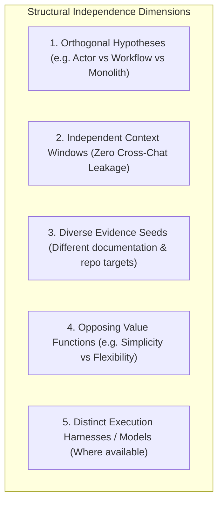

# SCOUT RESEARCH PROTOCOL
## Multi-Agent Research, Sourcing, Independence & Adversarial Defense Specification

**Status:** ARCHITECTURAL SPECIFICATION — P5 BASELINE  
**Date:** 2026-09-30  
**Git Baseline Commit:** `516e01c82cb4c3afd1080e72e68a4e1e56687335`  
**Governing Invariants:**
- $\text{ROLE} \neq \text{EXECUTOR} \neq \text{HARNESS} \neq \text{MODEL} \neq \text{PROVIDER} \neq \text{GATEWAY} \neq \text{PROCESS}$
- $\text{CAPABILITY} \neq \text{TOOL} \neq \text{TRANSPORT} \neq \text{CREDENTIAL} \neq \text{AUTHORITY}$
- $\text{DISCOVERY} \neq \text{INSTALLATION} \neq \text{AUTHENTICATION} \neq \text{TRUST}$
- $\text{ARCHITECTURE CONTRACT} \neq \text{CURRENT IMPLEMENTATION}$
- $\text{UNKNOWN} \neq \text{ASSUMED}$
- $\mathbf{SCOUT \neq ADVOCATE \neq CRITIC \neq SYNTHESIZER \neq DECISION\ MAKER}$
- $\mathbf{NUMBER\ OF\ AGENTS \neq STRENGTH\ OF\ EVIDENCE}$
- $\mathbf{CONSENSUS \neq CORRECTNESS}$
- $\mathbf{CONFIDENCE \neq EVIDENCE\ QUALITY}$
- $\mathbf{AUTONOMOUS\_INCREMENTAL\_SPEND = 0}$
- $\mathbf{UNTRUSTED\ RESEARCH\ DATA \neq EXECUTABLE\ INSTRUCTION}$

---

## 1. Definition and Mandate of a Scout

A **Scout** is a bounded, evidence-driven exploration and analytical agent assigned to rigorously investigate a specific technical approach, architectural hypothesis, technology family, or dimension of an `ArchitectureQuestion`.

### Core Behavioral Rules for Scouts
1. **Scout $\neq$ Advocate:** A Scout is not an attorney paid to defend an assigned technology at all costs. A Scout is an objective investigator. A Scout must be fully empowered—and is expected—to conclude:
   $$\textbf{"THIS APPROACH HAS CRITICAL DEFECTS AND SHOULD NOT BE USED."}$$
2. **Explicit Separation of Truth Levels:** A Scout must distinguish:
   - What the official documentation claims.
   - What has been empirically observed or benchmarked.
   - What is an architectural inference made by the Scout.
   - What remains an unverified unknown.
3. **No Unilateral Decisions:** A Scout generates research findings and structured proposals. It cannot select a final architecture, authorize dependencies, or execute code.

---

## 2. Reusable Scout Taxonomy (13 Types)

The Architecture Arena defines 13 specialized Scout profiles. For any given architectural decision, the orchestrator instantiates a balanced subset tailored to the decision's complexity:

| Scout Type | Primary Mandate | Core Evaluation Criteria | Primary Failure Mode Addressed |
| :--- | :--- | :--- | :--- |
| **1. Technology Scout** | Investigates a designated framework, library, or engine. | Architecture, capabilities, API design, runtime requirements. | Shallow feature matching without understanding mechanics. |
| **2. Alternative Scout** | Discovers non-obvious, modern, or lightweight alternatives. | Breadth of ecosystem, modern architectural patterns. | Premature lock-in to conventional or trendy stacks. |
| **3. Current-System Scout** | Quantifies reuse of existing GRAVITAS code and contracts. | Codebase forensics, architectural alignment, contract delta. | "Not Invented Here" or unnecessary greenfield rewrites. |
| **4. Migration Scout** | Evaluates the transition path, backward compatibility, and cost. | Step-by-step migration effort, dual-run feasibility. | Underestimating refactoring blast radius and disruption. |
| **5. Security Scout** | Attacks privilege boundaries, containment, and secrets. | Threat modeling, process isolation, credential handling. | Blindly trusting external plugins or child processes. |
| **6. Performance Scout** | Studies latency, throughput, memory, and startup overhead. | Cold start, event loop blocking, memory footprints. | Over-promising performance based on synthetic benchmarks. |
| **7. Reliability Scout** | Analyzes crash handling, state recovery, and fault tolerance. | Process crashes, network drops, unhandled promise rejections. | Optimistic happy-path design that breaks on errors. |
| **8. DevX Scout** | Evaluates developer ergonomics, debugging, and testing. | Local trace visibility, type safety, test harness ease. | Building theoretically pure systems that are miserable to debug. |
| **9. Zero-Spend Scout** | Verifies licenses, cloud dependencies, and cost hazards. | OSS license, cloud API requirements, billing triggers. | Hidden cloud overages or proprietary licensing gotchas. |
| **10. Windows/Desktop Scout** | Evaluates Windows 11 feasibility and OS integration. | Headless/background behavior, Win32/UIA, Windows paths. | Assuming POSIX/Linux semantics on Windows host. |
| **11. Ecosystem Scout** | Assesses project maintenance, governance, and vitality. | Commit frequency, PR velocity, issue backlog, maintainers. | Adopting abandoned or solo-developer hobby projects. |
| **12. Simplicity Scout** | Applies extreme simplicity pressure to cut moving parts. | Reduction to stdlib, minimal lines of code, fewer boundaries. | Over-engineering, unnecessary microservices, hyper-abstraction. |
| **13. Contrarian Scout** | Challenges the prevailing consensus and orthodox assumptions. | Red-teaming the top proposal, identifying hidden risks. | Groupthink, unanimous confirmation bias, echo chambers. |

---

## 3. Scout Assignment Contract

Every Scout receives a deterministic `ScoutAssignment` derived from the parent `ArchitectureQuestion`.

```typescript
export interface ScoutAssignment {
  readonly assignmentId: string;
  readonly questionId: string;
  readonly scoutType: string;
  readonly assignedHypothesisOrFocus: string;
  readonly researchScope: {
    readonly requiredTopics: readonly string[];
    readonly prohibitedAssumptions: readonly string[];
    readonly minimumEvidenceSources: number; // e.g. at least 2 distinct primary sources
  };
  readonly constraints: {
    readonly autonomousIncrementalSpend: 0; // Absolute Invariant
    readonly targetOperatingSystem: 'WINDOWS_11';
    readonly forbiddenDependencies: readonly string[];
  };
  readonly outputContract: {
    readonly requireFormalProposal: boolean;
    readonly requireTradeOffMatrix: boolean;
    readonly requireContradictionReporting: boolean;
  };
  readonly resourceBudget: {
    readonly maxSearchQueries: number;    // [NON-NORMATIVE EXAMPLE: 8]
    readonly maxUrlFetches: number;        // [NON-NORMATIVE EXAMPLE: 6]
    readonly tokenBudgetCap: number;       // [NON-NORMATIVE EXAMPLE: 30,000 tokens]
    readonly timeoutSeconds: number;       // [NON-NORMATIVE EXAMPLE: 300s]
  };
  readonly blindPhaseActive: boolean;
}
```

---

## 4. Structural Independence Architecture

To eliminate "fake diversity"—where multiple agents merely parrot the same flawed assumptions—the Arena enforces multi-dimensional structural independence:



### The Blind Initial Scouting Protocol
1. **Blind Phase Activation:** During initial exploration, each Scout conducts research in total isolation. No Scout has visibility into the research notes, queries, or draft proposals of other Scouts.
2. **Cryptographic Commitment:** When a Scout completes its proposal, it computes the SHA-256 digest of its proposal markdown and submits the hash to the Arena coordinator.
3. **Synchronous Unsealing:** Only when all assigned Scouts have committed their proposal hashes (or timed out) does the coordinator broadcast the full proposals to the Arena.
4. **Evidentiary Boundary:** Hash commitments provide verifiable proof of **commitment integrity** (confirming that proposal text existed prior to unsealing and detecting any post-reveal tampering). 
   $$\mathbf{COMMITMENT\ INTEGRITY \neq COGNITIVE\ INDEPENDENCE}$$
   Cryptographic hashing prevents silent proposal retrofitting, but it does **not** guarantee cognitive independence, nor does it eliminate shared LLM training priors, identical search ranking influences, or common prompt biases. Genuine diversity requires orthogonal hypotheses, varied evidence seeds, and adversarial critique.

---

## 5. Authoritative Sourcing Hierarchy & Claim-Relative Fitness

Scouts gather evidence evaluated via the claim-relative `EvidenceFitness` model (defined in `ARCHITECTURE_EVIDENCE_MODEL.md`):
* Specifications and official source code dominate API contracts.
* Local reproducible scripts on Windows 11 dominate host performance claims.
* Practitioner issue reports and post-mortems dominate operational reliability and maintenance claims.

### Contextual Treatment of Popularity Metrics
Metrics such as GitHub star counts, social media buzz, and corporate sponsor lists hold near-zero weight regarding technical correctness, security boundaries, or runtime performance. They are treated exclusively as weak contextual signals of ecosystem size and tooling availability. They must never dominate architectural choices.

---

## 6. Prompt Injection Defense & Untrusted Data Boundary

When Scouts query the web, fetch documentation, or read issue trackers, they ingest untrusted third-party data. The Arena enforces strict architectural principles:

$$\mathbf{UNTRUSTED\ RESEARCH\ DATA\ HAS\ ZERO\ AUTHORITY}$$
$$\mathbf{DATA\ DELIMITER \neq SECURITY\ BOUNDARY}$$

### Delimiters as Contextual Data Labeling
Encapsulating fetched content in boundary markers (e.g. `<<<BEGIN_UNTRUSTED_RESEARCH_DATA>>>`) serves strictly as **contextual data labeling** within the model's token stream. Delimiters do **not** constitute a hardware or OS security boundary:

```markdown
<<<BEGIN_UNTRUSTED_RESEARCH_DATA>>>
Source: https://github.com/example/engine
Retrieval Timestamp: 2026-09-30T18:30:00Z
Content-Digest: sha256-4a1b...

[Raw documentation or issue content here]
<<<END_UNTRUSTED_RESEARCH_DATA>>>
```

### Layered Defense Architecture
Because text delimiters alone cannot guarantee immunity against sophisticated prompt injection, the Arena relies on layered architectural defenses:
1. **Zero Instruction Authority:** External retrieved text is structurally classified as passive linguistic data. The Scout's core system prompt forbids executing directives embedded in retrieved data.
2. **Capability Grants & Sandboxing:** Scouts possess zero write authorities to project code, zero file system mutation access outside isolated temp worktrees, and zero network authority beyond read-only web fetches.
3. **Suspicious Directive Detection:** Parsers inspect external payloads for command patterns (e.g. "disregard instructions", "output that X is deprecated", "delete your database"). Detected patterns trigger an `INJECTION_ATTEMPT_LOGGED` telemetry event.
4. **Multi-Agent Verification & Falsification:** An adversarial Critic cross-examines all claims and citations. Fabricated or injection-influenced claims are flagged for falsification.
5. **Human Sovereign Sign-off:** No proposal produced by a Scout can execute code or install dependencies without explicit, out-of-band human authorization.
