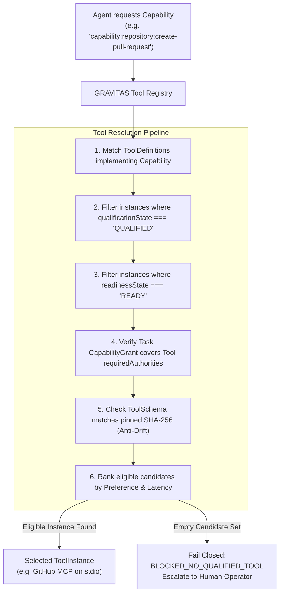
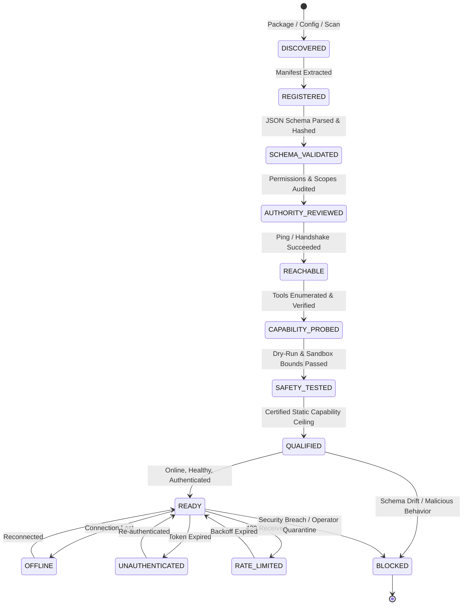

# GRAVITAS — TOOL REGISTRY ARCHITECTURE
## Canonical Capability Layer, Semantic Registry, and Qualification Lifecycle

**Document Identifier**: `GRAVITAS-ARCH-P4-001`  
**Governing Milestone**: Wave P4 (Tool Registry + MCP / Plugin / Connector Architecture)  
**Requirement Mapping**: `REQ-P4-01`, `REQ-P4-02`, `REQ-P4-03`, `REQ-P4-04`, `REQ-P4-08`, `REQ-P4-14`  
**Document Status**: Final Architectural Contract  
**Date**: 2026-09-30  

---

### Foundational Invariants `[INVARIANT]`
$$\mathbf{ROLE \neq EXECUTOR \neq HARNESS \neq MODEL \neq PROVIDER \neq GATEWAY \neq PROCESS}$$
$$\mathbf{CAPABILITY \neq TOOL \neq TRANSPORT \neq CREDENTIAL \neq AUTHORITY}$$
$$\mathbf{TOOL\ DECLARATION \neq TOOL\ QUALIFICATION \neq TOOL\ AUTHORIZATION \neq TOOL\ EXECUTION}$$
$$\mathbf{DISCOVERY \neq INSTALLATION \neq AUTHENTICATION \neq TRUST}$$
$$\mathbf{AUTONOMOUS\_INCREMENTAL\_SPEND = 0}$$
$$\mathbf{FREE\_QUOTA\_EXHAUSTED \longrightarrow STOP \mid SAFE\_FREE\_FALLBACK \mid WAIT \quad (\text{NEVER } \longrightarrow BILL)}$$
$$\mathbf{UNKNOWN\_COST \neq FREE \quad (\text{FAIL CLOSED})}$$
$$\mathbf{EXISTING\_ENTITLEMENT \neq FREE\_TIER \neq PERMANENTLY\_FREE}$$
$$\mathbf{REUSE > ADD\_DEPENDENCY}$$

---

## 1. Definitional Boundaries & Disambiguation

To prevent architectural collapse between tool interfaces, protocols, and authorities, GRAVITAS defines six distinct operational dimensions:

| Dimension | Definition | Lifetime | Concrete Example |
| :--- | :--- | :--- | :--- |
| **Capability** | Abstract functional intent requested by an agent or task, independent of vendor, transport, or tool name. | Permanent / System-wide | `capability:repository:create-pull-request` |
| **Tool** | A concrete functional unit exposing a strongly typed schema, parameters, and invocation semantics. | Plugin/Server Scope | `github_create_pull_request` |
| **Transport** | The mechanical communication mechanism used to dispatch an invocation to the tool runtime. | Session / Connection | `STDIO_JSONRPC`, `HTTP_SSE`, `IN_PROCESS`, `CLI_SUBPROCESS` |
| **Credential** | Sensitive authentication material (token, API key, certificate) required to access an external system. | Vault-Scoped / Ephemeral | `CredentialReference: 'vault:github:user-oauth-token'` |
| **Authority** | Granular security permission required to execute an action on a specific resource. | Policy-Bounded | `github.pr.create` on `Smarak-padhi/Gravitas` |
| **Cost Profile** | Economic classification and quota state governing whether the tool can be dispatched at zero incremental spend. | Policy / Registry Scope | `LOCAL_FOSS`, `FREE_TIER`, `ALREADY_OWNED` |

### Core Architectural Rules:
1. **A Tool is not a Role**: A Role specifies reasoning duties and boundaries (`Frontend Engineer`); a Tool specifies a concrete action (`format_typescript`).
2. **A Tool is not a Harness**: A Harness adapts an LLM execution surface (`codex`, `claude`); a Tool provides execution capabilities that an agent or harness invokes.
3. **A Harness may expose Tools**: A harness (e.g. `codex` CLI) may expose internal file-editing tools, but those tools must be registered and authorized through the Tool Registry if they affect persistent repository state.
4. **Tools speak multiple Transports**: The same logical capability (`git.commit`) may be invoked via an in-process Git library, a CLI subprocess, or an MCP server.
5. **No Blind Trust**: Speaking the Model Context Protocol (MCP) or JSON-RPC conveys **zero** automatic trust. An MCP server must progress through the qualification ladder before its tools can be dispatched.
6. **Zero Incremental Spend Default**: Autonomous dispatch is strictly restricted to non-billable tools. An eligible tool must be provably zero incremental cost under active policy. Unknown cost fails closed.

---

## 2. Canonical Tool Registry Domain Model & TypeScript Contracts `[ARCHITECTURAL CONTRACT]`

```typescript
/**
 * GRAVITAS ARCHITECTURE V2 — TOOL REGISTRY CONTRACTS
 * Governing Invariants:
 * CAPABILITY ≠ TOOL ≠ TRANSPORT ≠ CREDENTIAL ≠ AUTHORITY
 * TOOL DECLARATION ≠ TOOL QUALIFICATION ≠ TOOL AUTHORIZATION ≠ TOOL EXECUTION
 */

// ─── 1. CAPABILITY LAYER ─────────────────────────────────────────────────────

export type CapabilityDomain =
  | 'REPOSITORY'
  | 'FILESYSTEM'
  | 'SHELL'
  | 'VERIFICATION'
  | 'BROWSER_QA'
  | 'DESKTOP_AUTOMATION'
  | 'DATABASE'
  | 'COMMUNICATION'
  | 'CALENDAR'
  | 'RESEARCH'
  | 'DOCUMENTATION'
  | 'DEPLOYMENT'
  | 'OBSERVABILITY';

export interface CapabilityDefinition {
  /** Canonical capability identifier (e.g. 'capability:repository:create-pull-request') */
  readonly id: string;
  readonly domain: CapabilityDomain;
  readonly displayName: string;
  readonly description: string;
  /** Granular authorities required to satisfy this capability */
  readonly requiredAuthorities: readonly string[];
  /** Mutation classification of the capability */
  readonly mutationClass: ToolMutationClass;
  /** Whether this capability can be executed in dry-run/preview mode */
  readonly supportsPreview: boolean;
  /** Whether sovereign human approval is mandatory prior to execution */
  readonly requiresHumanApproval: boolean;
}

// ─── 2. TOOL TAXONOMY & CLASSIFICATION ────────────────────────────────────────

export type ToolSemanticClass =
  | 'DETERMINISTIC_LOCAL'      // In-process pure function or deterministic local utility
  | 'LOCAL_PRIVILEGED'        // Subprocess requiring local OS execution or elevated tokens
  | 'REMOTE_API'              // Direct REST/GraphQL endpoint to external SaaS
  | 'MCP_SERVER_TOOL'         // Tool exposed by a Model Context Protocol server
  | 'BROWSER_AUTOMATION'      // Headless/headed Playwright browser driver
  | 'DESKTOP_AUTOMATION'      // OS accessibility / UI automation driver
  | 'DATABASE_CONNECTOR'      // SQL/NoSQL query runner
  | 'FILESYSTEM_WORKSPACE'    // Worktree-confined file operations
  | 'SHELL_EXECUTION'         // Sandboxed terminal command execution
  | 'GIT_REPOSITORY';         // Version control mutations

export type ToolMutationClass =
  | 'READ_ONLY'               // No state change (e.g. read issue, fetch doc, run linter)
  | 'MUTATING_REVERSIBLE'     // Modifies ephemeral state; fully reversible (e.g. edit file in worktree)
  | 'MUTATING_EXTERNAL'       // Changes remote state (e.g. create draft PR, post comment)
  | 'DESTRUCTIVE'             // Permanently deletes or overwrites (e.g. delete branch, drop DB table)
  | 'PRIVILEGE_CHANGING'      // Expands access tokens or permissions
  | 'FINANCIAL'               // Incurs monetary charges or deploys billable resources
  | 'COMMUNICATION';          // Dispatches messages, emails, or notifications to humans

// ─── 3. TRANSPORT DEFINITIONS ────────────────────────────────────────────────

export type TransportType =
  | 'IN_PROCESS'
  | 'CHILD_PROCESS_STDIO'
  | 'MCP_STDIO'
  | 'MCP_SSE'
  | 'MCP_HTTP'
  | 'REST_HTTPS'
  | 'PLAYWRIGHT_CDP'
  | 'WINDOWS_UI_AUTOMATION';

export interface ToolTransportDescriptor {
  readonly type: TransportType;
  readonly endpointOrCommand: string;
  readonly args?: readonly string[] | undefined;
  readonly envWhitelist?: readonly string[] | undefined;
  readonly timeoutMs: number;
  readonly connectionState: 'CONNECTED' | 'DISCONNECTED' | 'RECONNECTING' | 'TERMINATED';
}

// ─── 4. COST CLASSIFICATION & QUOTA MODEL ────────────────────────────────────

export type CostCategory =
  | 'LOCAL_FOSS'              // Local execution, open-source, zero usage billing
  | 'ALREADY_OWNED'          // Existing perpetual license or OS entitlement
  | 'INCLUDED_SUBSCRIPTION'  // Covered by flat-rate subscription without marginal fees
  | 'FREE_TIER'              // External service bounded free allowance
  | 'FREE_CREDIT'            // Finite/temporary promotional credit grant
  | 'PAY_AS_YOU_GO'          // Metered utility billing (requires explicit human auth)
  | 'PAID_ADDON'             // Requires plan upgrade or marketplace purchase
  | 'UNKNOWN_COST';          // Unverified cost terms (fails closed as billable)

export interface QuotaDescriptor {
  readonly unit: 'REQUESTS' | 'TOKENS' | 'BYTES' | 'HOURS' | 'CREDITS';
  readonly limitTotal: number;
  readonly remainingObservable?: number | undefined;
  readonly resetTimestampIso?: string | undefined;
  readonly period: 'MINUTE' | 'HOUR' | 'DAY' | 'MONTH' | 'TOTAL_GRANT';
  readonly overageBehavior: 'HARD_STOP_REJECT' | 'AUTOMATIC_OVERAGE_BILL' | 'THROTTLE_DEGRADE' | 'UNKNOWN';
  readonly hardSpendingCapConfigured: boolean;
}

export interface CostProfile {
  readonly category: CostCategory;
  readonly incrementalCostPossibility: boolean;
  readonly requiresPaymentMethod: boolean;
  readonly activePromotionalCredit: boolean;
  readonly creditExpiryIso?: string | undefined;
  readonly quotas: readonly QuotaDescriptor[];
  readonly evidenceSource: string;
  readonly evidenceTimestampIso: string;
  readonly confidence: 'PROVEN_LOCAL' | 'VERIFIED_API_DOCS' | 'UNVERIFIED_HEURISTIC';
}

// ─── 5. TOOL SCHEMA & DRIFT TRACKING ──────────────────────────────────────────

export interface ToolParameterSchema {
  readonly type: 'object';
  readonly properties: Record<string, unknown>;
  readonly required?: readonly string[] | undefined;
  readonly additionalProperties?: boolean | undefined;
}

export interface ToolSchemaDigest {
  /** Canonical JSON representation of parameter schema */
  readonly rawSchema: ToolParameterSchema;
  /** SHA-256 digest of sorted canonical parameter schema */
  readonly parameterDigestSha256: string;
  /** Schema specification version (e.g. 'draft-07', '2020-12') */
  readonly schemaDialect: string;
  /** Timestamp when this schema was validated during qualification */
  readonly certifiedAt: string;
}

// ─── 6. TOOL DEFINITION & INSTANCE ───────────────────────────────────────────

export interface ToolDefinition {
  /** Unique tool identifier (e.g. 'tool:github:create-pull-request') */
  readonly toolId: string;
  /** Implemented capability IDs */
  readonly implementsCapabilities: readonly string[];
  readonly semanticClass: ToolSemanticClass;
  readonly mutationClass: ToolMutationClass;
  readonly costProfile: CostProfile;
  readonly displayName: string;
  readonly description: string;
  /** Canonical schema and cryptographic digest */
  readonly schema: ToolSchemaDigest;
  /** Granular authority classes enforced by this tool */
  readonly requiredAuthorities: readonly string[];
  /** Supported transports */
  readonly supportedTransports: readonly TransportType[];
  /** Minimum required OS containment level for local execution */
  readonly minimumContainmentLevel: 'L0_UNCONFINED' | 'L1_PROCESS_TREE' | 'L2_WORKTREE_RESTRICTED' | 'L3_SANDBOX';
  /** Opaque credential requirements */
  readonly requiredCredentialTypes: readonly string[];
}

export interface ToolInstance {
  readonly instanceId: string;
  readonly toolId: string;
  readonly providerId: string;
  readonly transport: ToolTransportDescriptor;
  readonly qualificationState: ToolQualificationState;
  readonly readinessState: ToolReadinessState;
  readonly schemaDigest: string;
  readonly lastHealthCheckAt: string;
  readonly isHealthy: boolean;
  readonly activeLeaseCount: number;
  readonly metrics: {
    readonly totalInvocations: number;
    readonly totalFailures: number;
    readonly averageLatencyMs: number;
  };
}

// ─── 6. TOOL QUALIFICATION & READINESS ────────────────────────────────────────

export type ToolQualificationState =
  | 'DISCOVERED'           // Detected in package, config, or MCP manifest; uninspected
  | 'REGISTERED'           // Metadata and capability mapping recorded in registry
  | 'SCHEMA_VALIDATED'     // JSON Schema verified; cryptographic digest computed
  | 'AUTHORITY_REVIEWED'   // Permissions, scopes, and blast radius audited
  | 'REACHABLE'            // Transport handshake successful (ping/pong, process spawn)
  | 'CAPABILITY_PROBED'    // Enumerated tools verified against declared schemas
  | 'SAFETY_TESTED'        // Containment, dry-run, and parameter bounds verified
  | 'QUALIFIED'            // Certified safe for task allocation (static capability ceiling)
  | 'BLOCKED';             // Quarantined due to schema drift, auth failure, or security breach

export type ToolReadinessState =
  | 'READY'                // Operational, authenticated, healthy, and unthrottled
  | 'OFFLINE'              // Subprocess down or remote endpoint unreachable
  | 'UNAUTHENTICATED'      // Token expired, missing, or requires OAuth renewal
  | 'RATE_LIMITED'         // Backed off due to HTTP 429 or provider quota
  | 'DEGRADED'             // Health checks failing or elevated error rate
  | 'REVOKED';             // Explicitly disabled by human operator
```

---

## 3. Capability-First Resolution Architecture `[ARCHITECTURAL CONTRACT]`

In GRAVITAS, agents and tasks request **Capabilities**, never specific vendors, plugins, or tool binaries.

$$\text{Task Capability Requirement} \xrightarrow{\text{Kernel Registry}} \text{Candidate Tools} \xrightarrow{\text{Qualification \& Readiness}} \text{Authorized Instance} \xrightarrow{\text{Dispatched Invocation}}$$



### Deterministic Selection Algorithm `[REFERENCE ALGORITHM]`

```typescript
export interface PricingFreshnessRule {
  readonly costCategory: CostCategory;
  readonly maximumTtlSeconds: number;
}

export interface PricingFreshnessPolicy {
  readonly rules: readonly PricingFreshnessRule[];
  readonly defaultTtlSeconds: number;
}

export interface CostPreferencePolicy {
  readonly preferredCategoryOrder: readonly CostCategory[];
  readonly preferLocalTransport: boolean;
}

export const DEFAULT_COST_PREFERENCE_POLICY: CostPreferencePolicy = {
  preferredCategoryOrder: ['LOCAL_FOSS', 'ALREADY_OWNED', 'INCLUDED_SUBSCRIPTION', 'FREE_TIER', 'FREE_CREDIT'],
  preferLocalTransport: true,
};

export interface CapabilityResolutionQuery {
  readonly requestedCapabilityId: string;
  readonly taskCapabilityGrant: CapabilityGrant;
  readonly roleId: string;
  readonly executorId: string;
  readonly autonomousIncrementalSpendBudget?: number | undefined; // Defaults to 0 (AUTONOMOUS_INCREMENTAL_SPEND = 0)
  readonly operatorCostAuthorization?: boolean | undefined;
  readonly pricingFreshnessPolicy?: PricingFreshnessPolicy | undefined;
  readonly costPreferencePolicy?: CostPreferencePolicy | undefined;
  readonly preferredTransports?: readonly TransportType[] | undefined;
  readonly explicitToolOverride?: string | undefined;
}

export type CapabilityResolutionOutcome =
  | {
      readonly status: 'RESOLVED';
      readonly selectedInstance: ToolInstance;
      readonly toolDefinition: ToolDefinition;
      readonly isFallback: boolean;
      readonly selectionProof: {
        readonly candidateCount: number;
        readonly eliminated: readonly { toolId: string; reason: string }[];
        readonly selectedScore: number;
        readonly costCategory: CostCategory;
      };
    }
  | {
      readonly status: 'BLOCKED_NO_TOOL';
      readonly errorCode:
        | 'UNIMPLEMENTED_CAPABILITY'
        | 'NO_QUALIFIED_INSTANCE'
        | 'AUTHORITY_DENIED'
        | 'SCHEMA_DRIFT_DETECTED'
        | 'BLOCK_COST_AUTHORIZATION_REQUIRED'
        | 'BLOCK_COST_EVIDENCE_STALE';
      readonly rejectionLedger: readonly {
        readonly toolId: string;
        readonly qualification: ToolQualificationState;
        readonly readiness: ToolReadinessState;
        readonly reason: string;
      }[];
    };

export function resolveCapability(
  query: CapabilityResolutionQuery,
  toolDefinitions: readonly ToolDefinition[],
  toolInstances: readonly ToolInstance[]
): CapabilityResolutionOutcome {
  const {
    requestedCapabilityId,
    taskCapabilityGrant,
    explicitToolOverride,
    autonomousIncrementalSpendBudget = 0,
    operatorCostAuthorization = false,
    pricingFreshnessPolicy,
    costPreferencePolicy = DEFAULT_COST_PREFERENCE_POLICY,
  } = query;
  const rejectionLedger: { toolId: string; qualification: ToolQualificationState; readiness: ToolReadinessState; reason: string }[] = [];

  // 1. Identify ToolDefinitions implementing the requested capability
  const matchingDefs = toolDefinitions.filter((def) =>
    def.implementsCapabilities.includes(requestedCapabilityId)
  );

  if (matchingDefs.length === 0) {
    return {
      status: 'BLOCKED_NO_TOOL',
      errorCode: 'UNIMPLEMENTED_CAPABILITY',
      rejectionLedger: [{
        toolId: 'NONE',
        qualification: 'DISCOVERED',
        readiness: 'OFFLINE',
        reason: `No registered tool implements capability '${requestedCapabilityId}'.`,
      }],
    };
  }

  // 2. Evaluate Candidate Instances
  const eligibleCandidates: { instance: ToolInstance; def: ToolDefinition; score: number }[] = [];

  for (const def of matchingDefs) {
    const costCat = def.costProfile.category;

    // 2a. Pricing Freshness Check (Governed by active PricingFreshnessPolicy)
    if (pricingFreshnessPolicy && costCat !== 'LOCAL_FOSS') {
      const rule = pricingFreshnessPolicy.rules.find((r) => r.costCategory === costCat);
      const ttlSeconds = rule?.maximumTtlSeconds ?? pricingFreshnessPolicy.defaultTtlSeconds;
      const evidenceAgeSeconds = (Date.now() - new Date(def.costProfile.evidenceTimestampIso).getTime()) / 1000;
      if (evidenceAgeSeconds > ttlSeconds) {
        rejectionLedger.push({
          toolId: def.toolId,
          qualification: 'QUALIFIED',
          readiness: 'READY',
          reason: `Pricing evidence is stale (${Math.round(evidenceAgeSeconds)}s > TTL ${ttlSeconds}s) according to active PricingFreshnessPolicy; autonomous dispatch blocked.`,
        });
        continue;
      }
    }

    // 2b. Zero-Spend Cost Eligibility Check [INVARIANT: AUTONOMOUS_INCREMENTAL_SPEND = 0]
    if (autonomousIncrementalSpendBudget === 0 && !operatorCostAuthorization) {
      if (costCat === 'PAY_AS_YOU_GO' || costCat === 'PAID_ADDON') {
        rejectionLedger.push({
          toolId: def.toolId,
          qualification: 'QUALIFIED',
          readiness: 'READY',
          reason: `Excluded by default: tool is billable (${costCat}) and autonomous spend ceiling is zero.`,
        });
        continue;
      }
      if (costCat === 'UNKNOWN_COST') {
        rejectionLedger.push({
          toolId: def.toolId,
          qualification: 'QUALIFIED',
          readiness: 'READY',
          reason: `Fail closed: tool pricing/cost terms are unverified (UNKNOWN_COST ≠ FREE).`,
        });
        continue;
      }
      if (costCat === 'FREE_TIER') {
        const hasUncappedOverage = def.costProfile.quotas.some(
          (q) => q.overageBehavior === 'AUTOMATIC_OVERAGE_BILL' && !q.hardSpendingCapConfigured
        );
        if (hasUncappedOverage) {
          rejectionLedger.push({
            toolId: def.toolId,
            qualification: 'QUALIFIED',
            readiness: 'READY',
            reason: `Excluded: free tier lacks guaranteed hard-stop cap; risk of silent automatic overage billing.`,
          });
          continue;
        }
        const isQuotaExhausted = def.costProfile.quotas.some(
          (q) => q.remainingObservable !== undefined && q.remainingObservable <= 0
        );
        if (isQuotaExhausted) {
          rejectionLedger.push({
            toolId: def.toolId,
            qualification: 'QUALIFIED',
            readiness: 'RATE_LIMITED',
            reason: `Excluded: free quota exhausted; transition to paid overage prohibited.`,
          });
          continue;
        }
      }
      if (costCat === 'FREE_CREDIT') {
        if (!def.costProfile.activePromotionalCredit) {
          rejectionLedger.push({
            toolId: def.toolId,
            qualification: 'QUALIFIED',
            readiness: 'RATE_LIMITED',
            reason: `Excluded: promotional credit has expired or is inactive.`,
          });
          continue;
        }
      }
    }

    // 2c. Check Authority Grant
    const missingAuthorities = def.requiredAuthorities.filter(
      (auth) => !taskCapabilityGrant.authorizedAuthorities.includes(auth)
    );
    if (missingAuthorities.length > 0) {
      rejectionLedger.push({
        toolId: def.toolId,
        qualification: 'QUALIFIED',
        readiness: 'READY',
        reason: `Task CapabilityGrant lacks required authorities: [${missingAuthorities.join(', ')}].`,
      });
      continue;
    }

    // 2d. Find instances for this definition
    const instances = toolInstances.filter((inst) => inst.toolId === def.toolId);
    for (const inst of instances) {
      // Static Qualification Ceiling Check
      if (inst.qualificationState !== 'QUALIFIED') {
        rejectionLedger.push({
          toolId: inst.toolId,
          qualification: inst.qualificationState,
          readiness: inst.readinessState,
          reason: `Tool instance qualification state is '${inst.qualificationState}' (must be QUALIFIED).`,
        });
        continue;
      }

      // Dynamic Operational Readiness Check
      if (inst.readinessState !== 'READY' || !inst.isHealthy) {
        rejectionLedger.push({
          toolId: inst.toolId,
          qualification: inst.qualificationState,
          readiness: inst.readinessState,
          reason: `Tool instance is not ready for dispatch (readiness: '${inst.readinessState}', healthy: ${inst.isHealthy}).`,
        });
        continue;
      }

      // Schema Integrity Check (Anti-Drift)
      if (inst.schemaDigest !== def.schema.parameterDigestSha256) {
        rejectionLedger.push({
          toolId: inst.toolId,
          qualification: inst.qualificationState,
          readiness: inst.readinessState,
          reason: `Schema drift detected: instance digest does not match certified definition digest.`,
        });
        continue;
      }

      // 2e. Semantic Cost Preference Ranking
      // Candidates are ranked primarily by CostPreferencePolicy category order,
      // secondarily by transport locality, and tertiarily by latency metrics.
      // (The numeric weight calculation below is a [NON-NORMATIVE EXAMPLE] reference implementation).
      let score = 100;
      if (explicitToolOverride && inst.toolId === explicitToolOverride) {
        score += 10000;
      }

      const categoryRankIndex = costPreferencePolicy.preferredCategoryOrder.indexOf(costCat);
      if (categoryRankIndex !== -1) {
        // Lower index = higher preference
        score += (costPreferencePolicy.preferredCategoryOrder.length - categoryRankIndex) * 100;
      }

      // Transport locality preference
      if (costPreferencePolicy.preferLocalTransport) {
        if (inst.transport.type === 'IN_PROCESS') score += 50;
        if (inst.transport.type === 'CHILD_PROCESS_STDIO') score += 30;
      }

      score -= Math.min(inst.metrics.averageLatencyMs / 10, 40);

      eligibleCandidates.push({ instance: inst, def, score });
    }
  }

  if (eligibleCandidates.length === 0) {
    const hasStaleEvidence = rejectionLedger.some((r) => r.reason.includes('Pricing evidence is stale'));
    const hasCostIssue = rejectionLedger.some((r) => r.reason.includes('Excluded by default: tool is billable') || r.reason.includes('Fail closed: tool pricing'));
    const hasAuthorityIssue = rejectionLedger.some((r) => r.reason.includes('CapabilityGrant lacks'));
    const hasDriftIssue = rejectionLedger.some((r) => r.reason.includes('Schema drift'));
    return {
      status: 'BLOCKED_NO_TOOL',
      errorCode: hasStaleEvidence
        ? 'BLOCK_COST_EVIDENCE_STALE'
        : hasCostIssue
        ? 'BLOCK_COST_AUTHORIZATION_REQUIRED'
        : hasDriftIssue
        ? 'SCHEMA_DRIFT_DETECTED'
        : hasAuthorityIssue
        ? 'AUTHORITY_DENIED'
        : 'NO_QUALIFIED_INSTANCE',
      rejectionLedger,
    };
  }

  // Sort descending by score; tie-break lexicographically by instanceId
  eligibleCandidates.sort((a, b) => b.score - a.score || a.instance.instanceId.localeCompare(b.instance.instanceId));
  const best = eligibleCandidates[0]!;

  return {
    status: 'RESOLVED',
    selectedInstance: best.instance,
    toolDefinition: best.def,
    isFallback: eligibleCandidates.length > 1 && (!explicitToolOverride || best.instance.toolId !== explicitToolOverride),
    selectionProof: {
      candidateCount: eligibleCandidates.length,
      eliminated: rejectionLedger.map((r) => ({ toolId: r.toolId, reason: r.reason })),
      selectedScore: best.score,
      costCategory: best.def.costProfile.category,
    },
  };
}
```

---

## 4. The 9-Stage Tool Qualification Lifecycle `[ARCHITECTURAL CONTRACT]`

Tools and external capability servers must undergo systematic qualification before they are dispatched by autonomous agents.



### Stage Verification Matrix

| Stage | Name | Verification Action | Success Criterion | Failure Action |
| :--- | :--- | :--- | :--- | :--- |
| **Q1** | `DISCOVERED` | Surface identified in local config, npm package, or MCP server manifest. | Path or URI exists. | Drop candidate. |
| **Q2** | `REGISTERED` | Tool ID, metadata, and capability mappings recorded in registry. | Unique ToolId assigned; no namespace collisions. | Reject duplicate. |
| **Q3** | `SCHEMA_VALIDATED` | Parameter schema parsed against JSON Schema dialect; canonical SHA-256 computed. | Valid schema syntax; deterministic hash generated. | Mark `BLOCKED`. |
| **Q4** | `AUTHORITY_REVIEWED`| Security auditor or human operator reviews declared blast radius. | Authorities explicitly bound to context domains. | Require review. |
| **Q5** | `REACHABLE` | Transport initialized (stdio process spawned, HTTP SSE connected). | Clean handshake response in $< 5000\text{ms}$. | Mark `OFFLINE`. |
| **Q6** | `CAPABILITY_PROBED` | `tools/list` or equivalent invoked; tool list matches declaration. | All declared tools present; zero undeclared tools. | Mark `BLOCKED`. |
| **Q7** | `SAFETY_TESTED` | Parameter bounds, dry-run mode, and sandbox isolation verified. | Containment boundary held; no out-of-scope mutations. | Mark `BLOCKED`. |
| **Q8** | `QUALIFIED` | Tool certified for autonomous dispatch within authorized scopes. | All stages Q1–Q7 passed; signed in registry. | Retain uncertified. |
| **Q9** | `READY` | Active operational status confirmed in real time. | Reachable, healthy, token valid, not rate-limited. | Fallback or wait. |

---

## 5. Schema Drift & Anti-Poisoning Architecture `[INVARIANT]`

> **SECURITY INVARIANT `[INVARIANT]`:**  
> A Tool must **NEVER** be dispatched if its active runtime schema differs from the certified schema pinned at qualification. Silent privilege expansion or parameter alteration triggers immediate containment quarantine.

### Anti-Drift Protocol:
1. **Cryptographic Schema Pinning**: At `SCHEMA_VALIDATED`, the Kernel computes:
   $$\text{parameterDigestSha256} = \text{SHA-256}(\text{CanonicalJSON}(\text{ToolParameterSchema}))$$
2. **Pre-Flight Schema Assertion**: Whenever an MCP client or tool adapter reconnects or re-enumerates tools:
   - It re-computes $\text{SHA-256}(\text{CanonicalJSON}(\text{ActiveSchema}))$.
   - If $\text{ActiveDigest} \neq \text{CertifiedDigest}$:
     - The tool instance is immediately transitioned to `BLOCKED`.
     - The Kernel raises security alert `TOOL_SCHEMA_DRIFT_DETECTED`.
     - Active task leases referencing this tool are suspended.
     - The human operator is prompted with a side-by-side JSON diff of the schema mutation.
     - Execution resumes **only** if the operator explicitly approves and re-certifies the updated schema.
