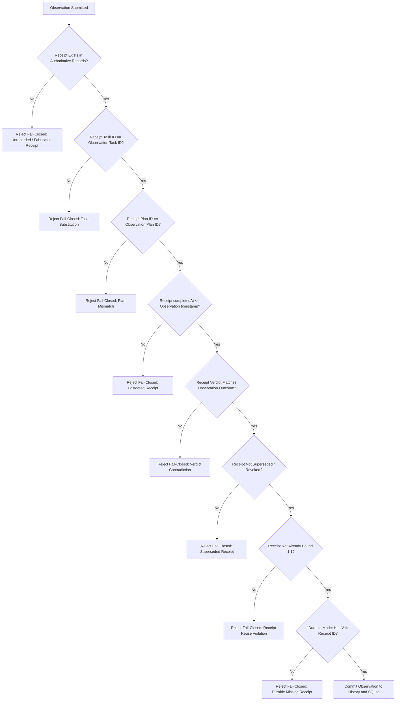

# GRAVITAS — Wave V1-B-R2 Receipt Provenance Specification
**Authoritative Receipt Issuance, Invariants & Anti-Fabrication Security**

---

## 1. Defining Invariant

> **AN AGENT CLAIM IS NEVER PROOF OF COMPLETION.**  
> **MODEL_SAYS_DONE != VERIFIED_SUCCESS.**  
> **A RECEIPT MUST BE ISSUED BY INDEPENDENT K5 VERIFICATION EXECUTION.**

In Gravitas, model execution is strictly isolated from verification authority. A model or harness can output code, diffs, or messages, but only `@gravitas/verifier` has the authority to execute independent test commands and issue a `K5VerificationReceipt`.

---

## 2. Receipt Contract

```typescript
export interface K5VerificationReceipt {
  readonly receiptId: string
  readonly planId: string
  readonly workSessionId: string
  readonly taskId: string
  readonly runId: string
  readonly attemptNumber: number
  readonly verdict: 'VERIFIED_PASS' | 'VERIFIED_FAIL'
  readonly commandsCount: number
  readonly passedCommandsCount: number
  readonly failedCommandsCount: number
  readonly completedAt: string
  readonly issuedAt: string
  readonly superseded?: boolean | undefined
}
```

Receipts are created via `createVerificationReceipt(verification, context)` in `@gravitas/verifier` immediately upon deterministic command execution.

---

## 3. The 8 Receipt Validation Invariants

Whenever an observation is submitted to `ModelCapabilityHistory.recordObservation`, all 8 invariants are strictly evaluated:



---

## 4. Anti-Substitution & Anti-Reuse Verification

### Anti-Substitution
If task `A` passes verification, an adversarial or faulty component cannot submit an observation for task `B` referencing `A`'s receipt. Invariant B asserts `receipt.taskId === observation.taskId`.

### Anti-Reuse
Each verification run produces a unique receipt that corresponds to exactly one observation attempt. Invariant G ensures a receipt cannot be reused to inflate the success rate of multiple models or runs.

### Temporal Monotonicity
A receipt must be completed prior to or simultaneously with observation creation. If an observation claims a timestamp earlier than the receipt's `completedAt`, Invariant D rejects it as causally impossible.
